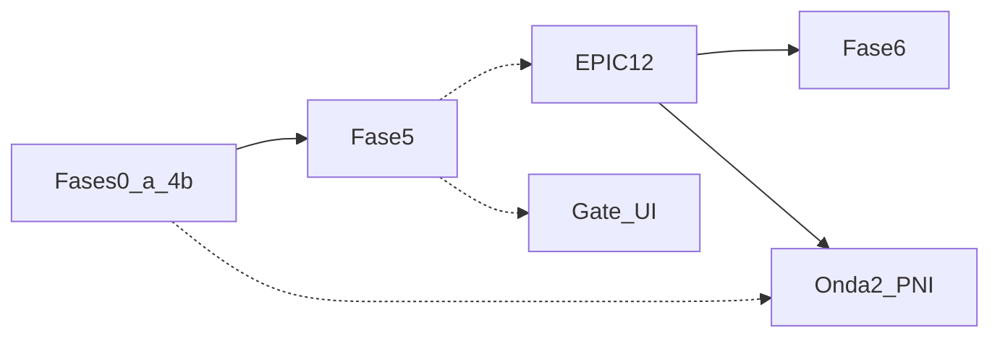

# CidadãoBR Saúde — Status e próximos passos (jun/2026)

**Plano mestre:** [padrão_ledi_e-sus_4f004208.plan.md](../padrão_ledi_e-sus_4f004208.plan.md)  
**Roteiro organizado (fases × épicos × tasks):** [roteiro-organizado-fases-epicos.md](../roteiro-organizado-fases-epicos.md)  
**EPIC-00 — volta aos trilhos:** [epic-00-remediation.md](../epic-00-remediation.md) + [ADR-0006](../adr/0006-platform-write-contract.md)
**Decisão PO:** [roadmap-decision-fase5.md](roadmap-decision-fase5.md) — Opção A (Fase 5 antes de mobile/Fase 6)  
**Última revisão:** jun/2026 — HEAD `58915e5` (Fases 3/5 gate técnico; OpenAPI citizen).

---

## 1. Resumo executivo

| Fase | Status | Gate |
|------|--------|------|
| **0–2** | Concluída | RLS, CQRS, Kafka, LEDI core, ops web |
| **3** | **Concluída** | EPIC-03 `done`; EPIC-04 API TASK-04-01..05 + OpenAPI alinhado — **Flutter = Fase 8** |
| **4** | Concluída | 17 indicadores, painel, gaps; repasse **ilustrativo** ([ADR-0003](../adr/0003-epic05-mvp-scope.md)) |
| **4b** | **Concluída (gate)** | 53/53 BPs `done` — C2.E PNI 2026 via `PniScheduleEvaluator` ([ADR-0009](../adr/0009-pni-calendar-reference.md)) |
| **5** | **Concluída (gate técnico)** | EPIC-06/07; suite RSpec verde; E2E HTTP campanhas; **UI gestor** = aceite visual checklist prefeitura |
| **12** | ~40% (paralelo) | Release referência; **bloqueia Fase 6** clínica |
| **6–8** | Pendente | Flutter só Fase 8 |

---

## 2. Fase 4b — o que está feito e o residual

**EPIC-05b / TASK-05-08:** concluídos para gate (packs Portaria 3493, DSL v1, vínculo MICI/MICDT, V_SAT, matriz de cobertura).

| Item | Status | Bloqueia fase? |
|------|--------|----------------|
| 53 BPs na [matriz](../indicators/methodology-coverage-matrix.md) | `done` | — |
| **C2.E** vacinação calendário | **`done`** — Onda 2a PNI 2026 (`PniCalendarDefinitions` + evaluator) | — |
| `mici_complete?` | Exige FCI LEDI válido no tenant | Operacional no piloto (dados), não código 4b |

**C2.E hoje:** `lib/indicators/pni_schedule_evaluator.rb` + `pni_schedule_entries` (calendário técnico MS 2026, criança 0–24m). Export auditável em `lib/reference/pni/2026/child.0_2.json`. Sincronização: `bin/rails reference:pni:sync`.

**Caveat deploy:** scores de vínculo dependem de import FCI; FCD web ajuda MICDT/microárea, não substitui MICI.

---

## 3. Calendário PNI — requisito de produto (PO)

O MS publica calendários **por faixa etária**, cada um com **Normal** (UI/cidadão) e **Técnico** (motor), **revisados anualmente**. Condições especiais → **CRIE/RIE** (fora do gap rotineiro C2.E).

| Faixa | Idade (MS) | Normal | Técnico |
|-------|------------|--------|---------|
| Gestante | até nascimento | [arquivos](https://www.gov.br/saude/pt-br/vacinacao/calendario-tecnico/calendario-tecnico-nacional-de-vacinacao-gestante) | [técnico](https://www.gov.br/saude/pt-br/vacinacao/calendario-tecnico/calendario-tecnico-nacional-de-vacinacao-gestante) |
| Criança | 0–9a 11m 29d | [normal](https://www.gov.br/saude/pt-br/vacinacao/arquivos/calendario-nacional-de-vacinacao-crianca) | [técnico](https://www.gov.br/saude/pt-br/vacinacao/calendario-tecnico/calendario-tecnico-nacional-de-vacinacao-crianca) |
| Adolescente / Jovem | 10–24a 11m 29d | [normal](https://www.gov.br/saude/pt-br/vacinacao/arquivos/calendario-nacional-de-vacinacao-adolescentes-jovens) | [técnico](https://www.gov.br/saude/pt-br/vacinacao/calendario-tecnico/calendario-tecnico-nacional-de-vacinacao-adolescentes-jovens) |
| Adulto | 25–59 | [normal](https://www.gov.br/saude/pt-br/vacinacao/arquivos/calendario-nacional-de-vacinacao-adulto) | [técnico](https://www.gov.br/saude/pt-br/vacinacao/calendario-tecnico/calendario-tecnico-nacional-de-vacinacao-adulto) |
| Idoso | ≥ 60 | [normal](https://www.gov.br/saude/pt-br/vacinacao/arquivos/calendario-nacional-de-vacinacao-adulto) | [técnico](https://www.gov.br/saude/pt-br/vacinacao/calendario-tecnico/calendario-tecnico-nacional-de-vacinacao-adulto) |

### Ondas de entrega PNI

| Onda | Escopo | Quando |
|------|--------|--------|
| **2a** | Criança 0–2a (C2.E) | **Concluída (jun/2026)** — ver [ADR-0009](../adr/0009-pni-calendar-reference.md) |
| **2b** | Criança 2–9a | Portal / campanhas |
| **2c** | Gestante | C3 + agendamento |
| **2d** | Adolescente → idoso | Cobertura municipal, EPIC-10 |

### Plataforma deve suportar atualização anual

- Import versionado (`PniCalendarImportJob` + `reference_import_runs`)
- Release em `reference_data_releases` (`pni_calendar_year`, `effective_from`/`until`)
- Motor usa calendário **vigente na `reference_date`** do quadrimestre
- Nova release → recálculo indicadores + snapshot com `pni_calendar_release_key`
- API `/api/v1/reference/*` + UI gestão (“Calendário PNI 2026 ativo desde …”)
- **Anti-patrão:** esquema hardcoded em Ruby

---

## 4. Fase 5 — status e gate

**Entregue no código:** estoque, wizard vacina 4 passos, campanha domiciliar (alvo → rotas → provisionamento → reserva → publicação → despacho), mapa, romaneio, `VisitRouteProgress` (MVP), API Field documentada.

### Gate Fase 5

| Critério | Status |
|----------|--------|
| E2E domiciliar (HTTP spec) | Feito |
| Wizard vacina + `ProvisioningValidator` (spec) | Feito |
| Suite completa (gate campanhas + regressão) | **Feito** — suite RSpec verde (jun/2026) |
| **Validação manual UI** | Checklist F5-1..F5-6 em `bin/dev` (operador); gate HTTP fechado |
| EPIC-06/07 marcados concluídos no plano mestre | **Feito** (jun/2026) |

**Logins piloto:** `admin@cidadaobr.local` / `ubs.centro@cidadaobr.local` — `password123`  
**Guias:** [piloto-validacao-tecnica.md](piloto-validacao-tecnica.md), [checklist-piloto-prefeitura.md](checklist-piloto-prefeitura.md) § Fase 5

**Extra recente:** cadastro FCD/households web (`6949e68`) — incluir no piloto se rotas dependem de domicílio.

---

## 5. Próximos passos (ordem)

### Prioridade 1 — Fase 5 encerrada (gate técnico; UI gestor opcional)

1. ~~Rodar specs de gate~~ — suite RSpec verde (jun/2026).

1b. ~~**EPIC-00** ondas B–J + Onda A (governança)~~ — concluído.

2. **Piloto UI gestor** (opcional antes de prefeitura): F5-1..F5-6 em `bin/dev` — [piloto-validacao-tecnica.md](piloto-validacao-tecnica.md).

3. ~~`phase-5-field-campaigns` → completed~~; EPIC-06/07 `done` no roteiro.

**Foco de desenvolvimento:** **EPIC-12** (Prioridade 3 abaixo) → **Fase 6**.

### Prioridade 2 — S11 (pós-gate, não bloqueia fechar F5)

- TASK-07-06: UX déficit/blocked no provisionamento  
- TASK-07-09: ~~specs~~ ok (`visit_route_progress_spec` + show); polish UX opcional  
- TASK-07-03: preview provisionamento enriquecido  

### Prioridade 3 — EPIC-12 (paralelo; bloqueia Fase 6)

- Fixtures CI + catálogo LEDI em release  
- `reference_data_releases` + manifest completo (incl. `pni_calendars` — [ADR-0009](../adr/0009-pni-calendar-reference.md))

### Prioridade 4 — Onda 2 PNI 2b–2d (pós-gate F5 + EPIC-12)

- Faixas etárias restantes (2–9a, gestante, adolescente → idoso)  
- API/UI gestão calendário (opcional pós-gate)  

### Depois

- **Fase 6:** EPIC-09 (PEC/LEDI) + EPIC-10 (APIs panic/tele/meds)  
- **Fase 8:** Flutter (`cidadaobr-field`, `cidadaobr-citizen`) — não é próximo passo

---

## 6. Referências rápidas

| Documento | Uso |
|-----------|-----|
| [piloto-execucao-dev-2026-05-28.md](piloto-execucao-dev-2026-05-28.md) | Comandos specs + gate F5 |
| [methodology-coverage-matrix.md](../indicators/methodology-coverage-matrix.md) | BPs 52/53 + C2.E |
| [cidadaobr-field-mvp-api.md](cidadaobr-field-mvp-api.md) | API Field (Fase 8 prep) |
