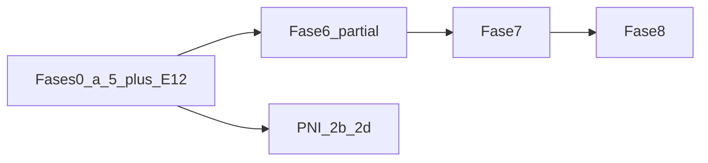

# CidadãoBR Saúde — Status e próximos passos (jun/2026)

**Plano mestre:** [padrão_ledi_e-sus_4f004208.plan.md](../padrão_ledi_e-sus_4f004208.plan.md)  
**Roteiro organizado (fases × épicos × tasks):** [roteiro-organizado-fases-epicos.md](../roteiro-organizado-fases-epicos.md)  
**EPIC-00 — volta aos trilhos:** [epic-00-remediation.md](../epic-00-remediation.md) + [ADR-0006](../adr/0006-platform-write-contract.md)
**Decisão PO:** [roadmap-decision-fase5.md](roadmap-decision-fase5.md) — Opção A (Fase 5 antes de mobile/Fase 6)  
**Última revisão:** jun/2026 — EPIC-12 gate fechado ([ADR-0004](../adr/0004-reference-data-sources.md)); Fase 6 MVP em curso.

---

## 1. Resumo executivo

| Fase | Status | Gate |
|------|--------|------|
| **0–2** | Concluída | RLS, CQRS, Kafka, LEDI core, ops web |
| **3** | **Concluída** | EPIC-03 `done`; EPIC-04 API TASK-04-01..05 + OpenAPI — **Flutter = Fase 8** |
| **4** | Concluída | 17 indicadores, painel, gaps; repasse **ilustrativo** ([ADR-0003](../adr/0003-epic05-mvp-scope.md)) |
| **4b** | **Concluída (gate)** | 53/53 BPs; C2.E PNI 2026 ([ADR-0009](../adr/0009-pni-calendar-reference.md)) |
| **5** | **Concluída (gate técnico)** | EPIC-06/07; RSpec/E2E; UI gestor = checklist prefeitura |
| **12** | **Concluída (gate)** | `Reference::Gate`, `bin/ci_reference_gate`, `/reference/*` + OpenAPI |
| **6** | **Parcial (MVP)** | PEC command, shared care web, walk-in+relatório, APIs panic/tele/meds |
| **7–8** | Pendente | Flutter só Fase 8 |

---

## 2. Fase 4b — o que está feito e o residual

**EPIC-05b / TASK-05-08:** concluídos para gate (packs Portaria 3493, DSL v1, vínculo MICI/MICDT, V_SAT, matriz de cobertura).

| Item | Status | Bloqueia fase? |
|------|--------|----------------|
| 53 BPs na [matriz](../indicators/methodology-coverage-matrix.md) | `done` | — |
| **C2.E** vacinação calendário | **`done`** — Onda 2a PNI 2026 | — |
| `mici_complete?` | Exige FCI LEDI válido no tenant | Operacional no piloto (dados), não código 4b |

**C2.E hoje:** `lib/indicators/pni_schedule_evaluator.rb` + `pni_schedule_entries`. Export: `bin/rails reference:pni:sync` → JSON em `lib/reference/pni/2026/` (**gitignore**).

**PNI 2b–2d:** definições Ruby adicionadas (`child_2_9`, `pregnant`, `adolescent`, `adult`, `elderly`); sincronizar com `reference:pni:sync`.

---

## 3. EPIC-12 — gate fechado

- [ADR-0004](../adr/0004-reference-data-sources.md) — fixture-first CI, jobs via `CommandBus`
- `bin/ci_reference_gate` — import → catalog → publish → manifest
- API `/api/v1/reference/*` + autocompletes web (TASK-12-07)
- Stretch: parser UFSC live + download DATASUS (não bloqueia F6)

---

## 4. Fase 5 — status e gate

Gate técnico fechado. **Piloto UI:** [piloto-validacao-tecnica.md](piloto-validacao-tecnica.md) — F5-1..F6 em `bin/dev` (opcional antes de prefeitura).

---

## 5. Próximos passos (ordem)

### Prioridade 1 — Fase 6 (EPIC-09/10)

- PEC produção real (sair de stub controlado)
- TASK-09-09 regras eSB/eMulti
- Polish walk-in + FCC web
- OpenAPI citizen-plus alinhado a contract spec

### Prioridade 2 — Piloto UI F5 (opcional)

Checklist prefeitura — não bloqueia dev F6.

### Prioridade 3 — PNI live MS

Competências reais + recálculo após release.

### Depois

- **Fase 7** — EPIC-11
- **Fase 8** — Flutter

---

## 6. Referências rápidas

| Documento | Uso |
|-----------|-----|
| [piloto-validacao-tecnica.md](piloto-validacao-tecnica.md) | Piloto F5 + gate EPIC-12 local |
| [methodology-coverage-matrix.md](../indicators/methodology-coverage-matrix.md) | BPs 53/53 + C2.E |
| [cidadaobr-field-mvp-api.md](cidadaobr-field-mvp-api.md) | API Field (Fase 8 prep) |
