# Padrão unificado das fichas e-SUS APS (LEDI)

## Identidade e branding — CidadãoBR

**Decisão de produto:** plataforma guarda-chuva **CidadãoBR**, com vertentes setoriais. Esta implementação é a vertente **CidadãoBR Saúde** (APS municipal, LEDI, indicadores 3.493, web gestão + apps profissional e cidadão).

### Estrutura de marca

| Nível | Nome | Escopo |
|-------|------|--------|
| **Marca mãe** | **CidadãoBR** | Plataforma cidadã municipal multivertente (login único futuro, identidade visual comum) |
| **Vertente atual** | **CidadãoBR Saúde** | SUS/APS: UBS, equipes, LEDI, campanhas, indicadores, portal cidadão |
| **Vertentes planejadas** | CidadãoBR Segurança, CidadãoBR Educação, **CidadãoBR Ouvidoria** | Fora do escopo técnico deste plano; mesma convenção `CidadãoBR {Setor}` |

### Nomes comerciais por canal (CidadãoBR Saúde)

| Canal | Nome do produto (UI / lojas) | Slogan / subtítulo (pt-BR) | Pacote técnico (repo, en-US) |
|-------|------------------------------|----------------------------|------------------------------|
| **Web gestão** | **CidadãoBR Saúde Gestão** | Gestão municipal e UBS | `web` / host `gestao.saude.cidadaobr` (exemplo) |
| **App profissional** | **CidadãoBR Saúde Campo** | Equipes APS, visitas e fichas no território | repo **`cidadaobr-field`** (`field_app` no código) |
| **App cidadão** | **CidadãoBR Saúde** | Minha UBS no celular | repo **`cidadaobr-citizen`** (`citizen_app` no código) |

**Por que estes nomes:** distinguem os três binários nas lojas e no desktop (Gestão ≠ Campo ≠ app cidadão), mantêm **Saúde** na vertente e evitam três apps idênticos chamados só “CidadãoBR Saúde”. O app do cidadão pode usar o nome curto **CidadãoBR Saúde** por ser o face da vertente para o público.

**Alternativas aceitáveis** (se preferir tom mais institucional):

| Canal | Alternativa A | Alternativa B |
|-------|---------------|---------------|
| Web | CidadãoBR Saúde **Rede** | CidadãoBR Saúde **Console** |
| Campo | CidadãoBR Saúde **Equipe** | CidadãoBR Saúde **Profissional** |
| Cidadão | **CidadãoBR Minha Saúde** | CidadãoBR Saúde **Cidadão** |

**Recomendação:** adotar tabela principal (Gestão / Campo / Saúde); usar “UBS no celular” apenas como **slogan**, não como nome de produto.

**Backlog:** épicos, histórias, tasks e subtasks usam o mesmo prefixo de canal — ver [Nomenclatura do backlog](#nomenclatura-do-backlog-cidadaobr-saúde) no roteiro de desenvolvimento.

### Vertentes futuras — adequação dos nomes

| Nome proposto | Adequação | Observação |
|---------------|-----------|------------|
| **CidadãoBR Saúde** | Adequado | Claro, alinhado ao SUS/APS; não conflita com PEC/e-SUS (são sistemas MS, não marcas concorrentes) |
| **CidadãoBR Segurança** | Adequado | Definir escopo (Guarda Civil, defesa civil, ocorrências) para não confundir com Polícia estadual/federal |
| **CidadãoBR Educação** | Adequado | Matrículas, transporte escolar municipal, merenda — padrão prefeitura |
| **CidadãoBR Ouvidoria** | **Adotado** | Ouvidoria municipal, reclamações, solicitações e participação cidadã — nome descartado: ~~CidadãoBR Manifesto~~ |

### Identidade técnica (não mudar com branding)

| Item | Convenção |
|------|-----------|
| Código, tabelas, eventos Kafka | **en-US** (`citizens`, `field_app`) |
| Labels, relatórios, push | **pt-BR** com nomes comerciais acima |
| `application_name` Rails | `CidadaoBr::Saude` ou módulo `CidadaoBrSaude` |
| Bundle ID Flutter (exemplo) | `br.com.cidadaobr.saude`, `br.com.cidadaobr.saude.campo` |
| API paths | `/api/v1/saude/...` ou namespaces `web`, `field`, `citizen` (interno) |

### Checklist jurídico e go-to-market (pré-lançamento)

- Pesquisa INPI + domínios (`cidadaobr.com.br`, `saude.cidadaobr.gov.br` se B2G)
- Ícones: marca mãe CidadãoBR + selo “Saúde” nas vertentes
- Ficha das lojas: título = nome comercial; descrição menciona prefeitura e UBS

---

## Glossário de siglas e termos

Referência rápida para leitura do plano. **Indicadores de desempenho** = **CVAT** + **V-*** (componente Vínculo) + **C1–C7, B1–B6 e M1–M2** (componente Qualidade) — **17 itens** no catálogo municipal. Siglas **FCI–MCA** são **fichas LEDI**, não indicadores.

### Sistemas, normas e padrões de dados

| Termo | Significado |
|-------|-------------|
| **SUS** | Sistema Único de Saúde — sistema público de saúde do Brasil. |
| **APS** | Atenção Primária à Saúde — porta de entrada do SUS (UBS, ESF, equipes territoriais). |
| **e-SUS APS** | Conjunto de sistemas do Ministério da Saúde para informatizar a APS (PEC, apps, integração). |
| **PEC** | Prontuário Eletrônico do Cidadão — sistema principal onde profissionais registram atendimentos na UBS. |
| **LEDI** | **L**ayout **e**-**SUS** para troca de **D**ados de **I**nteroperabilidade — padrão oficial (campos, tipos, regras) para **enviar** fichas de sistemas de terceiros ao e-SUS/PEC. É a “gramática” dos arquivos `.esus`. |
| **CDS** | Coleta de Dados Simplificada — módulo/forma de registro (ex.: visita domiciliar pelo app Território). |
| **SIAPS** | Sistema de Informação em APS — onde o MS consolida dados e calcula indicadores oficiais. |
| **SCNES** | Sistema de Cadastro Nacional de Estabelecimentos de Saúde — cadastro de UBS, CNES, equipes. |
| **Thrift** | Formato binário de serialização usado dentro do arquivo `.esus` (protocolo Apache Thrift). |
| **Portaria GM/MS 3.493/2024** | Norma que define o **novo financiamento federal** da APS (fixo, vínculo, qualidade). |

### Equipes e estratégias (quem recebe repasse por desempenho)

| Sigla | Significado |
|-------|-------------|
| **ESF** | Estratégia Saúde da Família — modelo de APS territorial. |
| **eSF** | **E**quipe de **S**aúde da **F**amília — médico, enfermeiro, ACS etc. vinculados a um território (INE). |
| **eAP** | **E**quipe de **A**tenção **P**rimária — modelo alternativo/complementar de equipe na APS. |
| **eSB** | **E**quipe de **S**aúde **B**ucal — dentistas na UBS. |
| **eMulti** | **E**quipe **Multi**profissional — nutricionista, fisio, psicólogo etc. |
| **ACS** | Agente Comunitário de Saúde — atua no território e em visitas domiciliares. |
| **UVZ** | Unidade de Vigilância de Zoonoses — UBS/SUS para vacinação animal e controle de zoonoses. |
| **SI-PNI** | Sistema de Informação do Programa Nacional de Imunizações — destino oficial das doses **humanas** (FV). |
| **SinPatinhas** | Sistema MS de registro de animais domésticos e vacinação veterinária (integração futura). |

### Siglas das 13 fichas LEDI (tipos de registro clínico/cadastral)

Cada sigla é um **tipo de ficha** (um formulário digital com campos definidos no dicionário LEDI).

| Sigla | Nome completo | O que registra |
|-------|---------------|----------------|
| **FCI** | Ficha de **C**adastro **I**ndividual | Dados do cidadão: saúde, sociais, identificação. |
| **FCD** | Ficha de **C**adastro **D**omiciliar e Territorial | Casa, famílias, condições do domicílio. |
| **FAI** | Ficha de **A**tendimento **I**ndividual | Consulta/atendimento clínico (médico/enfermeiro). |
| **FAO** | Ficha de **A**tendimento **O**dontológico | Atendimento odontológico. |
| **FAC** | Ficha de **A**tividade **C**oletiva | Reunião, grupo, ação coletiva na comunidade/escola. |
| **FP** | Ficha de **P**rocedimentos | Procedimentos e aferições (PA, glicemia, curativo…). |
| **FV** | Ficha de **V**acinação | Vacinas aplicadas. |
| **FVD** | Ficha de **V**isita **D**omiciliar e Territorial | Visita do ACS/enfermeiro ao domicílio. |
| **FAD** | Ficha de **A**tendimento **D**omiciliar | Atendimento em casa (atenção domiciliar / AD). |
| **FAE** | Ficha de **A**valiação de **E**legibilidade | Se o cidadão pode entrar em atenção domiciliar (AD). |
| **FCZM** | Ficha **C**omplementar **Z**ika/**M**icrocefalia | Triagens em bebês (olhinho, orelhinha, exames). |
| **FCC** | Ficha de **C**uidado **C**ompartilhado | Evolução de caso compartilhado entre profissionais/equipes. |
| **MCA** | **M**arcadores de **C**onsumo **A**limentar | Questionário de alimentação (crianças/adultos). |

### Catálogo de indicadores de desempenho (o que o município precisa enxergar)

A aplicação deve **definir e versionar todos os indicadores** em `indicator_catalog` (Portaria 3.493 + Portaria SAPS/MS 161/2024 + Notas Metodológicas MS) e mostrar, por **município / INE / cidadão**:

- **Quantos indicadores existem** no cofinanciamento por desempenho (não confundir com componente **Fixo**, que depende só do **IED**).
- **Quantos o município (ou cada equipe) está atendendo** — score, classificação (ótimo / bom / suficiente / regular) e **gaps** (`citizen_indicator_gaps`).

**Contagem oficial para o painel gestor:**

| Grupo | Códigos no catálogo | Qtd. | Componente de repasse |
|-------|---------------------|------|-------------------------|
| Vínculo e acompanhamento territorial | **CVAT**, **V-CAD**, **V-ACOMP**, **V-SAT** | 4 | Componente II (Vínculo) |
| Qualidade — linhas eSF/eAP | **C1**–**C7** | 7 | Componente III (Qualidade) |
| Qualidade — saúde bucal | **B1**–**B6** | 6 | Componente III (Qualidade) |
| Qualidade — eMulti | **M1**, **M2** | 2 | Componente III (Qualidade) |
| **Total indicadores de desempenho** | | **17** | Vínculo + Qualidade |

Cada indicador de qualidade desdobra em **boas práticas (BP A, B, C…)** em `indicator_rules` — são os itens que geram pendência por cidadão. O **CVAT** é o escore agregado (0–10); **V-CAD** e **V-ACOMP** são as dimensões que o MS soma; **V-SAT** é bônus de satisfação.

**O que não entra como “indicador de desempenho” no painel:** **Componente fixo** (valor por **IED** do município) e **recurso de implantação** (parcela única para equipe nova). Continuam no módulo financeiro, mas sem numerador/denominador por cidadão.

---

### Componente II — Vínculo e acompanhamento territorial (códigos **CVAT**, **V-***)

**Não usa prefixo “C”.** É o **Componente II** da Portaria 3.493/2024; metodologia detalhada na **Portaria SAPS/MS nº 161/2024** e **Nota Técnica nº 30/2025** (CVAT). Avalia **eSF** e **eAP**; repasse por classificação da equipe a partir de **maio/2025** (1º quadrimestre 2025 como avaliação; monitoramento em janela de **24 meses** para cadastro).

| Código catálogo | Nome | Peso no escore | O que mede | Fichas LEDI principais |
|-----------------|------|----------------|------------|------------------------|
| **CVAT** | Vínculo e acompanhamento territorial (agregado) | 100% (0–10 pts) | Soma **V-CAD** + **V-ACOMP** + efeito **V-SAT** | — (derivado) |
| **V-CAD** | Dimensão Cadastro | 30% (até 3,0 pts) | Qualidade e atualização do cadastro da população vinculada | **FCI**, **FCD** |
| **V-ACOMP** | Dimensão Acompanhamento | 70% (até 7,0 pts) | Continuidade do cuidado (contatos assistenciais) | **FAI**, **FAO**, **FP**, **FVD**, **FAC**, **FV**, **MCA** |
| **V-SAT** | Satisfação do usuário (bônus) | Bônus no quadrimestre | Maior nota de satisfação entre os meses do quadrimestre | Pesquisa MS (fora LEDI; conciliação futura) |

**Critérios transversais do CVAT** (ponderam dentro de V-CAD e V-ACOMP):

| Critério | População-alvo | Onde registrar (LEDI) |
|----------|----------------|------------------------|
| Vulnerabilidade **PBF** | Beneficiário Bolsa Família | **FCI** — informações socioeconômicas |
| Vulnerabilidade **BPC** | Beneficiário BPC | **FCI** |
| Faixa etária **menores de 5 anos** | Crianças | **FCI** `dataNascimento` |
| Faixa etária **≥60 anos** | Idosos | **FCI** `dataNascimento` |
| **Vínculo** pessoa–equipe | Adscrição territorial | **FCI** + **FCD** (`microArea`, **INE** no `headerTransport`) |

**Definições operacionais (MS → regras no motor):**

| Conceito MS | Código regra sugerido | Definição | Impacto |
|-------------|----------------------|-----------|---------|
| Cadastro **atualizado** | V-CAD-ATU | **MICI** válido no Sisab, revisado nos últimos **24 meses** | **V-CAD** |
| Cadastro **completo** | V-CAD-COM | **MICI** + **MICDT** (FCI + FCD) válidos | **V-CAD** |
| Pessoa **acompanhada** | V-ACOMP-12M | **Mais de 1 contato** com profissional (eSF, eAP, eSB, eMulti) em **12 meses**, sendo ≥1 **atendimento** (individual, coletivo ou domiciliar) | **V-ACOMP** |
| Teto de cadastro | V-LIM-CAD | Se cadastros acima do parâmetro da Portaria 3.493, classificação máxima **“bom”** (não “ótimo”) | **CVAT** |

**MVP — agregação CVAT no motor (`team_score_mode: linkage_aggregate`):** seed usa apenas **V_CAD (0,3)** + **V_ACOMP (0,7)**; **V_SAT** fica fora até EPIC-05. O evaluator renormaliza pela soma dos pesos presentes (`weighted_sum / weight_total`) para manter escala 0–100. Ao incluir **V_SAT**, substituir renormalização por pesos fixos oficiais MS (0,3 / 0,7 + bônus satisfação) em `db/seeds/indicator_catalog.rb` e travar fórmula neste plano.

**Siglas do cadastro no MS (não são fichas LEDI, mas aparecem nas notas):**

| Sigla | Significado |
|-------|-------------|
| **MICI** | Modelo de Informação do **C**adastro **I**ndividual (= **FCI** no e-SUS) |
| **MICDT** | Modelo de Informação do **C**adastro **D**omiciliar e **T**erritorial (= **FCD**) |

**Classificação da equipe (Vínculo e Qualidade):** ótimo → bom → suficiente → regular — define o **valor mensal** do componente (ex.: eSF 40h: até R$ 8.000 vínculo “ótimo” vs R$ 2.000 “regular”, conforme Quadro 1 do FAQ MS).

---

### Componente III — Indicadores de qualidade (C1–C7, B1–B6, M1–M2)

São indicadores **pactuados** com códigos oficiais SAPS em `indicator_catalog.code` (`C1`–`C7`, `B1`–`B6`, `M1`, `M2`). O score costuma ser **% de boas práticas** (ou ratio, no caso de B3) sobre o denominador → classificação do **componente qualidade** da equipe.

**Notas Metodológicas no site SAPS:** **C1–C7** têm PDFs nomeados **Nota Metodológica C1…C7** na [página eSF/eAP](https://www.gov.br/saude/pt-br/composicao/saps/publicacoes/fichas-tecnicas/equipe-de-atencao-primaria-e-saude-da-familia). Os indicadores de **saúde bucal** usam códigos **B1–B6** na [página eSB](https://www.gov.br/saude/pt-br/composicao/saps/publicacoes/fichas-tecnicas/equipe-de-saude-bucal); **eMulti** usa **M1–M2** na [página eMulti](https://www.gov.br/saude/pt-br/composicao/saps/publicacoes/fichas-tecnicas/equipes-multiprofissionais-emulti). Em `indicator_rules.expression` (ou pack em `lib/indicators/methodology/3493-2024/packs/`), usar o mesmo código da nota e `source_ref` com URL do PDF SAPS.

| Código | Nome completo | Equipe | BPs (qtd.) | Denominador (resumo) | Fichas LEDI |
|--------|---------------|--------|------------|----------------------|-------------|
| **C1** | Mais acesso à APS | eSF, eAP | conceito programado/espontâneo | Atendimentos da equipe no período | **FAI**, **FP** |
| **C2** | Cuidado no desenvolvimento infantil | eSF, eAP | A–E (+ MCA apoio) | Crianças **0–2 anos** vinculadas | **FAI**, **FVD**, **FV**, **FAC**, **MCA** |
| **C3** | Cuidado da gestante e puérpera | eSF, eAP | A–K | Gestantes/puérperas ativas | **FAI**, **FVD**, **FV**, **FAO**, **FCI** |
| **C4** | Cuidado da pessoa com diabetes | eSF, eAP | A–F | Diabetes (CIAP T89/T90, CID E10–E14, FCI) | **FAI**, **FP**, **FVD** |
| **C5** | Cuidado da pessoa com hipertensão | eSF, eAP | A–D | HAS (CIAP K86/K87, CID I10–I15, FCI) | **FAI**, **FP**, **FVD** |
| **C6** | Cuidado da pessoa idosa | eSF, eAP | A–D | **≥60 anos** com condição avaliada | **FAI**, **FP**, **FVD**, **FV**, **FAD** |
| **C7** | Cuidado da mulher na prevenção do câncer | eSF, eAP | rastreamento colo/mama, HPV | Mulheres na faixa etária da nota | **FAI**, **FP**, **FV** |
| **B1** | 1ª consulta odontológica programada | eSB | — | Usuários odonto (1ª consulta programática) | **FAO** |
| **B2** | Tratamento odontológico concluído | eSB | — | Usuários em tratamento | **FAO** |
| **B3** | Taxa de exodontias | eSB | — | Procedimentos odontológicos (ratio extrações) | **FAO** |
| **B4** | Escovação dental supervisionada | eSB | — | Ações de escovação | **FAC**, **FAO** |
| **B5** | Procedimentos odontológicos preventivos | eSB | — | Procedimentos preventivos | **FAO** |
| **B6** | TRA (tratamento restaurador atraumático) | eSB | — | Procedimentos TRA (SIGTAP) | **FAO** |
| **M1** | Média de atendimentos eMulti por pessoa | eMulti | — | População adscrita × atendimentos eMulti | **FAC**, **FAI**, **FAO** |
| **M2** | Ações interprofissionais realizadas pela eMulti | eMulti | — | Ações interprofissionais no território | **FAC**, **FCC** |

**Periodicidade:** indicadores de **qualidade** fecham por **quadrimestre** (repasse no quadrimestre seguinte). **Vínculo** usa média mensal das dimensões no quadrimestre avaliado.

---

### Componentes do financiamento (Portaria 3.493)

| Termo | Significado |
|-------|-------------|
| **Piso da APS** | Repasse federal mínimo de referência para custear APS no município. |
| **Cofinanciamento federal** | Dinheiro que a União repassa ao município para APS (não é o único recurso municipal). |
| **Componente fixo** | Valor mensal por equipe conforme **IED** (índice do município). |
| **Componente vínculo (II)** | Pagamento por **CVAT** — escore 0–10 (**V-CAD** 30% + **V-ACOMP** 70% + **V-SAT**). Fichas: **FCI**, **FCD** + atendimentos que contam acompanhamento. |
| **Componente qualidade (III)** | Pagamento por desempenho nos **17 indicadores catalogados** (**C1–C7, B1–B6 e M1–M2** + dimensões **V-*** quando exibidas no mesmo painel). |
| **IED** | Índice de Equidade e Dimensionamento — classifica o município para o componente fixo. |
| **Quadrimestre** | Período de ~4 meses usado para fechar e pagar indicadores de qualidade. |
| **INE** | Identificador Nacional de **E**quipes — código da equipe no CNES (10 dígitos). |
| **Classificação da equipe** | Faixa de desempenho (ex.: ótimo, bom, suficiente, regular) que define quanto a equipe recebe no componente qualidade/vínculo. |

### Identificadores de pessoas, lugares e registros

| Sigla | Significado |
|-------|-------------|
| **CNES** | Cadastro Nacional de Estabelecimentos de Saúde — código da **UBS/unidade** (7 dígitos). |
| **IBGE** | Código do **município** (7 dígitos). |
| **CNS** | Cartão Nacional de Saúde — identificador do cidadão ou profissional (15 dígitos). |
| **CPF** | Identificador do cidadão (11 dígitos); na LEDI, CNS **ou** CPF (não os dois). |
| **CBO** | Classificação Brasileira de Ocupações — código da profissão (médico, enfermeiro…). |
| **CID-10** / **CID10** | Classificação Internacional de Doenças — diagnóstico (ex.: diabetes E10). |
| **CIAP-2** / **CIAP** | Classificação Internacional de Atenção Primária — motivo/problema na APS (ex.: W78 gravidez, T90 diabetes). |
| **SIGTAP** | Tabela nacional de **procedimentos** do SUS (códigos de consulta, exame, curativo). |
| **UUID** | Identificador único da ficha no banco nacional (evita duplicar registro). |
| **DUM** | Data da Última Menstruação — usada na gestação (FAI). |
| **IVCF-20** | Índice de Vulnerabilidade Clínico-Funcional — avaliação em idosos (FP, FVD). |

### Termos técnicos do padrão LEDI (estrutura dos arquivos)

| Termo | Significado |
|-------|-------------|
| **Lote** | Conjunto de vários arquivos `.esus` enviados juntos. |
| **Arquivo `.esus`** | Um arquivo compactado = em geral **uma ficha** serializada. |
| **DadoTransporte** | “Envelope” padrão de **todas** as fichas: CNES, IBGE, tipo, blob binário, remetente. |
| **dadoSerializado** | Conteúdo binário **dentro** do envelope — a ficha propriamente dita (FCI, FAI…). |
| **tipoDadoSerializado** | Número que diz **qual tipo** de ficha está no blob (FCI vs FAI vs FP…). |
| **headerTransport** | Cabeçalho com **profissional**, CBO, CNES, INE, **data do atendimento**. |
| **UnicaLotacaoHeader** | Um profissional principal no cabeçalho (maioria das fichas). |
| **VariasLotacoesHeader** | Profissional principal + opcional auxiliar (FAI, FAO, FAD, FAE). |
| **Master + Child** | Padrão “capa do dia” (Master) + vários atendimentos na lista (Child) — ex. FAI, FP. |
| **tpCdsOrigem** | Origem do dado; valor **3** = sistema de terceiros (seu software). |
| **Payload / payload_json** | Conteúdo da ficha depois de convertido de Thrift para JSON no seu banco. |

### Boas práticas e gestão (usados nas tabelas de indicadores)

| Termo | Significado |
|-------|-------------|
| **BP A, B, C…** | **B**oa **P**rática — item checklist do indicador (ex.: C4-B = aferir PA no diabético). |
| **Numerador** | Quantidade de pessoas que **cumpriram** a boa prática. |
| **Denominador** | Total de pessoas que **deveriam** cumprir (ex.: todos diabéticos da equipe). |
| **Gap** | Pendência: cidadão no denominador que **ainda não** cumpriu uma boa prática. |
| **Agendamento programado** | Consulta marcada na UBS (`appointments.kind: scheduled`) — alimenta numerador **C1**. |
| **Walk-in / encaixe** | Atendimento espontâneo (`appointments.kind: walk_in`) — acolhimento sem hora prévia. |
| **Multirão** | Ação territorial em massa (vacinação, procedimentos, cadastro) — executada no **Flutter**. |
| **Dia D** | Data focal da campanha com meta de cobertura do público-alvo no território. |
| **Acamado** | Cidadão domiciliado com atendimento em casa — fluxo **FVD** + **FAD** (+ **FAE** se AD). |
| **Público-alvo** | Critérios definidos pelo gestor; backend levanta em `campaign_targets`. |
| **Roteiro domiciliar** | `visit_routes` + `visit_route_stops` ordenados 1..N por equipe/profissional. |
| **Condomínio / prédio** | `residential_buildings` — visão agregada de visitas por edifício. |
| **Provisionamento de rota** | `visit_route_provisionings` — kit imunobiológicos + insumos UBS atrelado ao roteiro. |
| **Romaneio de equipe** | `team_supply_dispatches` — saída física do estoque para o dia de campo. |
| **Botão de pânico** | Alerta de emergência do cidadão (`panic_alerts`) — protocolo municipal/SAMU. |
| **Teleconsulta** | Consulta com `modality: telehealth` — sala virtual na hora do agendamento. |
| **AD** | Atenção Domiciliar — cuidado em casa (modalidades AD1, AD2, AD3). |
| **EMAD** | Equipe de atenção domiciliar (vinculada à FAE). |

### Stack do projeto (siglas da sua arquitetura)

| Sigla | Significado |
|-------|-------------|
| **API** | Interface HTTP (JSON) para Flutter e integrações. |
| **Kafka** | Barramento de **integração** entre bounded contexts e replay de streams. |
| **Karafka** | Biblioteca Ruby para consumir/publicar no Kafka. |
| **Hotwire** | Turbo + Stimulus no Rails (web reativa sem SPA pesado). |
| **Stimulus** | JavaScript leve no Rails para interatividade da web. |
| **CidadãoBR Saúde Campo** | App profissional (Flutter `field_app`) — multirão, dia D, acamados, 13 fichas LEDI. |
| **CidadãoBR Saúde** | App do cidadão (Flutter `citizen_app`) — slogan “Minha UBS no celular”. |
| **CidadãoBR Saúde Gestão** | Web Hotwire — gestão prefeitura/UBS (indicadores, campanhas, agenda). |
| **UBS digital** | Experiência do cidadão via **CidadãoBR Saúde** integrada à UBS municipal (CNES, equipe, estoque). |
| **JSONB** | Tipo do PostgreSQL para guardar JSON indexável (payload da ficha). |
| **EDA** | **E**vent-**D**riven **A**rchitecture — fluxos reagem a eventos de domínio. |
| **ES** | **E**vent **S**ourcing — estado derivado de sequência imutável de eventos. |
| **CQRS** | Separação explícita de **comandos** (escrita) e **consultas** (leitura/projeções). |

### Relação mental rápida (para não confundir)

```
LEDI        →  COMO os dados devem ser formatados para o governo
FCI/FCD     →  Cadastro (alimenta V-CAD / vínculo)
FAI/FAO/…   →  Atendimentos (alimentam V-ACOMP e C1–C7, B1–B6 e M1–M2)
CVAT/V-*    →  Componente Vínculo (sem prefixo C)
C1–C7, B1–B6 e M1–M2      →  Componente Qualidade
indicator_catalog →  Os 17 indicadores que o município “atende ou não”
citizen_indicator_gaps →  Pendência por cidadão (BP ou V-CAD-COM, etc.)
INE/CNES    →  QUEM (equipe / UBS) recebe ou perde repasse
```

---

## Índice do plano (navegação para agentes)

| Seção | Conteúdo |
|-------|----------|
| [Glossário](#glossário-de-siglas-e-termos) | Siglas LEDI, indicadores CVAT/C1–C7, B1–B6 e M1–M2, stack |
| [Roteiro por etapas](#roteiro-de-desenvolvimento-por-etapas-para-agentes) | Épicos → Tarefas → Subtarefas (export Scrum/Kanban) |
| [Backlog CSV](#formato-de-exportação-para-scrumkanban) | Colunas para Jira, Linear, Azure Boards, Trello |
| [Modelo de banco A–L](#modelo-de-banco-recomendado-operacional--ledi) | Tabelas en-US por grupo (incl. roteiro domiciliar L) |
| [Financiamento / indicadores](#financiamento-aps-e-metas-municipais-portaria-gmms-nº-34932024) | Co-relação ficha ↔ BP ↔ repasse |
| [Stack + 3 canais](#stack-técnica-rails-8--postgresql-18) | Rails, Kafka, Web, Flutter Field, Flutter Citizen |
| [Repositórios Git](#repositórios-git-decisão-opção-a) | Polyrepo: `cidadaobr` (F0–7) + Flutter repos na **Fase 8** |
| [Roteiro imediato S1–S7](#roteiro-de-execução-imediato-sprints-17) | Ordem de trabalho para iniciar agora |
| [Roteiro de continuação S10+](#roteiro-de-continuação-s10) | Próximos passos: Fase 5 → EPIC-12 → Fase 6 |
| [Referências LEDI](#referências-rápidas-por-ficha-ledi) | Links dicionários UFSC |

**Regra para agentes:** não implementar feature de fase N+1 sem concluir dependências da fase N (ver coluna `depends_on` no roteiro). **Não** criar `apps/citizen_app` ou `apps/field_app` dentro do repo `cidadaobr` — apps Flutter vivem em repositórios irmãos (ver seção Repositórios Git).

---

## Repositórios Git (decisão: Opção A)

**Decisão:** polyrepo — cada artefato deployável no seu próprio repositório Git. O backend Rails **não** hospeda código Flutter.

Slugs de repositório **sem** o termo `saude` (a vertente continua no produto **CidadãoBR Saúde**, em labels e Bundle ID).

| Repositório | Conteúdo | Quando |
|-------------|----------|--------|
| **`cidadaobr`** | API Rails 8, web gestão (Hotwire), Karafka, LEDI, indicadores; contrato em `doc/api/openapi.v1.yaml` | Fases 0–7 |
| **`cidadaobr-mobile-shared`** | Pacotes Dart compartilhados — ver [Para que serve mobile-shared](#para-que-serve-cidadaobr-mobile-shared) | **Fase 8** (antes dos dois apps) |
| **`cidadaobr-citizen`** | App Flutter cidadão (TASK-04-06/07 + EPIC-10 UI) | **Fase 8** |
| **`cidadaobr-field`** | App Flutter profissional (EPIC-08 + FIELD-* de EPIC-09) | **Fase 8** |

### Para que serve `cidadaobr-mobile-shared`

Repositório de **pacotes Dart**, não um app instalável. Evita duplicar código entre Citizen e Field:

| Pacote (planejado) | Função |
|--------------------|--------|
| `api_client` | Cliente HTTP gerado a partir de `doc/api/openapi.v1.yaml` (SSOT no repo Rails) |
| `auth` | Login, refresh JWT, armazenamento seguro de token |
| `design_tokens` | Cores, tipografia e componentes base CidadãoBR (futuro) |

Citizen e Field **dependem** deste repo como path/git dependency; releases mobile pinam tag OpenAPI (`openapi-x.y.z`). Ver [ADR-0002](docs/adr/0002-multi-repo-mobile-and-api-contracts.md).

**Decisão (2026-05-29):** apps Flutter **não** entram nas fases de web/API (3–7). Piloto e operação municipal usam **web gestão** até Fase 8; APIs `/api/v1/citizen` e `/api/v1/field` ficam prontas antes, para testes via OpenAPI/Postman.

**Layout local típico** (vários clones, mesmo diretório pai):

```text
~/Development/Projects/
  cidadaobr/
  cidadaobr-citizen/
  cidadaobr-field/
  cidadaobr-mobile-shared/
```

**Versionamento:** OpenAPI no repo `cidadaobr` com tags `openapi-x.y.z`; apps mobile pinam versão do client em `cidadaobr-mobile-shared`. Breaking na API → `/api/v2/` + changelog.

**ADR:** [docs/adr/0002-multi-repo-mobile-and-api-contracts.md](docs/adr/0002-multi-repo-mobile-and-api-contracts.md).

**Descartado:** monorepo Flutter dentro de `cidadaobr` (`apps/field_app`, `apps/citizen_app`); renomear API para `cidadaobr-saude-api`.

---

## Roteiro de execução imediato (Sprints 1–7)

Ponto de partida para o time. Detalhe tarefa a tarefa no plano de execução do Cursor; aqui o mapa resumido.

| Sprint | O quê | Onde |
|--------|-------|------|
| **1** | Plano = verdade (YAML, checklist, status EPIC/TASK-05) | `cidadaobr` / `docs/` |
| **2** | Specs RLS + cross-UBS (F0/F2) | `cidadaobr` / `spec/` |
| **3** | `MarkAppointmentNoShow` + UI recepção | `cidadaobr` |
| **4** | ADR-0002 + `doc/api/openapi.v1.yaml` | `cidadaobr` |
| **5** | *(adiado — Fase 8)* OpenAPI estável + script `doc/mobile/bootstrap_sibling_repos.sh` | repos Flutter na Fase 8 |
| **6** | Motor indicadores (C2, CVAT, V_SAT, recálculo) | `cidadaobr` |
| **7** | Painel X/17, gaps, projeção repasse | `cidadaobr` |

**Regra:** Sprint 1 obrigatório antes de feature nova. **Gate Fase 5:** Sprints 1–7 + `phase-4-indicators` completed.

**Paralelo (2 pessoas):** após Sprint 2 — A: 3→4 (agenda + OpenAPI); B: 6→7 (indicadores). **Mobile (ex-Sprint 5) = Fase 8**, após Fases 5–7.

**Trilha paralela S8–S9 (dados de referência):** pode rodar **em paralelo** a EPIC-06/07 — ver [EPIC-12](#epic-12--cidadãobr-saúde--dados-de-referência-msledi). **Gate Fase 6 clínica:** EPIC-12 concluído antes de EPIC-09 (walk-in web + validação combos).

| Sprint | O quê | Onde |
|--------|-------|------|
| **8** | Schema grupo M + import UFSC (fixtures CI) + `LediCatalogSyncJob` | `cidadaobr` |
| **9** | SIGTAP + `PublishReferenceReleaseJob` + `recurring.yml` + API `/reference/*` | `cidadaobr` |

---

## Status do repositório (2026-05-30)

Atualizar ao fechar cada sprint do [roteiro imediato](#roteiro-de-execução-imediato-sprints-17).

**Commit de referência:** `main` @ `8725e29` — metodologia Portaria 3493 (EPIC-05b).

### Superfície por fase (regra mobile)

| Fases | Superfície | Flutter |
|-------|------------|---------|
| **0–7** | Monólito Rails + **web gestão** + APIs JSON (`/api/v1/citizen`, `/api/v1/field`) | **Não** — nenhuma task de Fase 2–7 exige app mobile |
| **8** | Repos `cidadaobr-mobile-shared`, `cidadaobr-citizen`, `cidadaobr-field` | **Sim** — TASK-04-06/07, EPIC-08, EPIC-10 UI |

Sprint 5 (bootstrap repos Flutter) foi **adiado para Fase 8**. Histórias EPIC-04 que mencionam “celular” referem-se à **API Fase 3** (testável via OpenAPI/Postman) até o app existir.

### Roteiro imediato S1–S7

| Sprint | Status | Nota |
|--------|--------|------|
| S1 | Concluído | Plano + checklist + ADR-0003 |
| S2 | Concluído | Specs cross-UBS + consumer tenant |
| S3 | Concluído | `MarkAppointmentNoShow`, recepção, relatório `utilization` |
| S4 | Concluído | ADR-0002 + `doc/api/openapi.v1.yaml` |
| S5 | Adiado → Fase 8 | Script bootstrap repos; apps Flutter fora do roteiro web |
| S6 | Concluído (MVP) | DSL C1–C7 + V_* + CVAT; Kafka `appointment.noshow` |
| S7 | Concluído (MVP) | Painel X/N, ranking equipes, gaps por indicador, projeção ilustrativa |
| S7b | Concluído | EPIC-05b — 48 packs, `MethodologyPackLoader`, DSL C2–C7 BPs, ADR-0005, matriz ~68% `done` |
| S7c | Concluído | EPIC-05b gate — 12 BPs fechados; matriz **48/53 `done` (~90,6%)**; V_SAT `external`; TASK-05-08 Done |
| S8 | Pendente | EPIC-12 — schema M + import UFSC + `LediCatalogSyncJob` |
| S9 | Pendente | EPIC-12 — SIGTAP + release + `recurring.yml` + API `/reference/*` |

**Gate Fase 5:** `phase-4-indicators` + infra EPIC-05b (packs exportados) concluídos; repasse permanece ilustrativo — [ADR-0003](docs/adr/0003-epic05-mvp-scope.md). Cobertura normativa ≥90% = [ADR-0005](docs/adr/0005-methodology-coverage.md) + [matriz](docs/indicators/methodology-coverage-matrix.md) (EPIC-05b, não bloqueia Fase 5).

**Kafka dev:** `bin/kafka_create_topics` (inclui `appointment.noshow`).

| Épico | Status | Nota |
|-------|--------|------|
| EPIC-00 | Concluído | RLS, CQRS, Kafka, auth |
| EPIC-01 | Concluído (MVP) | LEDI 7.4.0; catálogo seed manual; catálogo automático = **EPIC-12** |
| EPIC-12 | Pendente (S8–S9) | Sync UFSC + SIGTAP → Postgres; **paralelo** EPIC-06/07; gate EPIC-09 |
| EPIC-02 | Concluído | Ops web **only** (Fase 2); cross-UBS reforçado em specs — **sem Flutter** |
| EPIC-03 | Concluído | No-show + relatório ocupação/absenteísmo (web gestão) |
| EPIC-04 | Parcial (API F3) | TASK-04-01..05 na Fase 3; **TASK-04-06/07 = Fase 8** (app Flutter) |
| EPIC-05 | Concluído (MVP F4) | ADR-0003; painel, gaps, DSL piloto; repasse ilustrativo |
| EPIC-05b | Concluído | ADR-0005 gate; 48 packs + resolvers; matriz **48/53 `done` (~90,6%)**; TASK-05-08 Done |
| EPIC-06 | Em andamento (~80%) | Schema I + CRUD estoque/vacina + `ProvisioningValidator`; wizard multi-step pendente |
| EPIC-07 | Em andamento (~55%) | Schema L + rotas MVP + reserve/dispatch commands; mapa/TSP/romaneio UI pendente |
| EPIC-08 | Pendente (Fase 8) | App Campo — após web/API Fases 5–7 |

| Task | Status |
|------|--------|
| TASK-05-01 Schema H | Done |
| TASK-05-02 Seed 17 | Done — loader fino; SOT em `methodology_pack_definitions.rb` |
| TASK-05-03 Motor DSL | Partial — resolvers C2–C7/V_* expandidos; V_SAT real = import externo |
| TASK-05-04 Recálculo Kafka | Done |
| TASK-05-05 WEB-IND-01 | Done (MVP) |
| TASK-05-06 WEB-IND-02 | Done (MVP) |
| TASK-05-07 Projeção repasse | Partial — pesos ilustrativos + disclaimer |
| TASK-05-08 Cobertura BPs | **Done** — gate ADR-0005 (48/53 `done`); onda 2: CVAT mensal, C2-E, C7-B/C, import V_SAT ([matriz](docs/indicators/methodology-coverage-matrix.md)) |
| TASK-06-01 Schema I | Done |
| TASK-06-02 ProvisioningValidator | Done (MVP) |
| TASK-06-03 WEB-STOCK-01 | Partial — CRUD lotes/produtos |
| TASK-06-04 WEB-CAMP-01 | Partial — CRUD campanha; wizard multi-step pendente |
| TASK-07-01 Schema L | Done |
| TASK-07-02 BuildCampaignTargetList | Done (MVP) |
| TASK-07-03 Preview provisionamento | Partial |
| TASK-07-04 GenerateVisitRoutes | Partial — nearest-neighbor MVP; TSP PostGIS pendente |
| TASK-07-05 ReserveVisitRouteSupplies | Partial — command existe; gate publish + specs E2E pendentes |
| TASK-07-06 WEB-CAMP-06 | Pendente |
| TASK-07-07 DispatchTeamSupplyKit | Partial — command existe; WEB-STOCK-02 romaneio pendente |
| TASK-07-08 WEB-CAMP-03 mapa | Pendente |

---

## Roteiro de continuação (S10+)

**Onde estamos (2026-05-30):** Sprints S1–S7 + S7b + **S7c** concluídos (Fases 0–4 MVP + **Fase 4b gate ADR-0005** em `main`). **Fase 5 em curso** — EPIC-06 ~80% e EPIC-07 ~55% (schema, CRUD, commands reserve/dispatch; mapa, TSP, wizard vacina e romaneio pendentes). EPIC-12 (S8–S9) não iniciado. **Mobile = exclusivamente Fase 8** — nenhuma entrega Flutter nas Fases 2–7.

**Objetivo imediato:** fechar **Gate Fase 5** (campanha domiciliar operável na web gestão) e, em paralelo opcional, avançar **EPIC-12** antes da Fase 6 clínica.

### Visão por fases

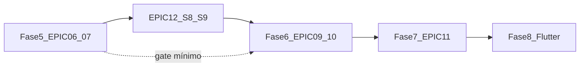

| Fase | Épicos | Gate de saída |
|------|--------|---------------|
| **5 (atual)** | EPIC-06, EPIC-07 | Gestor publica campanha domiciliar → rotas → reserva kit → romaneio; piloto web checklist |
| **1.5 transversal** | EPIC-12 | Release `reference_data_releases` + API `/reference/*` + jobs mensais |
| **6** | EPIC-09, EPIC-10 (API) | Walk-in web, PEC produção, adapters restantes; **requer EPIC-12** |
| **7** | EPIC-11 | IA + conciliação MS |
| **8** | EPIC-04 app, EPIC-08, EPIC-10 UI | `mobile-shared` + Citizen + Field |

### Trilha principal — fechar Fase 5 (prioridade)

Ordem sugerida respeitando `depends_on` e o que falta no repo:

| Ordem | Sprint | Task | Entrega verificável |
|-------|--------|------|---------------------|
| 1 | **S10** | **TASK-07-05** | `ReserveVisitRouteSupplies` + movimentos `stock_movements` tipo `reserve` (FEFO por lote); specs |
| 2 | **S10** | **TASK-07-06** | WEB-CAMP-06 — revisão de provisionamento (override manual, déficit por item) |
| 3 | **S11** | **TASK-07-07** | `DispatchTeamSupplyKit` + WEB-STOCK-02 romaneio/despacho |
| 4 | **S11** | **TASK-07-08** | WEB-CAMP-03 — mapa PostGIS + wizard rotas (Stimulus/Leaflet ou Mapbox) |
| 5 | **S12** | **TASK-07-04** | PostGIS clustering + TSP (substituir nearest-neighbor MVP em `generate_visit_routes.rb`) |
| 6 | **S12** | **TASK-07-09** | WEB-CAMP-04 — progresso por equipe/rota |
| 7 | **S12** | **TASK-06-04** | WEB-CAMP-01 wizard vacinação (multi-step dia D; hoje CRUD único) |
| 8 | **S12** | **TASK-07-03** | Enriquecer preview (base `citizen_count`, tabela déficit SUB-07-03-01) |

**Adiado (Field / Fase 8):** TASK-07-10 visão prédio/condomínio — EPIC-08.

**Gate Fase 5 (checklist):**

- [ ] Campanha domiciliar: público-alvo → rotas publicadas → provisionamento reservado → kit despachado
- [ ] Campanha vacinação: wizard + validação `ProvisioningValidator` end-to-end
- [ ] Request specs verdes: `spec/requests/web/stock_and_campaigns_spec.rb` + novos fluxos reserve/dispatch
- [ ] Atualizar [`docs/commercial/checklist-piloto-prefeitura.md`](docs/commercial/checklist-piloto-prefeitura.md) com fluxo Fase 5
- [ ] EPIC-06 e EPIC-07 marcados concluídos no [checklist executivo](#checklist-por-épico-executivo)

### Trilha paralela — EPIC-12 (S8–S9, pode intercalar)

Rodar **entre S10–S12** se houver capacidade (1 dev part-time) ou **bloquear antes de S13** (Fase 6):

| Sprint | Tasks | Entrega |
|--------|-------|---------|
| **S8** | TASK-12-01, 12-02, 12-03 | Grupo M + import UFSC + `LediCatalogSyncJob` + fixtures CI |
| **S9** | TASK-12-04, 12-05, 12-06 | SIGTAP + `recurring.yml` + API manifest/domains + Kafka release |

**Gate EPIC-12 obrigatório antes de:** TASK-09-08 (walk-in web) e formulários clínicos com combos.

### Após Fase 5 — Fase 6 (S13–S16)

| Sprint | Foco | Tasks principais |
|--------|------|------------------|
| **S13** | PEC + adapters | TASK-09-01, 09-03 — adapters FAO…FCC; integração PEC produção |
| **S14** | Clínica web | TASK-09-08 walk-in; TASK-12-07 autocompletes CIAP/CID/SIGTAP |
| **S15** | Cuidado compartilhado | TASK-09-02 FCC + `shared_care_cases` |
| **S16** | Cidadão Plus API | TASK-10-01, 10-02 — panic, tele, meds (sem UI Flutter) |

### Backlog técnico transversal (quando couber)

| Item | Épico | Nota |
|------|-------|------|
| TASK-05-08 onda 2 BPs | EPIC-05b | CVAT mensal, C2-E calendário, C7-B/C, import V_SAT — ver [matriz](docs/indicators/methodology-coverage-matrix.md) |
| TASK-05-07 repasse | EPIC-05 | Coeficientes oficiais quando Portaria fechar |
| ADR-0004 | EPIC-12 | Fontes UFSC + DATASUS |
| EPIC-04 API gaps | EPIC-04 | Completar endpoints citizen pendentes do OpenAPI (Fase 3; app Flutter = Fase 8) |

### Alocação sugerida (time pequeno)

| Pessoa | S10–S12 | S13+ |
|--------|---------|------|
| **Dev A** | EPIC-07 reserve → romaneio → mapa | EPIC-09 PEC + walk-in |
| **Dev B (opcional)** | EPIC-12 S8–S9 | EPIC-10 APIs |
| **Solo** | S10→S11→S12 EPIC-07; depois S8→S9 EPIC-12; só então S13 Fase 6 | — |

### Próximo passo concreto (Fase 5)

1. Branch `TASK-07-08/web-camp-map-wizard` (ou TASK-07-06 conforme prioridade PO)
2. Wire E2E: público-alvo → `GenerateVisitRoutes` → publish → `ReserveVisitRouteSupplies` → `DispatchTeamSupplyKit`
3. WEB-CAMP-03 mapa PostGIS + TASK-06-04 wizard vacina multi-step
4. Specs request + atualizar checklist piloto; marcar EPIC-06/07 concluídos no [checklist executivo](#checklist-por-épico-executivo)

**Paralelo opcional:** EPIC-05b onda 2 (CVAT mensal, C2-E, C7-B/C, import V_SAT) ou EPIC-12 S8–S9 antes da Fase 6 clínica.

---

## Conclusão principal

A documentação oficial deixa explícito que **todos os arquivos de dados compartilham a mesma macroestrutura**, independente do tipo de ficha ([Estrutura dos arquivos](https://integracao.esusaps.bridge.ufsc.tech/ledi/documentacao/estrutura_arquivos/index.html)). O padrão não é “13 bancos diferentes”, e sim:

1. **Uma camada de transporte fixa** (`DadoTransporte`)
2. **Um cabeçalho de profissional/lotação reutilizável** (`headerTransport`)
3. **Um payload serializado por tipo** (structs Thrift/XML específicas, com **sub-structs compartilhadas**)

Para escala nacional com operação clínica + envio ao PEC, o desenho recomendado é **híbrido**: envelope/documento para conformidade LEDI + tabelas relacionais só para domínios que você consulta no dia a dia.

**Escopo atual: 13 fichas LEDI** (9 originais + 4 adicionais: FAE, FCZM, FCC, MCA).

**Cliente-alvo:** gestão municipal de saúde — o sistema deve traduzir registros LEDI em **desempenho nos indicadores** que determinam repasse federal ([Portaria GM/MS nº 3.493/2024](https://bvsms.saude.gov.br/bvs/saudelegis/gm/2024/prt3493_11_04_2024.html)).

---

## Arquitetura em 3 camadas (padrão LEDI)

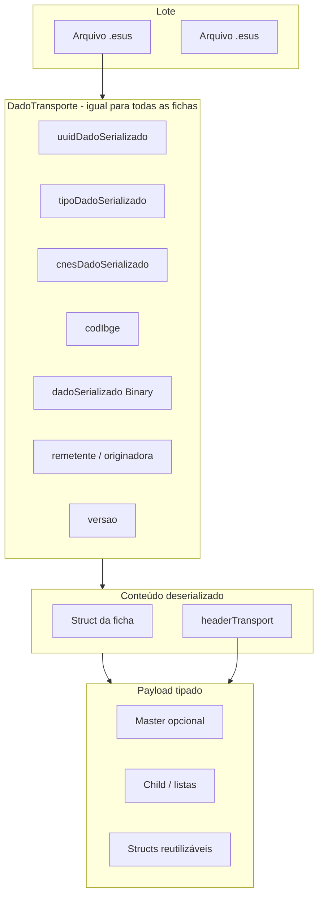

Referência da camada de transporte: [Camada de Transporte de Dados](https://integracao.esusaps.bridge.ufsc.tech/ledi/documentacao/estrutura_arquivos/camada-transporte.html).

| Camada | Struct raiz | Papel |
|--------|-------------|-------|
| Transporte | `DadoTransporte` | Envelope de envio; `tipoDadoSerializado` discrimina o Thrift dentro de `dadoSerializado` |
| Cabeçalho | `UnicaLotacaoHeader` ou `VariasLotacoesHeader` | Profissional, CBO, CNES, INE, `dataAtendimento`, IBGE |
| Ficha | Varia por tipo | Regras de negócio e campos clínicos/cadastrais |

Mapa oficial Thrift/XSD: [Registros Thrift / XSD por ficha](https://integracao.esusaps.bridge.ufsc.tech/ledi/documentacao/thrift-xsd.html).

---

## Quatro arquétipos de ficha (não treze modelos)

### 1. Cadastro monolítico (raiz única)

| Ficha | Struct raiz | Header | Particularidade |
|-------|-------------|--------|-----------------|
| [FCI](https://integracao.esusaps.bridge.ufsc.tech/ledi/documentacao/estrutura_arquivos/dicionario-fci.html) | `CadastroIndividual` | `UnicaLotacaoHeader` | `uuid` + `uuidFichaOriginadora` + recusa |
| [FCD](https://integracao.esusaps.bridge.ufsc.tech/ledi/documentacao/estrutura_arquivos/dicionario-fcd.html) | `CadastroDomiciliar` | `UnicaLotacaoHeader` | `uuid` + famílias + endereço |
| [FAC](https://integracao.esusaps.bridge.ufsc.tech/ledi/documentacao/estrutura_arquivos/dicionario-fac.html) | `FichaAtividadeColetiva` | `UnicaLotacaoHeader` | `uuidFicha`; `tbCdsOrigem` |
| [FAE](https://integracao.esusaps.bridge.ufsc.tech/ledi/documentacao/estrutura_arquivos/dicionario-fae.html) | `FichaAvaliacaoElegibilidade` | `VariasLotacoesHeader` | Elegibilidade AD; CID10; `condicoesAvaliadas` |
| [FCZM](https://integracao.esusaps.bridge.ufsc.tech/ledi/documentacao/estrutura_arquivos/dicionario-fczm.html) | `FichaComplementarZikaMicrocefalia` | `UnicaLotacaoHeader` | Triagens neonatais (par data/resultado) |
| [MCA](https://integracao.esusaps.bridge.ufsc.tech/ledi/documentacao/estrutura_arquivos/dicionario-mca.html) | `FichaConsumoAlimentar` | `UnicaLotacaoHeader` | Questionário por faixa etária (3 listas exclusivas) |

**Metadados comuns (cadastro / monolítico):**
- `uuidFicha` ou `uuid` (identificador nacional)
- `uuidFichaOriginadora` + `fichaAtualizada` — **somente** FCI/FCD
- `tpCdsOrigem` = **3** (sistemas terceiros)
- `headerTransport` — **exceto FCC** (arquétipo 4)
- Marcadores de recusa — FCI/FCD (`statusTermoRecusa*`)

### 2. Master + Child (1 profissional/dia, N atendimentos)

| Ficha | Master | Lista Child (máx. 99 na maioria) | Header |
|-------|--------|----------------------------------|--------|
| [FAI](https://integracao.esusaps.bridge.ufsc.tech/ledi/documentacao/estrutura_arquivos/dicionario-fai.html) | `FichaAtendimentoIndividualMaster` | `atendimentosIndividuais` | `VariasLotacoesHeader` |
| [FAO](https://integracao.esusaps.bridge.ufsc.tech/ledi/documentacao/estrutura_arquivos/dicionario-fao.html) | `FichaAtendimentoOdontologicoMaster` | `atendimentosOdontologicos` | `VariasLotacoesHeader` |
| [FP](https://integracao.esusaps.bridge.ufsc.tech/ledi/documentacao/estrutura_arquivos/dicionario-fp.html) | `FichaProcedimentoMaster` | `atendProcedimentos` | `UnicaLotacaoHeader` |
| [FV](https://integracao.esusaps.bridge.ufsc.tech/ledi/documentacao/estrutura_arquivos/dicionario-fv.html) | `FichaVacinacaoMaster` | `vacinacoes` | `UnicaLotacaoHeader` |
| [FVD](https://integracao.esusaps.bridge.ufsc.tech/ledi/documentacao/estrutura_arquivos/dicionario-fvd.html) | `FichaVisitaDomiciliarMaster` | `visitasDomiciliares` | `UnicaLotacaoHeader` |
| [FAD](https://integracao.esusaps.bridge.ufsc.tech/ledi/documentacao/estrutura_arquivos/dicionario-fad.html) | `FichaAtendimentoDomiciliarMaster` | `atendimentosDomiciliares` | `VariasLotacoesHeader` |

**Metadados comuns (master):**
- `uuidFicha` (identificador nacional da ficha)
- `tpCdsOrigem` = **3**
- `headerTransport`

**Padrão Child (encontro com cidadão)** — repetido com pequenas variações de nome:

| Conceito | Campos típicos |
|----------|----------------|
| Identificação | `cnsCidadao` **ou** `cpfCidadao` (mutuamente exclusivos) |
| Demografia | `dtNascimento` / `dataNascimento`, `sexo` |
| Contexto | `turno`, `localAtendimento` / `localDeAtendimento`, `numProntuario` |
| Janela temporal | `dataHoraInicialAtendimento`, `dataHoraFinalAtendimento` (epoch ms) |

### 3. Cadeia de evolução (caso + eventos sequenciais) — **FCC**

| Ficha | Struct raiz | Identificadores | Profissionais |
|-------|-------------|-----------------|---------------|
| [FCC](https://integracao.esusaps.bridge.ufsc.tech/ledi/documentacao/estrutura_arquivos/dicionario-fcc.html) | `FichaCuidadoCompartilhado` | `uuidCuidadoCompartilhado` (caso) + `uuidEvolucao` (evento) | `LotacaoThrift` — **não usa** `headerTransport` |

Cada arquivo `.esus` representa **uma evolução** do mesmo cuidado compartilhado, não um master com N childs.

**Campos-chave:**
- `coSequencialEvolucao` (1…999) — ordena evoluções do caso
- `dataCriacaoCuidado` — âncora temporal do caso (≥ 01/07/2023)
- `dataEvolucao`, `dataEvolucaoAnterior` (obrigatória se sequencial > 1)
- `solicitante` + `executante` + `lotacaoEvolucao` (objetos `LotacaoThrift`)
- `cid10` **ou** `ciap` (mutuamente complementares)
- `uuidFichaOrigem` + `tpDadoTranspFichaOrigem` — vínculo com ficha que originou o cuidado:

| `tpDadoTranspFichaOrigem` | Ficha de origem |
|---------------------------|-----------------|
| 4 | FAI |
| 5 | FAO |
| 7 | FP |
| 10 | FAD |
| 16 | Cuidado compartilhado (PEC) |

**Modelagem operacional (grupo G):**
- `cuidado_compartilhado` — `uuid_cuidado_compartilhado`, `cidadao_id`, `data_criacao`, `prioridade`, `cid10`/`ciap`, `uuid_ficha_origem`, `tp_ficha_origem`
- `cuidado_compartilhado_evolucao` — `ficha_id`, `co_sequencial`, `data_evolucao`, `conduta`, `lotacao` JSONB
- Índice único: `(uuid_cuidado_compartilhado, co_sequencial_evolucao)`

### 4. Composição por structs reutilizáveis (biblioteca compartilhada)

Estas structs **não são fichas**, mas blocos que aparecem em várias fichas — candidatas a módulos de domínio, não a tabelas “por ficha”:

| Struct | Usada em |
|--------|----------|
| `EnderecoLocalPermanencia` | FCD, **FAE** |
| `IdentificacaoUsuarioCidadao` | FCI |
| `medicoes` | FAI, FAO, FP, FVD |
| `Ivcf` | FP, FVD |
| `ProblemaCondicao` | FAI, FAO, FAD |
| `Medicamentos`, `Encaminhamentos`, `ResultadosExames` | FAI, FAO |
| `VacinaRowThrift` | FV |
| `FamiliaRow`, `CondicaoMoradia` | FCD |
| `ParticipanteRowItem`, `ProfissionalCboRowItem` | FAC |
| `condicoesAvaliadas` (lista 1–24) | **FAE**, **FAD** (mesmos códigos) |
| `LotacaoThrift` | **FCC** (solicitante, executante, evolução) |
| `PerguntaQuestionario*` + enums de resposta | **MCA** |

**Resumo visual dos 13 tipos:**

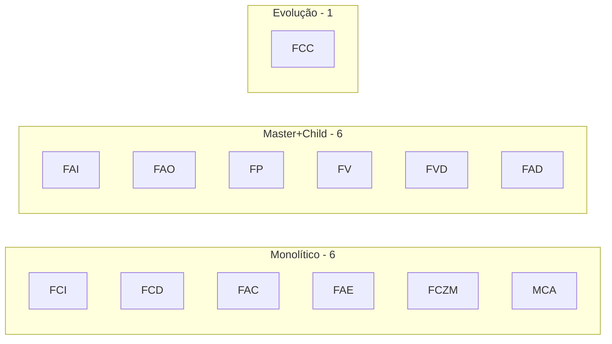

Isso explica por que o PEC/DW do Ministério usa **fatos + dimensões** por contexto clínico, não um schema relacional espelhando cada Thrift 1:1.

---

## Convenções transversais (validação e tipos)

| Convenção | Detalhe |
|-----------|---------|
| Datas | `Long` em **epoch milissegundos** na maioria dos campos; **exceção FCC**: `dataNascimentoCidadao` em string `aaaa-mm-dd` |
| Códigos de domínio | `Long` / `Integer` referenciando tabelas LEDI (sexo, turno, tipo imóvel, etc.) |
| UUID | `String` 36–44; recomenda-se prefixo `{CNES}-` + UUID canônico |
| Origem | `tpCdsOrigem` / `tbCdsOrigem` = **3** para integrador terceiro |
| Listas | Cardinalidade mín/máx por campo (ex.: 1–99 atendimentos no master) |
| Regras | Validação **condicional entre campos** (ex.: CNS XOR CPF; blocos omitidos se `statusTermoRecusa=true`) — melhor em motor de regras, não só CHECK no SQL |

---

## Modelo de banco recomendado (operacional + LEDI)

Como você vai **operar**, **enviar ao PEC** e **monitorar metas da Portaria 3.493**, evite 13 schemas paralelos. Use **12 grupos de tabelas** (A–L), **nomes en-US** na implementação:

### A. Integração LEDI (genérico, 1 modelo)

- `ledi_batches` — controle de envio
- `transport_records` — espelha `DadoTransporte`: `serialized_uuid`, `serialized_type`, `cnes`, `ibge_code`, `ine`, `batch_number`, `payload_binary`, `ledi_version`, status (`draft`, `validated`, `sent`, `accepted`, `rejected`)
- `installations` — remetente/originadora (`counter_key`, `installation_uuid`, tax_id)

### B. Registro de ficha (índice único)

- `clinical_records` — uma linha por ficha lógica:
  - `record_type` (enum: FCI, FCD, FAI, FAO, FAC, FP, FV, FVD, FAD, **FAE, FCZM, FCC, MCA**)
  - `record_uuid`
  - `originator_record_uuid` (quando aplicável)
  - `transport_record_id`
  - `payload_json` (canonical, pós-deserialização Thrift/XML)
  - `payload_schema_version`
  - Campos denormalizados: `cnes`, `ibge_code`, `encounter_at`, `professional_cns`

### C. Itens de ficha (só Master/Child)

- `clinical_record_items` — `clinical_record_id`, `sequence`, `payload_json`, `citizen_cpf`/`citizen_cns`

Cadastro monolítico (FCI, FCD, FAC, FAE, FCZM, MCA): **sem** `clinical_record_items`; tudo em `clinical_records.payload_json`.

FCC (arquétipo 4): **sem** `clinical_record_items`; usar `shared_care_cases` + `shared_care_evolutions`.

### D. Domínio operacional municipal (projeções de leitura — nomes em **en-US**)

Extrair o que o produto consulta entre fichas LEDI **e** o que a **gestão municipal** cadastra na web (não depende só de importação PEC).

| Tabela (en-US) | Responsabilidade |
|----------------|------------------|
| `municipalities` | Ente (`ibge_code`), IED, configurações — **tenant raiz** |
| `health_facilities` | UBS / UVZ / CNES, `municipality_id`, `facility_service_kind` — **sub-escopo operacional** |
| `user_municipality_memberships` | Escopo `municipality` (prefeitura vê todas UBS) ou `facility` (só uma UBS) — ver [Isolamento Prefeitura/UBS](#isolamento-de-dados-prefeitura-e-ubs-multi-tenancy-hierárquico) |
| `facility_micro_area_coverage` | Quais `micro_areas` cada UBS cobre (cidadãos/domicílios visíveis na UBS) |
| `care_teams` | Equipe INE + vínculo CNES |
| `team_areas`, `micro_areas` | Área e microárea territorial |
| `professionals` | CNS, CBO, vínculo equipe/facility |
| `users` + `roles` | RBAC: `municipal_staff` (web), `field_professional` (Flutter Field), `citizen` (Flutter Citizen) |
| `citizen_accounts` | Vínculo `user_id` ↔ `citizen_id` (CPF validado; login Gov.br futuro) |
| `citizens` | CPF/CNS, demografia (sync FCI + cadastro web) |
| `households` | Domicílio; **PostGIS** `location` (lat/lng); opcional `residential_building_id` |
| `household_members`, `families` | Membros e núcleo familiar |
| `household_animals` | Animais no domicílio (espécie, raça, tutor); origem **FCD** LEDI + cadastro web |
| `animal_vaccination_records` | Doses aplicadas (espelha lógica humana **FV**/SI-PNI, domínio zoonoses) |
| `animal_vaccination_cards` | Carteira/atestado vacinal (requisitos CFMV; PDF na web) |
| `encounters` | Atendimentos unificados (FAI/FAO/FP/FV/FVD/FAD/FAE/FCZM/MCA); `appointment_id` quando originado de agendamento |
| `citizen_medications` | Medicações em uso (FAI + prescrição municipal) |
| `shared_care_cases` + `shared_care_evolutions` | FCC (grupo G) |

Vínculo LEDI: `encounters.clinical_record_item_id` ou `clinical_record_id`; FCC via `shared_care_evolutions.clinical_record_id`.

### I. Operação UBS, estoque e campanhas (grupo novo — en-US)

Gestão web que **alimenta** indicadores e logística; emite eventos de domínio.

| Tabela (en-US) | Responsabilidade |
|----------------|------------------|
| `consultation_rooms` | Salas de atendimento por `health_facility` |
| `room_capacity_slots` | Capacidade por sala/dia/turno (vagas) |
| `immunobiological_products` | Catálogo PNI/SIGTAP (**human**) e imunobiológicos **veterinários** MS/zoonoses (**animal**); coluna `target_species` |
| `immunobiological_lots` | Lote, validade, fabricante |
| `stock_balances` | Saldo por facility, room ou campanha |
| `stock_movements` | Entrada/saída/transferência/perda |
| `supply_items` | Catálogo de insumos da UBS (imunobiológico, material consumo, kit visita, etc.) |
| `supply_provisionings` | Planejamento genérico: campanha vacina × capacidade sala × estoque |
| `visit_route_provisionings` | **Provisionamento atrelado ao roteiro** (1:1 ou 1:N com `visit_routes`) |
| `visit_route_provisioning_lines` | Linhas: produto/lote, qtd necessária, reservada, entregue, consumida |
| `team_supply_dispatches` | Saída de estoque UBS → equipe (romaneio de campo) |
| `team_supply_dispatch_lines` | Itens físicos entregues ao profissional no dia da rota |
| `vaccination_campaigns` | Campanha humana (**human_immunization**) ou animal (**animal_zoonoses**); mesmo motor de sala/estoque |
| `home_visit_campaigns` | Campanha visita domiciliar; `target_audience_definition` JSONB; `supply_plan` JSONB (ex.: remédio XYZ 1 un/visita); `waste_factor` (ex.: 0,10) |
| `campaign_targets` | Cidadãos elegíveis após levantamento (`pending` / `routed` / `visited` / `refused`) |
| `campaign_room_allocations` | Alocação sala + insumo por campanha |

### L. Roteirização de atendimento domiciliar (gestão web → execução Field)

Fluxo ponta a ponta para cumprir metas da **Portaria 3.493** (**V-ACOMP**, **C2–C6** visitas, **CVAT**) com planejamento territorial explícito.

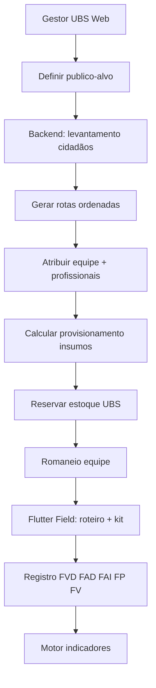

| Tabela (en-US) | Responsabilidade |
|----------------|------------------|
| `target_audience_criteria` | Regras reutilizáveis (idade, CIAP/CID, `citizen_indicator_gaps`, acamado, gestante, microárea, sem FCD 24m…) |
| `residential_buildings` | Condomínio/prédio: nome, endereço normalizado, `location`, `external_id` (FCD/bloco) |
| `household_building_units` | Vínculo `household_id` ↔ `residential_building_id` + `unit_label` (apto/bloco/andar) |
| `visit_routes` | Roteiro: `home_visit_campaign_id`, `care_team_id`, `route_date`, `sequence_number`, status |
| `visit_route_assignments` | Profissionais do roteiro (`professional_id`, papel: ACS, enfermeiro…) |
| `visit_route_stops` | Parada ordenada: `stop_order` 1..N, `household_id`, `citizen_id`, `status`, `visited_at` |
| `visit_route_stop_attempts` | Tentativas (morador ausente, recusa) — auditoria |
| `visit_route_provisionings` | Kit de insumos do roteiro (`status`: draft → calculated → reserved → dispatched → closed) |
| `visit_route_provisioning_lines` | `supply_item_id` ou `immunobiological_product_id`, `quantity_required`, `unit`, `citizen_count_basis`, `calculation_source`, lote reservado |
| `home_visit_campaign_provisionings` | **Consolidado da campanha** (soma de todas as rotas / preview antes de rotear) |

### L.1 — Provisionamento de insumos por roteiro (recurso transversal)

Cada `visit_route` e a **campanha inteira** geram um **romaneio quantificado**: o backend soma, por insumo, quantos cidadãos do público-alvo precisam de cada item e grava em `visit_route_provisioning_lines` (por rota) com **rollup** em `home_visit_campaign_provisionings` (visão gestor UBS).

| Tipo de insumo | Origem catálogo | Exemplo de cálculo |
|----------------|-----------------|-------------------|
| Imunobiológico | `immunobiological_products` + `immunobiological_lots` | 1 dose por cidadão elegível à vacina X (gap ou calendário) |
| Medicamento (entrega/adesão) | `citizen_medications` + `supply_items` | Soma `dose_per_visit × citizens` (ex.: insulina NPH) |
| Medicamento genérico campanha | `home_visit_campaigns.supply_plan` | Gestor define “remédio XYZ, 1 unidade/visita” → × paradas |
| Insumo geral | `supply_items` | Kit visita × paradas; lancetas, seringas, gaze |
| Procedimento | `supply_items` + SIGTAP | Tiras glicemia × diabéticos com gap C4-B |

**Exemplo concreto (levantamento → provisionamento):**

Gestor define campanha “Visita domiciliar — vacina X + adesão medicamentos”. O backend levanta **500 cidadãos** em `campaign_targets`.

| # | Insumo | Regra de contagem | Qtd calculada | `calculation_source` |
|---|--------|-------------------|---------------|---------------------|
| 1 | **Vacina X** | 500 alvos com gap `FV:vaccine_x` ou critério campanha | **500 doses** | `immunobiological:500×dose` |
| 2 | **Insulina** (ex.: NPH 100 UI/ml) | 43 cidadãos com `citizen_medications` insulina + visita para aplicar/entregar 1 frasco | **43 unidades** | `medication:43×citizens` |
| 3 | **Remédio XYZ** | Campanha: 1 unidade por visita × 534 paradas planejadas (pode incluir não-vacina) | **534 unidades** | `campaign_plan:534×stops` |
| 4 | Seringas 5 ml | 500 vacinas + margem | **520 un** | `derived:immunobiological+waste` |
| 5 | Gaze / álcool 70% | 1 kit × 500 paradas | **500 kits** | `supply_kit×stops` |

- **+10% perda** opcional em imunobiológicos (`waste_factor` na campanha) → Vacina X pode virar **550 doses** reservadas.
- Gestor revisa na **WEB-CAMP-06**, ajusta linha manualmente (ex.: XYZ **500** em vez de 534) antes de `ReserveVisitRouteSupplies`.

**Divisão por rota (3 equipes / 3 rotas):**

| Rota | Paradas | Vacina X | Insulina | Remédio XYZ |
|------|---------|----------|----------|-------------|
| Rota A (INE …01) | 180 | 180 doses | 15 un | 180 un |
| Rota B (INE …01) | 200 | 200 doses | 20 un | 200 un |
| Rota C (INE …02) | 120 | 120 doses | 8 un | 154 un |
| **Total campanha** | **500** | **500** | **43** | **534** |

Cada rota tem `visit_route_provisioning_id`; o **romaneio do dia** na UBS soma as rotas da mesma equipe/data em `team_supply_dispatch_lines`.

**Passo 2b — Preview de insumos (opcional, antes de rotear):**

Command: `PreviewCampaignProvisioning` (`home_visit_campaign_id`) — após `BuildCampaignTargetList`, mostra tabela estilo exemplo acima **sem** reservar estoque; gestor valida viabilidade.

**Passo 3b — Calcular e reservar (após rotas, antes de publicar):**

Command: `CalculateVisitRouteProvisioning` (`visit_route_id`):

1. Filtra `campaign_targets` / `visit_route_stops` da rota.
2. Para cada cidadão: avalia gaps (`citizen_indicator_gaps`), `citizen_medications`, `home_visit_campaigns.supply_plan`.
3. Gera linhas com `quantity_required`, `unit` (`dose`, `vial`, `unit`, `kit`), `calculation_source`, `citizen_count_basis` (ex.: `500`, `43`).
4. **Consolida** SKUs iguais na rota; **rollup** atualiza `home_visit_campaign_provisionings.totals_json`.
5. Compara totais da campanha com `stock_balances` da UBS.
6. Se faltar estoque → `status: blocked` na campanha e nas rotas afetadas; **WEB-CAMP-06** exibe défcit por item (ex.: “Vacina X: faltam 120 doses”).

Command: `ReserveVisitRouteSupplies` — cria `stock_movements` tipo `reserve` ligados ao `visit_route_provisioning_id` e lotes (`immunobiological_lots` FEFO por validade).

Command: `DispatchTeamSupplyKit` — agrupa rotas do mesmo dia/INE em `team_supply_dispatches`; baixa estoque (`movement: dispatch_to_team`); romaneio impresso/PDF na web.

**Passo 4b — Equipe recebe e confirma (Field):**

Query: `VisitRouteProvisioningChecklist` — lista insumos esperados vs entregues.

Command: `ConfirmTeamSupplyReceipt` — profissional confirma cold chain / quantidades no app (**FIELD-10**).

Command: `RecordSupplyConsumptionAtStop` — ao aplicar vacina (**FV**) ou procedimento (**FP**) na parada, incrementa `quantity_consumed`; libera reserva não usada no fechamento da rota.

Command: `CloseVisitRouteProvisioning` — devolução à UBS (`stock_movements: return`) de saldo não consumido.

**Regras:**

1. `PublishVisitRoutes` **bloqueado** se `visit_route_provisionings.status = blocked` (configurável: soft warning vs hard block).
2. Mesmo motor de `SupplyProvisioningRejected` para campanhas em sala — **reutilizar** serviço `Inventory::ProvisioningValidator`.
3. Romaneio por **equipe + data**, não só por rota (várias rotas INE no mesmo dia somam no dispatch).
4. Rastreabilidade: lote vacina → parada → `clinical_records` FV (auditoria PNI).

**UI / ids agente:**

| id | Canal | Função |
|----|-------|--------|
| **WEB-CAMP-06** | Web | Tabela consolidada (vacina 500, insulina 43, XYZ 534…); edição qty; déficit estoque; override |
| **WEB-STOCK-02** | Web | Romaneio: separar estoque UBS e registrar `DispatchTeamSupplyKit` |
| **FIELD-10** | Field | Checklist kit insumos ao iniciar rota; consumo por parada |

**Eventos Kafka:** `visit_route.provisioning.calculated`, `visit_route.provisioning.blocked`, `visit_route.supplies.dispatched`, `visit_route.supply.consumed`.

**Passo 1 — Gestor define público-alvo (web):**

| Critério exemplo | Fonte de dados |
|------------------|----------------|
| Idosos ≥60 com gap C6-C | `citizens` + `citizen_indicator_gaps` |
| Diabéticos sem visita 12m | C4 + último **FVD** |
| Gestantes com BP E pendente | C3 + `citizen_indicator_gaps` |
| Acamados / AD elegível | **FAE** / `condicoesAvaliadas` |
| Microárea / território INE | `micro_areas` + **FCI** vínculo equipe |
| Cadastro incompleto CVAT | V-CAD-COM |

Command: `DefineHomeVisitTargetAudience` → persiste em `home_visit_campaigns.target_audience_definition`.

**Passo 2 — Backend levanta elegíveis:**

Command: `BuildCampaignTargetList` — query composta (SQL + regras `indicator_rules`); popula `campaign_targets` com score de prioridade; exclui duplicatas; vincula `household_id` + geo.

**Passo 3 — Geração de rotas ordenadas:**

Command: `GenerateVisitRoutes`:

1. Agrupa alvos por `micro_area` / proximidade (**PostGIS** `ST_ClusterDBSCAN` ou k-means lat/lng).
2. Ordena paradas — **TSP heurístico** (vizinho mais próximo) do ponto de partida (UBS ou 1º domicílio) até o último.
3. Respeita `max_stops_per_route` e `max_routes_per_team_per_day` (config gestor).
4. Cria `visit_routes` + `visit_route_stops` com `stop_order` explícito (1 = primeiro, N = último).

Command: `AssignVisitRouteToCareTeam` — INE + lista `visit_route_assignments` (profissionais disponíveis).

Command: `CalculateVisitRouteProvisioning` → `ReserveVisitRouteSupplies` (ver **L.1**).

Command: `PublishVisitRoutes` — só após provisionamento `reserved` ou override; emite `home_visit.route.published` + `visit_route.supplies.dispatched` → **Flutter Field**.

**Passo 4 — Profissional executa (Flutter Field):**

Query: `MyVisitRoutesForToday` — roteiro ordenado; navegação geo entre paradas.

Command: `CompleteRouteStop` — check-in geo opcional; abre wizard **FVD** (+ **FAD**/**FAI**/**FP** conforme missão); atualiza `campaign_targets.status = visited`.

Command: `SkipRouteStop` — motivo (ausente, recusa) → `visit_route_stop_attempts`.

**Passo 5 — Condomínios / prédios:**

- **FCD** / cadastro: `tipoImovel`, bloco, complemento → normalizar `residential_buildings`.
- Tela web **WEB-CAMP-03** e Field: visão **por edifício** — lista unidades, quem foi atendido, pendências no prédio.
- Query: `BuildingAttendanceSummary(building_id)` — % visitados no campanha; lista cidadãos por unidade.

**Vínculo com indicadores (por que o roteiro existe):**

| Indicador / componente | Como o roteiro ajuda |
|------------------------|----------------------|
| **V-ACOMP** | Visitas + consultas registradas em sequência campanha |
| **V-CAD** | Rota prioriza sem FCD ou FCI desatualizado |
| **C2-D** | Visitas ACS em janelas (2 visitas gestante/criança) |
| **C4-C, C5-C, C6-C** | ≥2 visitas domiciliares intervaladas — roteiro planeja 1ª e 2ª passagem |
| **C3-E, J** | Visitas gestante/puerpério domiciliar |
| Dashboard campanha | Meta campanha vs `campaign_targets.visited` vs gaps fechados |

**Bounded context `home_visit_routing` (em `app/domains/campaigns/` ou `territory/`):**

| Command | Query |
|---------|-------|
| `DefineHomeVisitTargetAudience` | `CampaignTargetListPreview` |
| `BuildCampaignTargetList` | `VisitRouteMap` (GeoJSON paradas) |
| `GenerateVisitRoutes` | `BuildingAttendanceSummary` |
| `AssignVisitRouteToCareTeam` | `RouteProgressByTeam` |
| `PreviewCampaignProvisioning` | `CampaignProvisioningSummary` (ex.: 500 + 43 + 534) |
| `CalculateVisitRouteProvisioning` | `VisitRouteProvisioningChecklist` |
| `ReserveVisitRouteSupplies` | `CampaignProvisioningVsStock` |
| `DispatchTeamSupplyKit` | `TeamDispatchManifest` |
| `PublishVisitRoutes` | `CampaignCoverageVsIndicators` |
| `CompleteRouteStop` | `MyVisitRoutesForToday` (Field API) |
| `ConfirmTeamSupplyReceipt` | — |
| `RecordSupplyConsumptionAtStop` | — |

**Eventos Kafka:** `home_visit.targets.built`, `home_visit.route.generated`, `visit_route.provisioning.calculated`, `visit_route.provisioning.blocked`, `home_visit.route.published`, `visit_route.supplies.dispatched`, `home_visit.stop.completed`, `visit_route.supply.consumed`.

**Módulos UI:**

| id | Canal | Função |
|----|-------|--------|
| **WEB-CAMP-03** | Web | Wizard público-alvo → preview elegíveis → gerar rotas → mapa |
| **WEB-CAMP-04** | Web | Atribuição equipe/profissionais; painel progresso campanha |
| **WEB-CAMP-05** | Web | Visão **condomínio/prédio**: unidades e status de visita |
| **FIELD-08** | Field | Meus roteiros do dia; paradas ordenadas; FVD por parada |
| **FIELD-09** | Field | Modo “prédio”: atender várias unidades no mesmo endereço |
| **WEB-CAMP-06** | Web | Provisionamento de insumos por rota (calcular, bloquear, override) |
| **WEB-STOCK-02** | Web | Romaneio UBS → equipe (`team_supply_dispatches`) |
| **FIELD-10** | Field | Recebimento do kit + registro de consumo por parada |

Regra de negócio transversal (humana **e** animal): **não agendar vacinação além de** `min(stock_available, room_capacity_remaining)` — evento `SupplyProvisioningRejected` se violar.

### J. Agendamentos UBS — consultas e atendimentos (grupo novo — en-US, **módulo web**)

Gestão de **agenda municipal na UBS**: marcação de consultas e atendimentos (médico, enfermagem, odonto, procedimentos, vacinação, acolhimento), consumindo **capacidade de sala** e opcionalmente **profissional**. Integra indicador **C1** (atendimento programado vs espontâneo) e antecipa geração de **FAI/FAO/FP/FV** após o atendimento realizado.

| Tabela (en-US) | Responsabilidade |
|----------------|------------------|
| `appointment_service_types` | Tipos: `medical_consultation`, `nursing`, `dental`, `procedure`, `immunization`, `reception`, `animal_vaccination` |
| `appointments` | Agendamento: `citizen_id`, `health_facility_id`, `consultation_room_id`, `professional_id`, `care_team_id`, `scheduled_at`, `duration_minutes`, `status`, `kind`, `channel` (`citizen_app` / `web_reception` / `walk_in`), `modality` (`in_person` / `telehealth`) |
| `appointment_room_slots` | Vaga consumível (liga `room_capacity_slots` ↔ `appointments`; evita overbooking) |
| `appointment_waitlist_entries` | Fila de espera quando não há vaga (prioridade, `citizen_id`, `service_type`) |
| `professional_availability_blocks` | Bloqueio de agenda (férias, reunião, falta) |

### K. Portal do cidadão — “UBS no celular” (grupo novo — en-US)

Dados e serviços expostos ao **Flutter Citizen** (leitura CQRS + comandos limitados). Não registra fichas LEDI — consome projeções de `clinical_records` / FV e agenda via `scheduling`.

| Tabela (en-US) | Responsabilidade |
|----------------|------------------|
| `citizen_immunization_records` | Projeção de doses (FV / campanhas / SI-PNI conciliação) — carteira vacinal |
| `citizen_vaccination_schedules` | Próximas doses do calendário PNI + agendamento de vaga |
| `citizen_medication_reminders` | Medicamento de uso contínuo + lembretes (`citizen_medications` origem FAI/prescrição) |
| `panic_alerts` | Botão de pânico: `citizen_id`, `location`, `triggered_at`, `status`, protocolo SAMU/UBS |
| `teleconsultation_sessions` | Consulta online: `appointment_id`, sala virtual, `started_at`, `ended_at`, provider (WebRTC terceiro) |
| `citizen_notification_preferences` | Push/SMS para confirmação de consulta, vacina, medicamento |

**Funcionalidades do Flutter Citizen (escopo):**

| Módulo | Comportamento |
|--------|---------------|
| **Agenda de consultas** | Ver vagas por UBS/serviço; `BookAppointment` / `RescheduleAppointment` / `CancelAppointment`; histórico e status |
| **Cobertura vacinal** | Dashboard % calendário PNI; doses em atraso; link para agendar |
| **Carteira de vacinação** | PDF/QR digital espelhando `citizen_immunization_records` (PNI) |
| **Agendar vacinação** | Slots de `immunization` + validação de estoque (mesma regra UBS) |
| **Medicamentos contínuos** | Lista `citizen_medications`; lembretes; solicitar renovação (gera tarefa na UBS/web) |
| **Botão de pânico** | `TriggerPanicAlert` — geolocalização, notifica equipe/SAMU conforme protocolo municipal |
| **Atendimento online** | Se UBS habilitou `modality: telehealth`, entrar na sessão na hora do `appointment` |

**Regras:**

1. Cidadão só acessa **próprios** dados (`citizen_accounts.citizen_id`).
2. Agendamento respeita `appointment_room_slots` — mesma fila que recepção web (sem overbooking).
3. Vacinação no app só exibe horários com `stock_balances` disponível.
4. Pânico: LGPD — log mínimo, retenção definida, integração SAMU/190 conforme pactuação municipal.
5. Teleconsulta: fase 1 link/sala WebRTC (Daily/Jitsi/Whereby); fase 2 integração regulada se exigido.

**Bounded context `citizen_portal`:**

| Command | Query |
|---------|-------|
| `BookAppointment` (channel: citizen_app) | `CitizenUpcomingAppointments` |
| `BookImmunizationAppointment` | `CitizenImmunizationCoverage` |
| `TriggerPanicAlert` | `CitizenVaccinationWallet` |
| `RequestMedicationRenewal` | `CitizenContinuousMedications` |
| `JoinTeleconsultationSession` | `AvailableTelehealthSlots` |

**Eventos Kafka:** `panic.alert.triggered`, `appointment.booked` (channel citizen_app), `teleconsultation.session.started`.

**Status do agendamento (`appointments.status`):**

`scheduled` → `confirmed` → `checked_in` → `in_progress` → `completed` | `cancelled` | `no_show`

Ao **`completed`**: command `CompleteAppointment` cria ou vincula `encounters` e dispara preparação de ficha LEDI (FAI/FAO/FP/FV conforme `appointment_service_types`).

**Regras de negócio:**

1. **Overbooking:** 1 `appointment` ativo por `appointment_room_slot`; conflito → `AppointmentSlotUnavailable`.
2. **Capacidade:** `BookAppointment` decrementa vaga na projeção `room_availability`; libera em `CancelAppointment` / `no_show`.
3. **Vacinação agendada:** valida `stock_balances` + `target_species` antes de confirmar (mesma regra de campanha).
4. **C1 — Mais acesso:** `kind: scheduled` + `appointment_service_types` elegíveis contam como **programado** no motor de indicadores; `walk_in` = espontâneo/acolhimento.
5. **Prioridade:** gestante, idoso ≥60, crônicos (flags de `citizen_profiles` / gaps C3–C6) podem reordenar `appointment_waitlist_entries`.

**Bounded context `scheduling` (novo):**

| Command | Efeito |
|---------|--------|
| `BookAppointment` | Reserva slot, emite `appointment.booked` |
| `ConfirmAppointment` | Confirmação (SMS/WhatsApp futuro) |
| `RescheduleAppointment` | Move slot, emite `appointment.rescheduled` |
| `CancelAppointment` | Libera capacidade |
| `CheckInAppointment` | Recepção UBS — fila do dia |
| `CompleteAppointment` | Gera `encounters`, fecha ciclo |
| `MarkAppointmentNoShow` | `no_show`; libera slot |

| Query (web) | Uso |
|-------------|-----|
| `FacilityDailySchedule` | Grade dia/sala/profissional (calendário Hotwire) |
| `RoomUtilizationReport` | % ocupação por sala/período |
| `AppointmentNoShowReport` | Absenteísmo por equipe/microárea |

**Módulo web — Scheduling (Hotwire):**

| Tela | Função |
|------|--------|
| **Agenda da UBS** | Visão semanal/diária por sala e por profissional; drag-and-drop opcional (Stimulus) |
| **Nova marcação** | Busca cidadão, tipo de serviço, sala, horário livre, equipe INE |
| **Fila / recepção** | Check-in, chamada de senha, status `checked_in` → `in_progress` |
| **Encaixe / walk-in** | `kind: walk_in` quando há vaga remanescente ou override gestor |
| **Lista de espera** | Inclusão e promoção quando abre vaga |
| **Relatórios** | Ocupação de salas, no-show, tempo médio de espera |

**Agendamento UBS:** **Flutter Citizen** (autogestão do cidadão) + **web** (recepção/gestor) + API compartilhada `BookAppointment`. **Flutter Field** não agenda consulta na UBS — foco territorial.

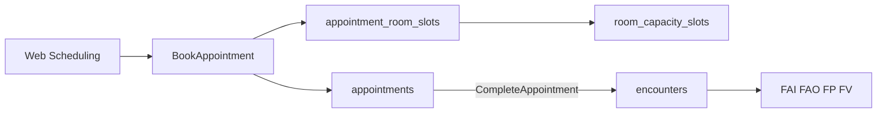

**Eventos Kafka:**

| Topic | Uso |
|-------|-----|
| `appointment.booked` | Atualiza calendário, notifica recepção |
| `appointment.completed` | Motor C1, prepara registro clínico |
| `appointment.no_show` (tópico Kafka: `appointment.noshow`) | Relatório absenteísmo; libera slot |

### Vacinação animal — mesmo padrão UBS / Ministério da Saúde (não silo paralelo)

A vacinação de animais **reutiliza a mesma arquitetura** da vacinação humana e da operação UBS; o que muda é o **domínio regulatório** (Vigilância em Zoonoses / SVS) e o **catálogo de imunobiológicos**, não o desenho de estoque, campanha, sala ou CQRS.

| Aspecto | Vacinação humana (APS) | Vacinação animal (zoonoses SUS) |
|---------|------------------------|----------------------------------|
| Estabelecimento | UBS (`health_facilities`, CNES APS) | **UVZ** / CCZ ou UBS com tipologia zoonoses no CNES (`facility_service_kind: zoonoses`) |
| Registro nacional | **FV** LEDI → SI-PNI / e-SUS PEC | **SinPatinhas** (MS) + prontuário/carteira **CFMV**; LEDI **FCD** (animais no domicílio) |
| Imunobiológicos | PNI, Notas Técnicas DPNI | Catálogo MS zoonoses (ex.: antirrábica canina/felina, leishmaniose) em `immunobiological_products` com `target_species: animal` |
| Campanha | `vaccination_campaigns` `human_immunization` | `vaccination_campaigns` `animal_zoonoses` (campanha antirrábica municipal) |
| Estoque / lote / vencimento | `immunobiological_lots`, `stock_balances`, `stock_movements` | **Mesmas tabelas** — saldo por UVZ/UBS/sala/campanha |
| Capacidade sala | `consultation_rooms`, `room_capacity_slots` | **Mesmo modelo** — sala de vacinação zoonoses na UVZ ou UBS |
| Provisionamento | `supply_provisionings` | **Mesma fórmula**: doses campanha × capacidade × estoque |
| Profissional | Enfermeiro/médico (CBO APS) | **Médico-veterinário** (CRMV) em `professionals` + `professional_credentials` |
| Eventos | `clinical.record.persisted`, campanha humana | `animal.vaccination.administered`, `animal.vaccination.campaign.launched` |
| Indicadores Portaria 3.493 | C1–C7, B1–B6 e M1–M2, CVAT (humanos) | **Fora do cofinanciamento APS**; indicadores **VCZ** municipais (cobertura antirrábica, etc.) em `indicator_catalog` com `funding_component: zoonoses` (opcional, relatórios web) |

**Fluxo unificado na aplicação:**

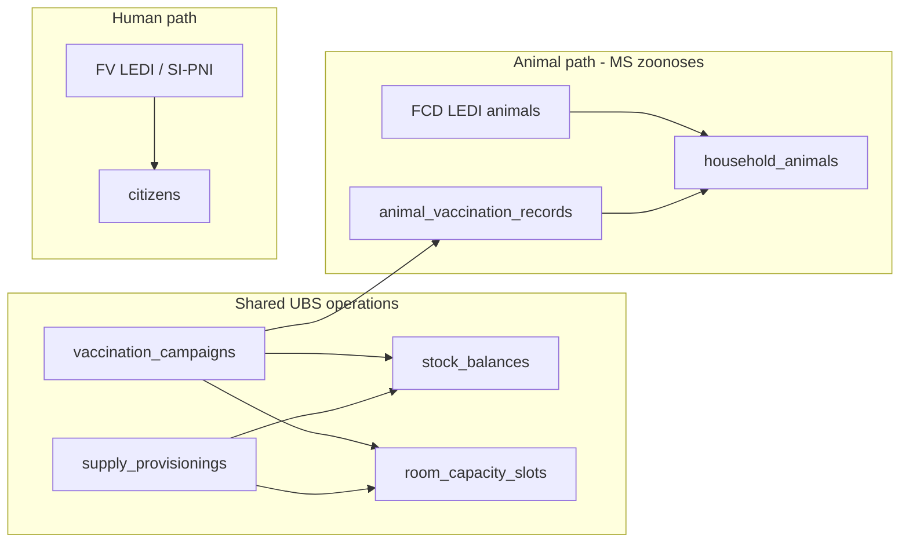

**Implementação (en-US, mesmo bounded context `campaigns` + `inventory`):**

- Command `AdministerAnimalVaccination` — valida CRMV, lote `target_species: animal`, baixa estoque, grava `animal_vaccination_records`, emite evento para relatório de cobertura antirrábica.
- Command `LaunchAnimalVaccinationCampaign` — meta por microárea/bairro; alvos = `household_animals` elegíveis (espécie, idade, dose anterior).
- Query `AnimalVaccinationCoverageReport` — mesmo padrão de **Reports** humanos (CSV/PDF para gestor UVZ).
- **Integração futura:** export/conciliação **SinPatinhas** (API MS quando disponível); até lá, registro municipal completo + export manual.

**Glossário (vacinação animal):**

| Termo | Significado |
|-------|-------------|
| **UVZ** | Unidade de Vigilância de Zoonoses — estrutura SUS para prevenção/controle de zoonoses |
| **CCZ** | Centro de Controle de Zoonoses (denominação anterior; ainda usada localmente) |
| **SinPatinhas** | Sistema federal de registro de animais domésticos e vacinação (MS) |
| **CFMV** | Conselho Federal de Medicina Veterinária — regras de atestado/carteira vacinal |
| **Campanha antirrábica** | Campanha municipal típica; modelo `animal_zoonoses` em `vaccination_campaigns` |

### E. Catálogo e validação LEDI

- `ledi_field_catalog` — metadados gerados a partir dos [13 dicionários HTML por ficha](https://integracao.esusaps.bridge.ufsc.tech/ledi/documentacao/estrutura_arquivos/index.html) e XSD (tipo, obrigatoriedade Sim/Não/Condicional, min/max, `domain_key`, referências a struct filho)
- `ledi_validation_rule` — regras condicionais por `record_type` + versão LEDI (prosa UFSC → DSL: `absent_when`, cardinalidade de listas, XOR CPF/CNS, valor fixo `tpCdsOrigem=3`, etc.)
- Motor de validação na aplicação ([`Ledi::ValidationEngine`](lib/ledi/validation_engine.rb)); expandir conforme import automático

**Estado atual:** seed MVP manual ([`db/seeds/ledi_catalog.rb`](db/seeds/ledi_catalog.rb)); [`ledi:catalog:import_xsd`](lib/tasks/ledi_catalog.rake) ainda stub.

#### E.1 — Sincronização periódica de referência MS/LEDI (decisão 2026-05-29)

**Objetivo:** manter Postgres sempre alinhado à documentação UFSC vigente, para web gestão, validação server-side, APIs Field/Citizen e apps Flutter (Fase 8) consumirem **JSON versionado**, não HTML ao vivo.

**Duas fontes UFSC complementares:**

| Fonte | URL | Alimenta |
|-------|-----|----------|
| Dicionários **por ficha** (13) | [estrutura_arquivos](https://integracao.esusaps.bridge.ufsc.tech/ledi/documentacao/estrutura_arquivos/index.html) → `dicionario-fci.html` … | `ledi_field_catalog`, `ledi_validation_rules` |
| Dicionário de **domínios** (~87 tabelas) | [referencias/dicionario.html](https://integracao.esusaps.bridge.ufsc.tech/ledi/documentacao/referencias/dicionario.html) + CBOs, CIAP×CID, CATMAT, municípios | `reference_domain_entries` |

**Referências cruzadas na doc de ficha:** struct aninhada (mesma página); código em coluna do Dicionário de dados (`Long`/`List` → `Sexo`, `Imunobiologico`, …); validações externas (CNS, nome, epoch ms).

**Complemento:** SIGTAP completo via [download DATASUS](https://wiki.saude.gov.br/sigtap/index.php/Download) (mensal), além dos domínios UFSC.

**Pipeline (Solid Queue + `config/recurring.yml`):**

1. **Mirror** — HTML espelhado em `vendor/reference/{ledi_version}/` (como Thrift em `vendor/ledi/`)
2. **`UfscReferenceImportJob`** — parse `dicionario.html` + Referências → `reference_domain_entries`
3. **`LediCatalogSyncJob`** — parse 13 HTML de ficha (+ XSD) → catálogo + regras
4. **`SigtapImportJob`** — ZIP mensal DATASUS (procedimentos)
5. **`PublishReferenceReleaseJob`** — `reference_data_releases` + checksum; evento `reference_data.release_published` (Kafka)

**Frequência acordada (2026-05-29):**

| Job | Cadência | Horário sugerido (`config/recurring.yml`) | Observação |
|-----|----------|-------------------------------------------|------------|
| `UfscReferenceImportJob` | Mensal | `at 3am on day 1` | `dicionario.html` + páginas Referências |
| `LediCatalogSyncJob` | Mensal + on deploy | `at 4am on day 1` | 13 HTML de ficha + XSD; **extra** quando `LEDI_VERSION` muda no deploy |
| `SigtapImportJob` | Mensal pós-competência | `at 5am on day 5` | ZIP DATASUS (~5º dia útil após fechamento MS) |
| `PublishReferenceReleaseJob` | Após imports | `at 6am on day 1` e `at 6am on day 5` | Só publica se checksum mudou; emite Kafka |

**Distribuição aos clientes:**

- Web Hotwire: leitura Postgres + cache; autocompletes CIAP/CID/SIGTAP (Fase 6 walk-in)
- API: `GET /api/v1/reference/manifest`, `/domains/{key}`, `/ledi/catalog` (OpenAPI, ETag)
- Mobile Fase 8: pull na abertura + SQLite offline; notificação opcional após nova release

**Grupo M — Reference data (tabelas globais, sem tenant):**

| Tabela | Responsabilidade |
|--------|------------------|
| `reference_data_releases` | `release_key`, `ledi_version`, `sigtap_competence`, checksum, `published_at` |
| `reference_domains` | `domain_key`, `source` (`ufsc_dictionary`, `sigtap`, …) |
| `reference_domain_entries` | `domain_key`, `code`, `label`, `active`, `payload_json` |
| `reference_import_runs` | auditoria de cada job de import |

Plano detalhado de implementação: **EPIC-12** (backlog abaixo). ADR proposto: **ADR-0004** (fontes UFSC + DATASUS).

### H. Indicadores APS / Portaria 3.493 (gestão municipal)

- `indicador_catalogo`, `indicador_regra`, `equipe_indicador_resultado`, `cidadao_indicador_gap`, `repasse_projecao_municipio` — ver seção Financiamento APS acima

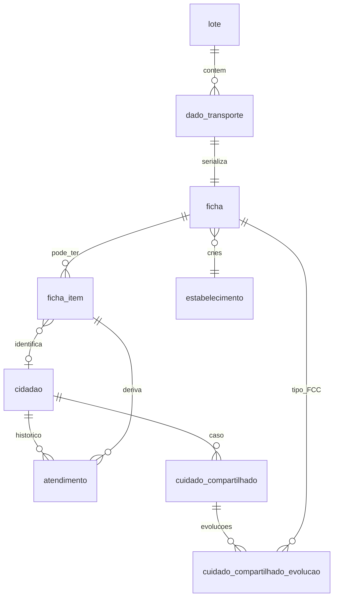

---

## O que NÃO fazer

- **Não** criar 13 conjuntos de tabelas espelhando cada campo Thrift (centenas de colunas, regras condicionais impossíveis de manter).
- **Não** ignorar a camada `DadoTransporte` — é ela que o PEC valida primeiro; inconsistência descarta o registro inteiro.
- **Não** misturar `uuidDadoSerializado` (transporte) com `uuidFicha` / `uuid` (ficha nacional) — são identificadores de propósitos diferentes.

---

## Implicações para escala Brasil

| Aspecto | Diretriz |
|---------|----------|
| Particionamento | Por `cod_ibge` (município) ou região; índice em `uuid_ficha`, `cpf`, `cns` |
| Idempotência | Unique em `uuid_ficha` / `uuid_dado_serializado` |
| Armazenamento | Manter `payload_binary` + `payload_json` para auditoria e reprocessamento |
| Validação | Pipeline assíncrono: regras LEDI antes de montar lote `.esus` |
| Consultas clínicas | Views/materializações sobre `atendimento` + `cidadao`, não sobre blobs brutos |
| Versionamento | Trancar `ledi_version` por lote; LEDI evolui independente do PEC |

---

## Financiamento APS e metas municipais (Portaria GM/MS nº 3.493/2024)

A [Portaria GM/MS nº 3.493, de 10/04/2024](https://bvsms.saude.gov.br/bvs/saudelegis/gm/2024/prt3493_11_04_2024.html) altera a Portaria de Consolidação GM/MS nº 6/2017 e institui a **nova metodologia de cofinanciamento federal do Piso da APS**. O repasse mensal ao município deixa de depender só de equipes homologadas e passa a considerar **desempenho em indicadores** calculados pelo Ministério a partir dos sistemas de informação (principalmente e-SUS APS / PEC).

### Componentes do cofinanciamento que o projeto deve endereçar

| Componente | O que o MS avalia | Papel do seu sistema |
|------------|-------------------|----------------------|
| **Fixo** | Estrato do município no IED × nº eSF/eAP | Cadastro de equipes/CNES/INE; não depende de fichas diárias |
| **Vínculo e acompanhamento territorial** | Cadastro qualificado, vulnerabilidade, acompanhamento, satisfação | FCI + FCD completos; vínculo cidadão–equipe–microárea |
| **Qualidade** | 15 indicadores (eSF/eAP, eSB, eMulti) por quadrimestre | Fichas clínicas + `ProblemaCondicao`/CIAP/CID + visitas + procedimentos |
| **Implantação / programas** | eSF, eAP, eSB, eMulti | Escopo administrativo (fora do LEDI diário) |

Referências operacionais: [FAQ novo financiamento APS](https://www.gov.br/saude/pt-br/composicao/saps/esf/faq-novo-modelo-de-cofinanciamento-federal-da-aps), [Fichas técnicas eSF/eAP](https://www.gov.br/saude/pt-br/composicao/saps/publicacoes/fichas-tecnicas/equipe-de-atencao-primaria-e-saude-da-familia), [Nota técnica tripartite](https://conasems-ava-prod.s3.sa-east-1.amazonaws.com/institucional/orientacoes/nota-tecnica-conjunta-saps-conasems-conass-novo-financiamento-aps-versao-final-saps-03072024-1720464797.pdf).

**Linha do tempo relevante:**
- Parcela **05/2024** (maio/2024): início dos efeitos financeiros.
- **Transição 12 meses** (mai/24–abr/25): vínculo e qualidade pagos como classificação “bom” para todos.
- A partir da **parcela 05/2025**: componente de qualidade passa a refletir **desempenho real** por equipe (Nota Metodológica / atos posteriores, ex. [Nota Técnica 30/2025](https://www.gov.br/saude/pt-br/composicao/saps/publicacoes/fichas-tecnicas/equipe-de-atencao-primaria-e-saude-da-familia)).

### 15 indicadores de qualidade (blocos eSF/eAP, eSB, eMulti)

Publicados em maio/2025; cada indicador tem nota metodológica com numerador, denominador e periodicidade — **C1–C7** (notas C*), **B1–B6** (eSB), **M1–M2** (eMulti); ver tabela Componente III acima.

**eSF / eAP (exemplos centrais para o seu escopo LEDI):**

| Cód. | Indicador | Linha de cuidado |
|------|-----------|------------------|
| C1 | Mais acesso à APS | demanda espontânea / escuta |
| C2 | Cuidado no desenvolvimento infantil | crianças |
| C3 | Cuidado da gestante e puérpera | pré-natal / puerpério |
| C4 | Cuidado da pessoa com diabetes | DM (T89/T90, CIAP, procedimentos) |
| C5 | Cuidado da pessoa com hipertensão | HAS |
| C6 | Cuidado da pessoa idosa | ≥60 anos, IVCF |
| C7 | Cuidado da mulher na prevenção do câncer | rastreamento |

**eSB:** 1ª consulta odontológica programada, tratamento concluído, exodontias, escovação supervisionada, procedimentos preventivos, TRA.

**eMulti:** média de atendimentos por pessoa, ações interprofissionais.

O MS consolida resultados por **equipe (INE + CNES)** e repassa conforme faixa de desempenho (ótimo / bom / suficiente / regular, conforme nota vigente).

### Por que o modelo LEDI unificado serve às metas (e não só à IA)

Os indicadores não leem “9 tipos de banco”: leem **eventos clínicos e cadastrais** que já estão nas fichas LEDI. O mesmo extrator que alimenta IA alimenta o **motor de indicadores**:

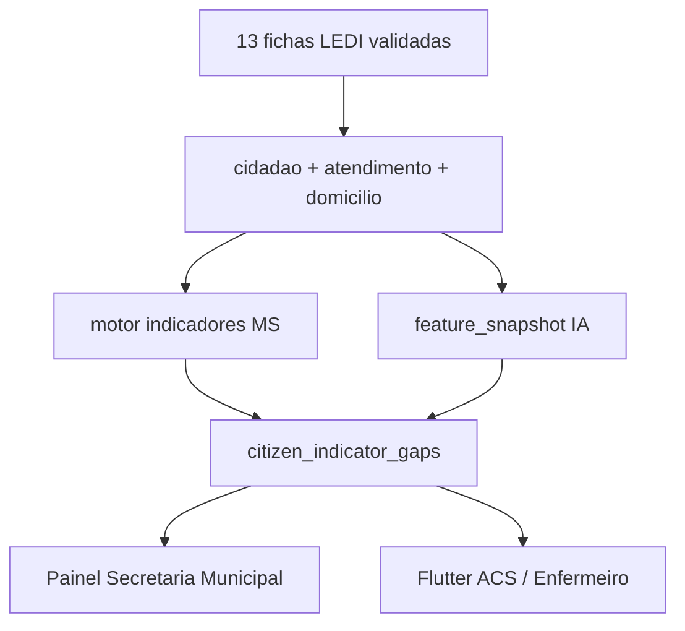

### Co-relação: indicadores que aumentam recursos × fichas LEDI

#### Como o dinheiro do município sobe (mecanismo)

A Portaria 3.493 não paga “por ficha enviada”; paga por **classificação da equipe** em cada componente. Quanto melhor o desempenho nos indicadores, maior o valor mensal por eSF/eAP (e, em blocos separados, eSB e eMulti).

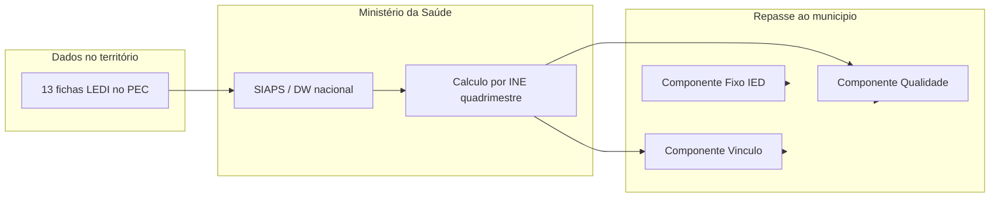

| Componente | O que sobe o repasse | Principal fonte LEDI | Indicadores / regras |
|------------|----------------------|----------------------|----------------------|
| **Fixo** | Estrato IED do município × nº equipes | SCNES (admin) | Não é ficha clínica |
| **Vínculo** | Classificação da eSF/eAP (cadastro + acompanhamento) | **FCI**, **FCD** | Completude cadastro, microárea, vulnerabilidade |
| **Qualidade** | Classificação por **15 indicadores** (C1–C7, B1–B6 e M1–M2) | **FAI**, **FVD**, **FP**, **FV**, **FAO**, **FAC**, etc. | Boas práticas A…K por linha de cuidado |
| **Implantação** | Parcelas de implantação eSB/eMulti | Administrativo | Fora do escopo diário LEDI |

**Premissa do seu produto:** cada boa prática abaixo deve virar uma regra em `indicador_regra` + um `cidadao_indicador_gap` quando faltar registro LEDI equivalente ao que o PEC/SIAPS espera (Notas Metodológicas oficiais e Caderno de Ações FEPECS/MS).

**Atenção:** o MS consolida a partir do **PEC/SIAPS**. Fichas LEDI válidas e sincronizadas são o meio para o município **não perder** contabilização. O motor interno antecipa gaps **antes** do fechamento do quadrimestre.

---

#### Matriz resumo: indicador → impacto financeiro → fichas

| Cód. | Indicador | Equipe | Componente | Fichas LEDI principais |
|------|-----------|--------|------------|------------------------|
| — | Vínculo territorial | eSF, eAP | **Vínculo** | FCI, FCD |
| C1 | Mais acesso à APS | eSF, eAP | Qualidade | FAI, FP |
| C2 | Desenvolvimento infantil | eSF, eAP | Qualidade | FCI, FAI, FVD, FV, MCA, FAC |
| C3 | Gestante e puérpera | eSF, eAP | Qualidade | FCI, FAI, FVD, FV, FAO |
| C4 | Diabetes | eSF, eAP | Qualidade | FCI, FAI, FVD, FP |
| C5 | Hipertensão | eSF, eAP | Qualidade | FCI, FAI, FVD, FP |
| C6 | Pessoa idosa | eSF, eAP | Qualidade | FCI, FAI, FVD, FP, FV, FAD |
| C7 | Mulher — prevenção câncer | eSF, eAP | Qualidade | FAI, FP (procedimentos/exames) |
| B1 | 1ª consulta odontológica programada | eSB | Qualidade | FAO |
| B2 | Tratamento odontológico concluído | eSB | Qualidade | FAO |
| B3 | Taxa de exodontias | eSB | Qualidade | FAO |
| B4 | Escovação supervisionada | eSB | Qualidade | FAC, FAO |
| B5 | Procedimentos preventivos odonto | eSB | Qualidade | FAO |
| B6 | TRA (restaurador atraumático) | eSB | Qualidade | FAO |
| M1 | Média atendimentos eMulti/pessoa | eMulti | Qualidade | FAC, FAI, FAO |
| M2 | Ações interprofissionais eMulti | eMulti | Qualidade | FAC, FCC |

---

#### Vínculo e acompanhamento territorial (não faz parte dos 15 de qualidade, mas aumenta repasse)

| Requisito MS | Campo / struct LEDI | Ficha |
|--------------|---------------------|-------|
| Cadastro individual atualizado | `IdentificacaoUsuarioCidadao`, demografia, CNS/CPF | **FCI** |
| Condições de saúde no cadastro | `CondicoesDeSaude` (diabetes, HAS, gestante…) | **FCI** |
| Cadastro domiciliar + família | `EnderecoLocalPermanencia`, `FamiliaRow`, `microArea` | **FCD** |
| Vínculo equipe–território | `headerTransport.ine`, `codigoIbgeMunicipio`, microárea FCI/FCD | **FCI**, **FCD** |
| Peso vulnerabilidade / idade | `dataNascimento`, benefícios, situação de rua | **FCI** |

Gap típico municipal: FCI sem CNS/CPF, FCD desatualizado, cidadão sem microárea → **perda no componente Vínculo**.

---

#### C1 — Mais acesso à APS

| Boa prática (conceito) | O que contar | Ficha LEDI | Campos / structs |
|------------------------|--------------|------------|------------------|
| Atendimentos **programados** vs espontâneos | Consulta agendada / programada | **FAI** (child) | `tipoAtendimento`, `dataHoraInicialAtendimento`, `dataHoraFinalAtendimento` |
| Escuta inicial / acolhimento | Demanda espontânea organizada | **FP** (child) | `statusEscutaInicialOrientacao` |

Denominador: atendimentos na equipe (INE do `headerTransport`). Numerador: proporção classificada como programada (regra alinhada à Nota C1). **Fonte municipal:** `appointments` com `kind: scheduled` + `status: completed` vinculados a `encounters` (antes do espelho FAI no PEC).

---

#### C2 — Cuidado no desenvolvimento infantil (0–2 anos)

| BP | Requisito (Caderno MS) | Ficha LEDI | Campos LEDI |
|----|------------------------|------------|-------------|
| A | 1ª consulta até 30º dia | **FAI** | `dataNascimento`, `dataHoraInicialAtendimento`, CBO médico/enfermeiro no header |
| B | ≥9 consultas até 2 anos | **FAI** | contagem de childs por `cnsCidadao`/`cpfCidadao` |
| C | ≥9 registros peso+altura | **FAI**, **FVD**, **FAC** | `medicoes.peso`, `medicoes.altura`; ou `pesoAcompanhamentoNutricional` / `alturaAcompanhamentoNutricional` em **FVD**; peso/altura em **FAC** `ParticipanteRowItem` |
| D | 2 visitas ACS (1ª ≤30d, 2ª ≤6m) | **FVD** | `motivosVisita`, `dataHoraInicialAtendimento`, vínculo ACS (CBO no header) |
| E | Vacinação completa calendário | **FV** | `VacinaRowThrift` (imunobiológico, dose, estratégia) |
| — | Alimentação (apoio) | **MCA** | questionários `#7`/`#8`/`#9` por idade |

Identificar denominador: `dataNascimento` + diferença para `dataAtendimento` do header ≤ 2 anos.

---

#### C3 — Gestante e puérpera

| BP | Requisito | Ficha LEDI | Campos LEDI |
|----|-----------|------------|-------------|
| A | 1ª consulta pré-natal ≤12 sem | **FAI** | `dumDaGestante`, `ProblemaCondicao` CIAP W78 / CID O/Z34 |
| B | ≥7 consultas na gestação | **FAI** | série temporal childs + gestação ativa |
| C | ≥7 registros de PA | **FAI**, **FP**, **FVD** | `medicoes.pressaoArterialSistolica/Diastolica` ou PA em **FVD** |
| D | ≥7 peso+altura | **FAI**, **FVD**, **FP** | `medicoes` / antropometria visita |
| E | ≥3 visitas ACS pós 1ª consulta | **FVD** | `motivosVisita` (grupos gestação), datas |
| F | dTpa ≥20ª semana | **FV** | imunobiológico dTpa em `vacinas` |
| G | Testes 1º trim (sífilis, HIV, hep B/C) | **FAI** | `ResultadosExames` / `Exame` + SIGTAP (ex. 02.14.01.005-8) |
| H | Testes 3º trim (sífilis, HIV) | **FAI** | idem |
| I | ≥1 consulta no puerpério | **FAI** | CIAP/CID puerpério + data ≤42d pós-parto |
| J | ≥1 visita ACS puerpério | **FVD** | motivo + data puerpério |
| K | ≥1 avaliação odontológica na gestação | **FAO** | atendimento odonto + vínculo gestação |

Cadastro: **FCI** `CondicoesDeSaude` gestante; encerramento gestação via `ProblemaCondicao.situacao` / datas em **FAI** (senão C3 para de contar — regra MS).

---

#### C4 — Diabetes mellitus

**Denominador (quem entra no indicador):** cidadão com diabetes ativo — CIAP **T89/T90** ou CID **E10–E14** em **FAI** `ProblemaCondicao` / `ListaCiapCondicaoAvaliada`, ou marcadores em **FCI** `CondicoesDeSaude`.

| BP | Janela | Ficha LEDI | Campos LEDI |
|----|--------|------------|-------------|
| A | ≥1 consulta médica/enfermagem | 6 meses | **FAI** | child com `tipoAtendimento`, datas, CBO 2231/2235… |
| B | ≥1 aferição PA | 6 meses | **FP**, **FAI**, **FVD** | `medicoes.pressao*` ou `pressaoSistolica`/`pressaoDiastolica` |
| C | ≥2 visitas domiciliares, intervalo ≥30d | 12 meses | **FVD** | `motivosVisita` (acompanhamento), `dataHoraInicial/Final`, 2+ childs |
| D | ≥1 peso+altura | 12 meses | **FP**, **FAI**, **FVD** | `medicoes.peso`, `medicoes.altura` |
| E | ≥1 hemoglobina glicada | 12 meses | **FAI** | `ResultadosExames` / procedimento HbA1c SIGTAP |
| F | ≥1 avaliação dos pés | 12 meses | **FAI**, **FP** | procedimento **03.01.04.009-5** em `procedimentos` ou registro equivalente |

Score do indicador = % de boas práticas cumpridas sobre o denominador → impacta classificação **Qualidade** da INE.

---

#### C5 — Hipertensão arterial

**Denominador:** CIAP **K86/K87** ou CID **I10–I15**, **O10–O11** (gestacional) em **FAI** `ProblemaCondicao`, ou HAS no **FCI** `CondicoesDeSaude`.

| BP | Janela | Ficha LEDI | Campos LEDI |
|----|--------|------------|-------------|
| A | ≥1 consulta | 6 meses | **FAI** | idem C4-A |
| B | ≥1 aferição PA | 6 meses | **FP**, **FAI**, **FVD** | `medicoes.pressao*` |
| C | ≥2 visitas domiciliares (≥30d entre) | 12 meses | **FVD** | idem C4-C |
| D | ≥1 peso+altura | 12 meses | **FP**, **FAI**, **FVD** | `medicoes` |

---

#### C6 — Pessoa idosa (≥60 anos)

**Denominador:** idade derivada de `dataNascimento` em qualquer ficha vs `dataAtendimento` (não exige CID específico, mas exige problema/condição avaliada no atendimento — **FAI** `ProblemaCondicao`).

| BP | Janela | Ficha LEDI | Campos LEDI |
|----|--------|------------|-------------|
| A | ≥1 consulta | 12 meses | **FAI**, **FAD** | child atendimento |
| B | ≥2 registros peso+altura | 12 meses | **FP**, **FAI**, **FVD** | `medicoes`; **FVD** antropometria |
| C | ≥2 visitas domiciliares (≥30d) | 12 meses | **FVD** | visitas + **Ivcf** opcional |
| D | ≥1 dose influenza | 12 meses | **FV** | imunobiológico influenza em `vacinas` |

Apoio: **FCI** `CondicoesDeSaude` idoso; **FAD** `condicoesAvaliadas` (1–24); **FP**/**FVD** `Ivcf` para fragilidade (gestão, não sempre numerador MS).

---

#### C7 — Mulher na prevenção do câncer

| BP (conceito) | Ficha LEDI | Campos LEDI |
|---------------|------------|-------------|
| Rastreamento colo / mama | **FAI**, **FP** | `procedimentos` SIGTAP (citopatológico, mamografia…), `Exame` |
| Vacinação HPV | **FV** | imunobiológico HPV |
| Saúde sexual/reprodutiva | **FAI** | CIAP/CID + procedimentos |

---

#### B1–B6 — Saúde bucal (eSB)

| Cód. | Indicador | Ficha LEDI | Campos LEDI (child **FAO**) |
|------|-----------|------------|-----------------------------|
| B1 | 1ª consulta odontológica programada | **FAO** | `tiposConsultaOdonto` = 1ª consulta programática |
| B2 | Tratamento concluído | **FAO** | `condutaDesfeudo` / desfecho tratamento |
| B3 | Taxa exodontias | **FAO** | `procedimentos` + `ProcedimentoQuantidade` |
| B4 | Escovação supervisionada | **FAC** | `praticasEmSaude` = 9; ou **FAO** |
| B5 | Procedimentos preventivos | **FAO** | `procedimentos` preventivos |
| B6 | TRA | **FAO** | procedimento TRA SIGTAP |

Header **FAO**: `VariasLotacoesHeader` com CBO cirurgião-dentista → atribuição à **eSB**.

---

#### M1–M2 — eMulti

| Cód. | Indicador | Ficha LEDI | Campos LEDI |
|------|-----------|------------|-------------|
| M1 | Média atendimentos/pessoa | **FAC**, **FAI**, **FAO** | volume de atendimentos com profissional eMulti (CBO na lotação) |
| M2 | Ações interprofissionais | **FAC** | `profissionais`, `atividadeTipo`, `praticasEmSaude`; **FCC** reforça coordenação |

---

#### Fichas complementares e impacto indireto

| Ficha | Indicadores / componentes |
|-------|---------------------------|
| **FAE** | População elegível AD; `condicoesAvaliadas` (mesma tabela FAD) → C6, paliativos |
| **FCZM** | C2 — triagens neuro (testes olhinho, orelhinha, neuroimagem) |
| **MCA** | C2 — marcadores alimentares por faixa etária |
| **FCC** | M2, C1 — continuidade e integralidade entre equipes |
| **FAD** | C6 — domiciliados, `condicoesAvaliadas`, `ProblemaCondicao` |

---

#### Identificadores transversais (toda co-relação)

| Chave | Origem LEDI | Uso |
|-------|-------------|-----|
| `ine` + `cnes` | `headerTransport`, `DadoTransporte` | Atribui score à **equipe** (repasse) |
| `cpfCidadao` / `cnsCidadao` | Quase todo child | Denominador por pessoa |
| `dataAtendimento` | `UnicaLotacaoHeader` / `VariasLotacoesHeader` | Janelas 6m / 12m / quadrimestre |
| CIAP/CID ativo | **FAI** `ProblemaCondicao`, **FCC** | Define linha de cuidado (C3, C4, C5…) |

---

#### Implementação no motor (`indicador_regra`)

Cada linha da tabela acima vira uma regra executável:

```
indicador_codigo: C4
boa_pratica: F
denominador_query: cidadaos_com_diabetes(ine, quadrimestre)
numerador_query: count_avaliacao_pe(ine, quadrimestre)
ficha_origem: [FAI, FP]
campos_obrigatorios: [procedimentos contém 0301040095, medicoes, ...]
```

Quando `numerador_query` falha para um `citizen_id` → insere `citizen_indicator_gaps` → **Flutter** exibe checklist de fichas/campos faltantes no público-alvo → **web** mostra impacto na projeção de repasse.

### Camada H — Indicadores e gestão municipal (grupo de tabelas)

Além dos grupos A–G já definidos (projeções CQRS, **en-US**):

- `indicator_catalog` — code (**CVAT**, **V_CAD**, **V_ACOMP**, **V_SAT**, **C1…C7, B1…B6, M1…M2**); constante `Indicators::Portaria3493::INDICATOR_CODES`; validação no model
- `indicator_rules` — numerator/denominator DSL, allowed ICD/CIAP, time window; `good_practice_code` com códigos oficiais (`V_CAD_COM`, `V_ACOMP_12M`, BP **A–K**, etc.) — ver `Indicators::Portaria3493::GOOD_PRACTICE_CODES`
- `care_teams` — INE, CNES, kind, `municipality_id`
- `team_indicator_results` — quadrimestre snapshot: score, tier, projected transfer
- `citizen_indicator_gaps` — `citizen_id`, `indicator_code`, `good_practice_code`, `due_on`, `status`
- `municipality_transfer_projections` — monthly aggregate (optimistic/realistic scenarios)

### Mapa de nomes (legado do plano → implementação en-US)

| Plano (pt) | Implementação (en-US) |
|------------|------------------------|
| `ficha` / `ficha_item` | `clinical_records` / `clinical_record_items` |
| `lote` / `dado_transporte` | `ledi_batches` / `transport_records` |
| `cidadao` | `citizens` |
| `domicilio` | `households` |
| `estabelecimento` | `health_facilities` |
| `equipe` | `care_teams` |
| `atendimento` | `encounters` |
| `indicador_catalogo` | `indicator_catalog` |
| `cidadao_indicador_gap` | `citizen_indicator_gaps` |
| `cidadao_perfil` | `citizen_profiles` |
| `cidadao_feature_snapshot` | `citizen_feature_snapshots` |

**Importante (governança):** o **oficial** para pagamento é o cálculo do MS (SIAPS/relatórios publicados). Seu sistema é **ferramenta de gestão municipal**: antecipar gaps, orientar profissionais e auditar qualidade do envio LEDI **antes** do fechamento do quadrimestre. Prevê integração futura para **conciliar** scores internos com publicações do MS (import CSV/API quando disponível).

### IA + indicadores (valor para o município)

Perfis de IA e motor de indicadores **compartilham** `cidadao_feature_snapshot`:

| Saída IA | Uso na meta municipal |
|----------|------------------------|
| `risco_perda_indicador_c4` | Lista priorizada para visita domiciliar / consulta |
| `polifarmacia_idoso` | Reforça C6 + segurança clínica |
| `gestante_alto_risco` | Reforça C3 |
| `cadastro_incompleto_vinculo` | Reforça componente **Vínculo** |

O painel da secretaria cruza: **desempenho atual da equipe** × **nº cidadãos com gap** × **impacto financeiro estimado** se a meta subir de faixa.

### Telas por persona (município)

| Persona | Canal | Conteúdo |
|---------|-------|----------|
| Secretário / coordenador APS | **Web** (Hotwire) | **17 indicadores**, relatórios PDF/CSV, projeção repasse, ranking INE, mapa domicílios |
| Gestor UBS / enfermeiro chefe | **Web** | **Agendamentos** (agenda sala/profissional), salas e capacidade, estoque, campanhas, provisionamento |
| Recepção / administrativo UBS | **Web** | Marcação presencial, check-in, fila do dia, encaixe, teleconsulta habilitada |
| **Cidadão** | **Flutter Citizen** | Agendar/reagendar consulta e vacina, carteira vacinal, medicamentos, pânico, teleconsulta |
| Administrador municipal | **Web** | Usuários/RBAC, UBS, equipes, áreas/microáreas, profissionais, cidadãos, famílias |
| Profissional de campo (ACS, enfermeiro, dentista, vet UVZ) | **Flutter** (exclusivo) | Multirão / dia D, domicílio acamados, **13 fichas LEDI**, público-alvo da campanha, offline-first |
| TI / integração | **Web** admin | Status LEDI, rejeições PEC, replay Kafka, saúde projections |

### Eventos Kafka adicionais

Ver tabela completa em [Stack técnica](#stack-técnica-rails-8--postgresql-18). Destaques: `indicator.gap.detected`, `indicator.team_score.updated`, `inventory.lot.expiring`, `campaign.capacity.exceeded`, `household.location.updated`.

---

## Como o padrão unificado habilita perfis de cidadão com IA

O objetivo de IA (comorbidades, idade, medicações, risco, segmentação) **não combina bem com 9 schemas de ficha**. O padrão LEDI já separa o que a IA precisa em três camadas distintas:

| Necessidade da IA | Onde o padrão LEDI entrega | Por que ajuda |
|-------------------|----------------------------|---------------|
| Identidade estável do cidadão | `cidadao` (CPF/CNS) + vínculos em `ficha_item` | Um `cidadao_id` agrega FCI + todos os childs de atendimento |
| Histórico temporal | `atendimento` + `data_atendimento` / epoch nos childs | Trajetória clínica ordenada para modelos sequenciais |
| Comorbidades estruturadas | `ProblemaCondicao` (CIAP/CID10), `CondicoesDeSaude` (FCI) | Códigos normalizados — features categóricas diretas |
| Medicações | `Medicamentos` (FAI, FAO) | Dose, frequência, duração — regras de polifarmácia e interação |
| Idade e fragilidade | `dtNascimento` + `Ivcf` (FP, FVD) + `medicoes` | Features numéricas e flags de vulnerabilidade |
| Contexto social | FCI (`InformacoesSocioDemograficas`), FCD (`CondicaoMoradia`) | Perfis socioambientais sem NLP |
| Texto livre (opcional) | Campos `descricao*` em payloads JSON | Embedding/NLP só onde necessário |
| Reprocessamento / retreino | `payload_json` + eventos Kafka | Replay de features quando o modelo muda |

**Fluxo recomendado:**

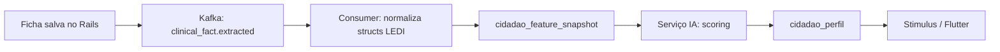

**Structs LEDI → features de IA (mapeamento direto):**

| Struct compartilhada | Features típicas para o modelo |
|----------------------|--------------------------------|
| `CondicoesDeSaude` | diabetes, HAS, tuberculose, internação 12m, gestante, etc. |
| `ProblemaCondicao` | lista CIAP/CID10 ativos, `situacao`, evolução temporal |
| `Medicamentos` | contagem, classes terapêuticas, uso contínuo |
| `medicoes` | PA, glicemia, IMC derivado, saturação |
| `Ivcf` | score + flags por dimensão (≥60 anos) |
| `IdentificacaoUsuarioCidadao` | idade, sexo, raça/cor, nacionalidade |
| `VacinaRowThrift` | cobertura vacinal, atrasos |
| `condicoesAvaliadas` (FAE/FAD) | dependência, paliativo, sondas, oxigenoterapia — perfil **fragilidade domiciliar** |
| `FichaAvaliacaoElegibilidade` | `atencaoDomiciliarModalidade`, CID10, elegível/inelegível |
| `FichaComplementarZikaMicrocefalia` | triagens alteradas (olhinho, orelhinha, neuroimagem) — perfil **risco neurodesenvolvimento** |
| `FichaConsumoAlimentar` | padrão alimentar por idade — perfil **risco nutricional infantil** |
| `FichaCuidadoCompartilhado` | prioridade, conduta evolutiva, encaminhamento compartilhado — perfil **continuidade do cuidado** |

**Perfis sugeridos (exemplos de saída da IA, não exclusivos do LEDI):**

- `hipertensao_descompensada` — PA elevada + CIAP/CID HAS + idade
- `polifarmacia_idoso` — ≥5 medicamentos + idade ≥60 + IVCF alterado
- `gestante_alto_risco` — CIAP gravidez + condições FCI
- `risco_cardiovascular` — comorbidades + medidas + procedimentos
- `elegivel_ad_modalidade_2` — FAE com AD2/AD3 + condições avaliadas graves
- `risco_neurodesenvolvimento_infantil` — FCZM com exames alterados
- `desnutricao_infantil` — MCA com padrão alimentar de risco por faixa etária
- `cuidado_compartilhado_prioridade_alta` — FCC com reclassificação de prioridade

Armazene **perfil como dado derivado** (`cidadao_perfil`), nunca como substituto do payload LEDI — auditoria e envio ao PEC continuam no modelo de ficha original.

### Tabelas adicionais para IA (grupo F)

- `cidadao_feature_snapshot` — JSONB versionado + `computed_at` + `feature_schema_version` (materialização para treino e inferência)
- `cidadao_perfil` — `cidadao_id`, `perfil_codigo`, `score`, `model_version`, `explicacao_json` (SHAP/resumo para equipe)
- `perfil_regra` — regras determinísticas de fallback quando IA indisponível (mesmas structs LEDI)

Índices PostgreSQL 18: GIN em `feature_snapshot.features`, BRIN em `computed_at`, particionamento por `municipality_id` alinhado ao restante.

---

## Isolamento de dados: Prefeitura e UBS (multi-tenancy hierárquico)

**Requisito:** cada **Prefeitura** (`municipality`) enxerga e governa apenas seus dados e o de todas as **UBS** (`health_facilities`) vinculadas; cada **UBS** enxerga e altera apenas o que pertence ao seu escopo — **sem acesso cruzado** entre UBS do mesmo município. Cidadão (`citizen`) vê somente o próprio registro.

### Decisão arquitetural adotada (MVP e fase inicial)

| Item | Escolha |
|------|---------|
| **Estratégia** | **RLS (PostgreSQL Row Level Security) + chaves hierárquicas** |
| **Banco** | Um cluster PostgreSQL 18, **schema compartilhado** |
| **Chave raiz** | `municipality_id` NOT NULL em toda tabela operacional |
| **Chave UBS** | `health_facility_id` onde o dado é da unidade; território via `facility_micro_area_coverage` |
| **Aplicação** | RBAC + `user_municipality_memberships` (`scope`: `municipality` \| `facility` \| `team`) |
| **Defesa em profundidade** | RLS obrigatório desde **EPIC-00**; Rails **não** é a única barreira |

**Fora de escopo na fase inicial** (reavaliar só por contrato/compliance):

- Database ou schema **por UBS**
- Database **por município** (isolamento físico entre prefeituras no mesmo cluster)
- Isolamento **apenas** via `default_scope` / `where` no ActiveRecord

**Evolução futura (opcional):** migrar prefeituras críticas para database dedicado mantendo o mesmo modelo de chaves e políticas RLS — sem redesenho de domínio.

### Modelo de dados (banco)

**Um único PostgreSQL, schema compartilhado**, com isolamento em **camadas hierárquicas**:

| Camada | Chave | Quem enxerga |
|--------|-------|--------------|
| **Município (tenant raiz)** | `municipality_id` NOT NULL | Secretaria, admin municipal, relatórios consolidados |
| **UBS (sub-escopo operacional)** | `health_facility_id` + vínculos territoriais | Gestor UBS, recepção, almoxarifado, estoque/salas daquela unidade |
| **Equipe / território** | `care_team_id`, `micro_area_id` (via `team_areas`) | Profissional de campo e indicadores por INE |
| **Cidadão** | `citizen_id` | App Citizen (1:1 com `citizen_accounts`) |

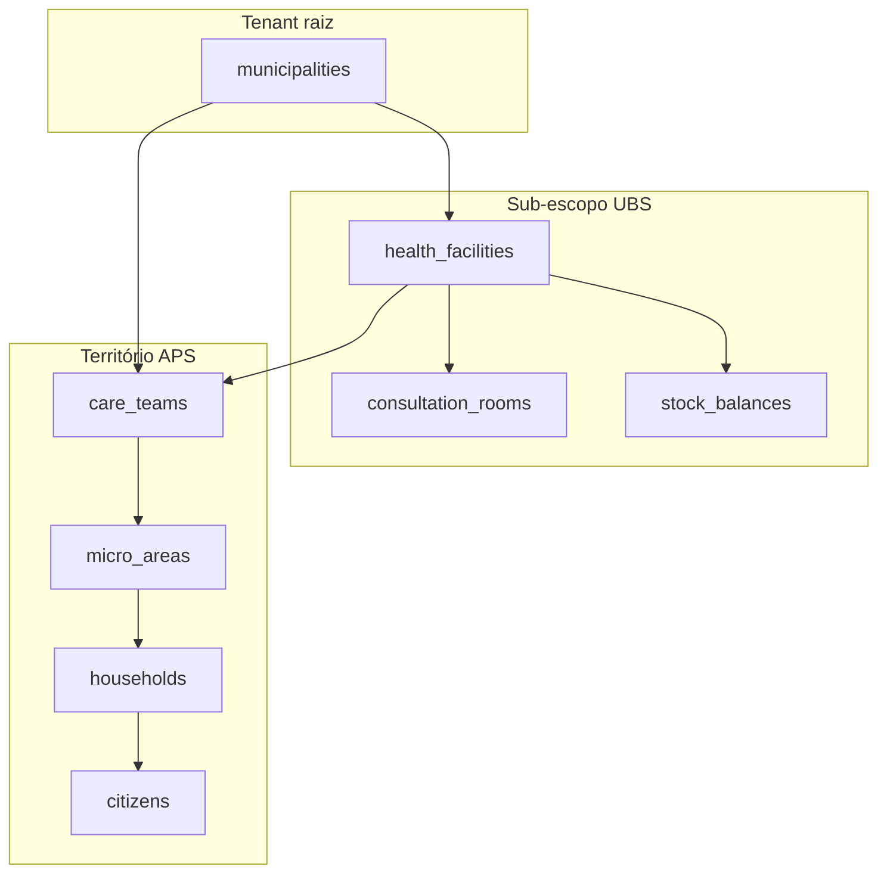

**Regra de ouro:** toda tabela operacional carrega **`municipality_id` denormalizado** (mesmo quando há `health_facility_id`), para políticas RLS e particionamento sem JOIN obrigatório. Tabelas globais de referência MS (`indicator_catalog`, `ledi_field_catalog`) ficam **sem** tenant.

### Tabelas de governança de acesso (grupo D estendido)

| Tabela (en-US) | Responsabilidade |
|----------------|------------------|
| `user_municipality_memberships` | `user_id`, `municipality_id`, `scope` = `municipality` \| `facility`, `health_facility_id` (NULL se escopo municipal), `role`, `active` |
| `user_team_assignments` | Profissional ↔ `care_team_id` (campo visita só equipes atribuídas) |
| `facility_team_links` | `health_facility_id` ↔ `care_team_id` (CNES/INE da UBS) |

**Escopos RBAC (aplicação + RLS):**

| Papel | `scope` | Filtro efetivo |
|-------|---------|----------------|
| `municipal_admin`, `health_secretary` | `municipality` | `municipality_id = sessão` (todas UBS) |
| `facility_manager`, `reception`, `warehouse` | `facility` | `municipality_id = sessão` **AND** `health_facility_id = sessão` |
| `field_professional` | `team` | `municipality_id` + `care_team_id IN (assignments)` + microáreas da equipe |
| `citizen` | `self` | `citizen_id = sessão` |

### PostgreSQL Row Level Security (RLS) — obrigatório no MVP

Parte central da decisão **RLS + chaves hierárquicas**. Configurar no **início (EPIC-00)**; complementar (não substituir) validações em commands/API.

**Contexto de sessão** (setado no `ApplicationRecord` connection após autenticação):

```sql
SET LOCAL app.current_municipality_id = 'uuid';
SET LOCAL app.current_health_facility_id = 'uuid';  -- vazio se escopo municipal
SET LOCAL app.current_scope = 'municipality' | 'facility' | 'team' | 'citizen';
SET LOCAL app.current_team_ids = 'uuid1,uuid2';     -- field
SET LOCAL app.current_citizen_id = 'uuid';          -- citizen app
```

**Políticas exemplo:**

```sql
-- citizens: municipal vê todos do município; UBS vê cidadãos vinculados às microáreas da UBS
CREATE POLICY citizens_municipal ON citizens
  FOR ALL USING (municipality_id = current_setting('app.current_municipality_id')::uuid);

CREATE POLICY citizens_facility ON citizens
  FOR ALL USING (
    municipality_id = current_setting('app.current_municipality_id')::uuid
    AND current_setting('app.current_scope') = 'facility'
    AND id IN (
      SELECT hm.citizen_id FROM household_members hm
      JOIN households h ON h.id = hm.household_id
      WHERE h.health_facility_id = current_setting('app.current_health_facility_id')::uuid
         OR h.micro_area_id IN (SELECT micro_area_id FROM facility_micro_area_coverage WHERE ...)
    )
  );

-- stock_balances: estritamente por UBS
CREATE POLICY stock_facility ON stock_balances
  FOR ALL USING (
    municipality_id = current_setting('app.current_municipality_id')::uuid
    AND (
      current_setting('app.current_scope') = 'municipality'
      OR health_facility_id = current_setting('app.current_health_facility_id')::uuid
    )
  );
```

| Tipo de dado | Coluna principal de escopo UBS | Coluna municipal |
|--------------|-------------------------------|------------------|
| Estoque, salas, agendamento na UBS | `health_facility_id` | `municipality_id` |
| Campanhas / rotas domiciliares | `health_facility_id` (UBS organizadora) | `municipality_id` |
| Cidadão / domicílio | `micro_area_id` → cobertura UBS | `municipality_id` |
| Indicadores equipe | `care_team_id` | `municipality_id` |
| LEDI / clinical_records | `municipality_id` + `origin_health_facility_id` | `municipality_id` |

**`FORCE ROW LEVEL SECURITY`** em tabelas sensíveis; role da aplicação sem `BYPASSRLS`. Migrations e jobs usam role separada ou `SET ROLE` explícito com auditoria.

### Particionamento e índices

- **Particionamento LIST/HASH por `municipality_id`** em tabelas volumosas (`clinical_records`, `encounters`, `domain_events`, `citizen_indicator_gaps`) — backup/restore e performance por prefeitura.
- Índices compostos: `(municipality_id, health_facility_id, …)`, `(municipality_id, care_team_id, quadrimestre)` para painéis.

### Anti-padrões (proibidos na implementação inicial)

| Abordagem | Status | Motivo |
|-----------|--------|--------|
| Só filtro no Rails (`where(municipality_id:)`) | **Proibido** | Vazamento entre UBS; console/jobs ignoram escopo |
| Schema ou DB **por UBS** | **Fora de escopo MVP** | Centenas de UBS → explosão operacional |
| DB **por município** | **Fora de escopo MVP** | Reavaliar em tier enterprise; não bloqueia RLS atual |
| `health_facility_id` sem `municipality_id` | **Proibido** | RLS lenta; risco cross-municipality |
| Role app com `BYPASSRLS` | **Proibido** | Anula a decisão arquitetural |

### CQRS, Kafka e APIs

- **Commands:** validar que `municipality_id` / `health_facility_id` do payload = membership do `current_user`.
- **Eventos:** envelope obrigatório `{ municipality_id, health_facility_id?, care_team_id? }`.
- **Projectors:** propagar `municipality_id` na materialização; read models herdando RLS.
- **API Field/Citizen:** token JWT com claims `municipality_id`, `scope`, `facility_id` ou `team_ids`.

### Implementação no backlog (checklist RLS + chaves)

| Item | Onde | Done when |
|------|------|-----------|
| `user_municipality_memberships` + `municipality_id` NOT NULL em migrations | **TASK-02-01** SUB-02-01-01..03 | policy spec: insert sem tenant falha |
| `facility_micro_area_coverage` | **TASK-02-02** (STORY-02-02) | UBS A não lista cidadão da microárea da UBS B |
| Middleware `TenantScope` + `SET LOCAL app.*` | **TASK-00-06** SUB-00-06-03 | request spec com 2 UBS no mesmo município |
| Policies RLS em tabelas núcleo (citizens, stock, appointments) | **TASK-00-06** SUB-00-06-03 | `FORCE ROW LEVEL SECURITY` + teste SQL |
| JWT claims `municipality_id`, `scope`, `facility_id` | **TASK-00-06** SUB-00-06-02 | Field/Citizen API respeitam escopo |
| Event envelope com tenant keys | **TASK-00-03** / **TASK-00-05** | Karafka consumer não projeta fora do tenant |
| Testes regressão cross-UBS | **TASK-02-05** (STORY-02-01) | gestor UBS A recebe 403 em recurso da UBS B |
| ADR no repo | **TASK-00-02** | `docs/adr/0001-tenant-isolation-rls.md` commitado |

**Definition of Done (isolamento):** nenhuma query de produção sem `municipality_id` na policy; profissional `facility` não altera `stock_balances` de outra UBS; secretário municipal lista todas UBS do município.

---

## Stack técnica (Rails 8 + PostgreSQL 18)

### Convenções de código (obrigatório)

| Escopo | Idioma | Exemplos |
|--------|--------|----------|
| Código-fonte Ruby/JS | **en-US** | `Citizen`, `HealthFacility`, `VaccinationCampaign`, `PublishClinicalRecord` |
| Banco de dados | **en-US** | `citizens`, `household_id`, `occurred_at` |
| Eventos de domínio / Kafka | **en-US** | `clinical.record.persisted`, `inventory.lot.expiring` |
| Comentários e docs técnicos no repo | **en-US** | ADRs, README, YARD |
| Interface do usuário (labels, relatórios) | **pt-BR** | [`rails-i18n`](https://github.com/svenfuchs/rails-i18n) + `config/locales/pt-BR.yml` (`cidadaobr.*`); termos MS (C4, CVAT) mantidos |
| Mensagens de validação (models, forms, API errors) | **pt-BR via I18n** | Lookup Rails (`validates` sem `message:` + YAML) ou `errors.add(:attr, :symbol)`; **proibido** string literal |

**Proibido no código:** nomes de model/tabela/coluna em português (`cidadao`, `domicilio`, `equipe`). O plano histórico pode citar termos MS em português; na implementação usar o [mapa en-US](#mapa-de-nomes-legado-do-plano--implementação-en-us) abaixo.

**Indicadores (Portaria 3.493 / SAPS):** usar **somente** códigos oficiais em `indicator_catalog.code` e em `good_practice_code` — ver [Componente II — Vínculo](#componente-ii--vínculo-e-acompanhamento-territorial-códigos-cvat-v-) (`CVAT`, `V_CAD`, `V_ACOMP`, `V_SAT`, `C1`–`C7`, `B1`–`B6`, `M1`, `M2`) e regras de vínculo (`V_CAD_ATU`, `V_CAD_COM`, `V_ACOMP_12M`, `V_LIM_CAD`). **Proibido:** códigos inventados (`C8`–`C15`), abreviações em português (`CAD`, `ACOMP`, `SAT`, `VAC`) e contornos como listas “canônicas” que desativam linhas legadas no seed — a fonte de verdade é `Indicators::Portaria3493` + validação nos models.

### Desenvolvimento (pré-produção) — migrations e dados

Enquanto o produto estiver em **desenvolvimento local/piloto** (sem base de produção a preservar):

| Fazer | Não fazer |
|-------|-----------|
| Migrations **estruturais** (tabelas, colunas, índices, RLS, constraints) | Migrations de **dados** que renomeiam códigos, corrigem textos/JSONB ou “limpam” seed antigo |
| Corrigir nomenclatura no **código**, **seed** e **validações** | `update_all` / `delete_all` em migrations para alinhar `indicator_catalog`, `citizen_indicator_gaps`, `indicator_rules.expression` |
| Resetar ambiente com `bin/rails db:drop db:prepare db:seed` quando o schema ou catálogo mudar | Scripts one-off permanentes no repo só para consertar dev |

**Regra:** se a correção é de conteúdo de referência (catálogo de indicadores, rótulos I18n, expressões DSL), **não** persistir via migration — recriar o banco. Migrations de backfill de dados entram **apenas** quando houver ambiente de produção/staging com dados a migrar (pós-MVP).

### Internacionalização (I18n) — padrão do projeto

**Dependência obrigatória:** `gem "rails-i18n", "~> 8.1.0"` ([repositório](https://github.com/svenfuchs/rails-i18n)).

| Camada | Origem | Conteúdo |
|--------|--------|----------|
| Base | `rails-i18n` | Mensagens genéricas (`blank`, `taken`, `inclusion`), datas, números, pluralização pt-BR |
| App | `config/locales/pt-BR.yml` | Marca, dashboard, futuras telas (`cidadaobr.*`) |
| Model | `config/locales/models/<model>_pt-BR.yml` | Erros por atributo + `activerecord.attributes` (labels humanos) |
| Código | en-US | Nomes Ruby/DB/eventos; **zero** string literal pt-BR em `validates`, `errors.add` ou views |

**Configuração Rails:** `default_locale: pt-BR`, `available_locales: [pt-BR, en]`, `config.rails_i18n.enabled_modules = [:locale, :pluralization]`, `raise_on_missing_translations: true` em development/test.

**Models:** por model, **uma única** linha `validates :a, :b, :c, presence: true` com todos os atributos obrigatórios; `uniqueness`, `inclusion` etc. em linhas separadas **sem** repetir `presence: true`. Sem `message:` literal — I18n via YAML. Validações customizadas com `errors.add(:health_facility_id, :required_for_facility_scope)`.

Exemplo:

```ruby
validates :email, :full_name, :status, presence: true
validates :email, uniqueness: true
validates :status, inclusion: { in: STATUSES }
```

O Rails resolve a cadeia `activerecord.errors.models.<model>.attributes.<attr>.<key>` → fallback `activerecord.errors.messages.*` do gem.

**Arquivo por model:** `config/locales/models/<nome_do_model>_pt-BR.yml` (snake_case, ex.: `user_municipality_membership_pt-BR.yml`).

**Estrutura YAML:**

```yaml
pt-BR:
  activerecord:
    attributes:
      user:
        email: "E-mail"
        full_name: "Nome completo"
    errors:
      models:
        user:
          attributes:
            email:
              blank: "é obrigatório"
              taken: "já está em uso"
```

**Views/controllers:** `t('.key')` (lazy lookup) ou `I18n.t('cidadaobr....')`; proibido texto pt-BR inline.

**API JSON:** serializar `errors.full_messages` (já traduzidos pelo locale pt-BR).

**Commands/services:** quando precisarem de mensagens de erro, usar `I18n.t` com a mesma chave `activerecord.errors.models...`.

**Escopo:** vale para models atuais e futuros; arquivos globais (`config/locales/pt-BR.yml`) ficam para UI/marca, não para erros de model.

### Backend

- **Ruby on Rails 8** (versão estável mais recente) — monólito modular: **Command** layer, **Query** layer, **Event** publishers
- **rails-i18n** — locale base pt-BR (datas, pluralização, mensagens genéricas ActiveRecord)
- **PostgreSQL 18** — JSONB, **PostGIS**, **RLS** + chaves `municipality_id` / `health_facility_id`, particionamento por `municipality_id`, GIN/BRIN; `pgvector` opcional ([decisão de isolamento](#decisão-arquitetural-adotada-mvp-e-fase-inicial))
- **Solid Queue** — jobs idempotentes curtos (envio lote LEDI, rebuild projection)
- **Karafka** — producers/consumers Kafka

### Arquitetura: Event Sourcing + CQRS + EDA

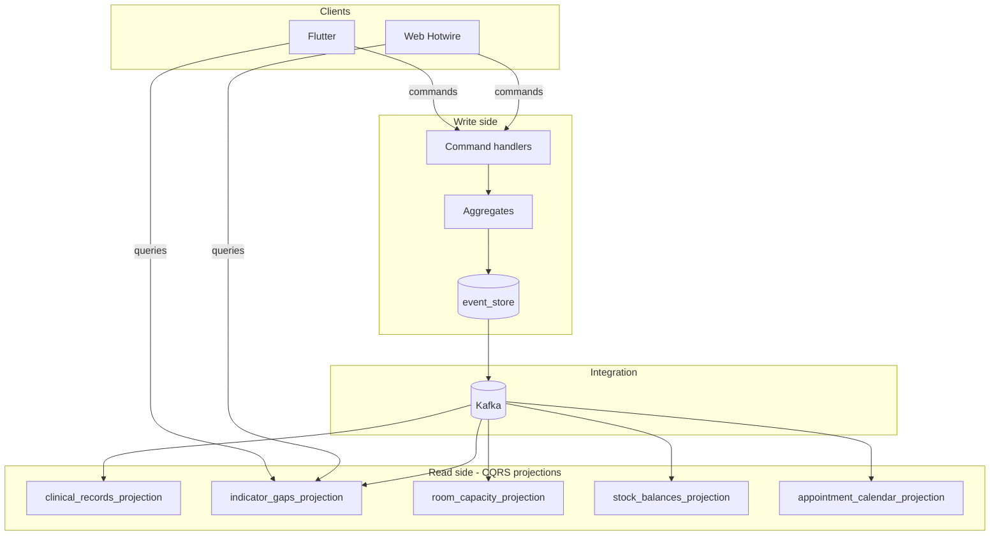

**Princípios:**

1. **Event Sourcing (núcleo):** agregados críticos (`Citizen`, `Household`, `ClinicalRecord`, `VaccinationCampaign`, `StockLot`) persistem decisões como eventos append-only em `domain_events` (ou gem `rails_event_store`). Estado atual = fold dos eventos ou snapshot periódico.
2. **CQRS:** telas de relatório/indicador/estoque leem **projeções** otimizadas (`*_read_models`), nunca fazem JOIN pesado no event store.
3. **EDA:** após commit do evento, **outbox** publica no Kafka; consumers idempotentes atualizam projeções, motor de indicadores, IA e alertas de vencimento.
4. **LEDI:** `clinical_records.payload_json` é **projeção** derivada de `ClinicalRecordImported` / `ClinicalRecordValidated`; envio PEC emite `LediBatchSubmitted`.

**Bounded contexts (pacotes `app/domains/`):**

| Context | Comandos exemplo | Projeções / queries |
|---------|------------------|---------------------|
| `integration/ledi` | `ImportTransportRecord`, `SubmitLediBatch` | `clinical_records`, `transport_records` |
| `clinical` | `RegisterEncounter`, `LinkCitizenToHousehold`, `SubmitFieldClinicalRecord` | `encounters`, `citizen_timeline` |
| `field_operations` | `SyncOfflineBatch`, `CompleteFieldVisit` | `field_visit_routes`, `campaign_day_queue` |
| `territory` | `UpdateHouseholdLocation`, `AssignMicroArea` | `households_map`, `team_coverage` |
| `facility` | `ConfigureRoomCapacity`, `BookRoomSlot` | `room_availability` |
| `scheduling` | `BookAppointment`, `CheckInAppointment`, `CompleteAppointment`, `RescheduleAppointment` | `facility_daily_schedule`, `room_utilization` |
| `citizen_portal` | `BookAppointment` (citizen_app), `BookImmunizationAppointment`, `TriggerPanicAlert`, `JoinTeleconsultationSession` | `citizen_immunization_wallet`, `citizen_appointment_feed` |
| `inventory` | `ReceiveLot`, `TransferStock`, `ReserveVisitRouteSupplies`, `DispatchTeamSupplyKit`, `RecordSupplyConsumptionAtStop` | `stock_balances`, `visit_route_provisionings` |
| `campaigns` | `LaunchVaccinationCampaign`, `DefineHomeVisitTargetAudience`, `BuildCampaignTargetList`, `GenerateVisitRoutes`, `PublishVisitRoutes`, `CompleteRouteStop` | `campaign_dashboard`, `visit_route_map`, `building_attendance_summary` |
| `indicators` | `RecalculateTeamScore` (reage a eventos) | `team_indicator_results`, `citizen_indicator_gaps` |
| `identity` | `InviteUser`, `AssignRole` | `users`, `permissions` |

### Aplicação web (escopo funcional Hotwire)

Módulos na mesma app Rails (`/admin` ou namespaces por papel):

| Módulo | Funções |
|--------|---------|
| **Indicators** | Painel 17 indicadores, drill-down BP, gaps por cidadão/equipe, quadrimestre |
| **Reports** | Export CSV/PDF: repasse, cobertura vacinal, visitas, estoque |
| **Users & RBAC** | Usuários, papéis (secretário, gestor UBS, profissional, TI) |
| **Facilities & teams** | UBS, salas, equipes, áreas, microáreas, profissionais |
| **Citizens & families** | Cidadão, família, membros, medicações, vínculo equipe |
| **Households & geo** | Domicílio no mapa, rotas visita, `household_animals` (FCD) |
| **Animal vaccination** | Campanhas antirrábicas, doses, carteira/atestado CFMV, cobertura UVZ — **mesmo** estoque/sala/provisionamento |
| **Scheduling** | Agenda UBS (staff); visualização de agendamentos via app cidadão; check-in, no-show |
| **Rooms & capacity** | Cadastro de salas e **templates** de capacidade (`room_capacity_slots`); alimenta o módulo Scheduling |
| **Immunobiologics stock** | Lotes, vencimentos, movimentações, alertas |
| **Provisioning** | Simulação demanda campanha × estoque × capacidade sala |
| **Vaccination campaigns** | Campanha, público-alvo, salas alocadas, doses reservadas |
| **Home visit routing** | Público-alvo → rotas → **provisionamento insumos** → romaneio equipe → execução (**WEB-CAMP-03..06**, **FIELD-08..10**) |
| **LEDI ops** | Status envio PEC, rejeições, reprocessamento |

**Web** = planejamento, gestão UBS, agendamentos, relatórios, estoque. **Flutter** = execução territorial (ver seção abaixo).

### Mensageria: Kafka (recomendado) vs RabbitMQ

| Critério | Kafka | RabbitMQ |
|----------|-------|----------|
| Volume Brasil / replay | Log imutável, reprocessar histórico para retreino IA | Fila consome-e-apaga; replay mais trabalhoso |
| Múltiplos consumidores | PEC pipeline, extrator de features, IA, auditoria em paralelo | Fanout possível, mas sem histórico longo por padrão |
| Integração Rails | Karafka maduro | Bunny + workers simples |
| Operação | Mais infra (brokers, ZooKeeper/KRaft) | Mais simples para MVP pequeno |

**Decisão: Kafka** como barramento principal de **fatos clínicos** (`clinical.*`), porque você terá vários consumidores assíncronos, volume nacional e necessidade de **replay** para recalcular perfis quando o modelo LEDI ou de IA mudar.

RabbitMQ fica dispensável no desenho inicial: **Solid Queue** cobre filas de tarefa unitária (ex.: “enviar lote X”); Kafka cobre o stream de domínio.

**Tópicos Kafka (en-US):**

| Topic | Producer | Consumer |
|-------|----------|----------|
| `clinical.record.submitted` | Flutter `SubmitFieldClinicalRecord` | Validation queue |
| `clinical.record.persisted` | After LEDI validation | Projector → `citizens`, `encounters`; close gaps |
| `clinical.fact.extracted` | Extractor worker | `citizen_feature_snapshots` builder |
| `clinical.profile.requested` | Scheduler / command | AI scoring service |
| `clinical.profile.scored` | AI service | `citizen_profiles` + Turbo push |
| `indicator.gap.detected` | Indicator engine | Web notifications, Flutter sync |
| `indicator.team_score.updated` | Quadrimestre close | Dashboard projection |
| `inventory.lot.expiring` | Stock projector | Web alerts (human + animal lots) |
| `animal.vaccination.administered` | `AdministerAnimalVaccination` | Coverage projector, SinPatinhas export (future) |
| `animal.vaccination.campaign.launched` | `LaunchAnimalVaccinationCampaign` | Campaign dashboard UVZ |
| `campaign.capacity.exceeded` | Provisioning validator | Block scheduling UI |
| `appointment.booked` | `BookAppointment` (citizen_app / web) | Calendar, push ao cidadão, fila recepção |
| `panic.alert.triggered` | `TriggerPanicAlert` | Equipe SAMU/UBS, auditoria LGPD |
| `teleconsultation.session.started` | `JoinTeleconsultationSession` | Sala WebRTC |
| `appointment.completed` | `CompleteAppointment` | C1 indicator engine, clinical record prep |
| `appointment.no_show` → `appointment.noshow` | `MarkAppointmentNoShow` | Utilization report, slot release |
| `household.location.updated` | Territory command | Map projection, visit routes |
| `ledi.batch.ready` | LEDI command | Thrift serializer + PEC submit |
| `ledi.batch.status_changed` | PEC integration | `transport_records.status` |

Particionar por `ibge_code` (ou `citizen_id` hash). **Transactional outbox** na mesma transação do `domain_events` insert garante at-least-once sem perder eventos.

### Serviço de IA

- **Fase 1:** regras + scoring estatístico em Ruby (fallback em `perfil_regra`) usando features extraídas das structs LEDI
- **Fase 2:** serviço **Python** (FastAPI) ou worker dedicado consumindo `clinical.fact.extracted` — modelos sklearn/XGBoost ou LLM com RAG restrito ao `feature_snapshot` (não enviar PHI bruta a terceiros sem controles)
- Contrato: mensagem compacta com `cidadao_id`, `feature_schema_version`, features normalizadas

### Frontend — três canais

| Canal | App | Público | Escopo |
|-------|-----|---------|--------|
| **Web (Hotwire)** | — | Gestores, recepção | Gestão UBS, agenda (visão staff), indicadores, estoque, campanhas, relatórios |
| **CidadãoBR Saúde Campo** | `field_app` | Profissionais de campo | Multirão, visitas, **13 fichas LEDI**, offline-first |
| **CidadãoBR Saúde** | `citizen_app` | Cidadão | Consultas, vacinas, medicamentos, pânico, teleconsulta |
| **CidadãoBR Saúde Gestão** | Rails Hotwire `web` | Gestor/recepção/secretaria | Indicadores, campanhas, agenda UBS, LEDI ops |

**Repositórios Flutter (Opção A, Fase 8):** `cidadaobr-mobile-shared` primeiro; depois `cidadaobr-field` (**CidadãoBR Saúde Campo**) e `cidadaobr-citizen` (**CidadãoBR Saúde**). `api_client` gerado do OpenAPI em **`cidadaobr`**. Marca mãe **CidadãoBR** no splash/onboarding futuro hub multivertente.

A web **planeja** (Fases 2–7); o **Field** **executa** no território (Fase 8); o **Citizen** **autogere** serviços (Fase 8).

---

### Flutter — app de campo (uso exclusivo)

**Objetivo de produto:** permitir que equipes em ação territorial atendam **qualquer cidadão elegível ao público-alvo** (campanha ou linha de cuidado) e registrem **100% das fichas** exigidas para **CVAT**, **C1–C7, B1–B6 e M1–M2** e campanhas zoonoses — offline-first, com sync posterior ao Rails/Kafka/PEC.

**Perfis de uso (campo):**

| Cenário | Planejamento (web) | Execução (Flutter) |
|---------|-------------------|-------------------|
| **Multirão** | Campanha web + dia de ação | Fila por microárea; FAI, FP, FV, FAC, FCI pontual |
| **Dia D** | Campanha com `event_date` e metas por INE | Lista “público-alvo do dia”; check-in cidadão; fichas em sequência guiada |
| **Acamados / domicílio** | `visit_routes` publicados (WEB-CAMP-03..05) | **FVD**, **FAD**, **FAI**, **FP**; prédio = FIELD-09 |
| **Cadastro territorial** | Metas V-CAD / V-ACOMP | **FCI**, **FCD** no domicílio |
| **Zoonoses (dia D animal)** | `animal_zoonoses` campaign | **FCD** (animais) + `AdministerAnimalVaccination` |

**Público-alvo no app:** união de `campaign_targets` (campanha ativa) + `citizen_indicator_gaps` (pendências BP) + cidadãos da microárea da equipe logada. Regra: **se está no público-alvo, pode ser atendido** — sem lista fechada manual.

**Suporte às 13 fichas LEDI no Flutter (obrigatório):**

| Ficha | Formulário no app | Indicadores / componentes |
|-------|-------------------|---------------------------|
| **FCI** | Cadastro individual | CVAT (V-CAD) |
| **FCD** | Cadastro domiciliar + animais | CVAT, campanhas |
| **FAI** | Atendimento individual (child) | C1–C7, V-ACOMP |
| **FAO** | Atendimento odontológico | B1–B6 |
| **FAC** | Atividade coletiva (master) | C2, M1, M2, multirão |
| **FP** | Procedimentos / aferições | C4–C6, C3 |
| **FV** | Vacinação (master/child) | C2, C3, C6, C7, dia D |
| **FVD** | Visita domiciliar | C2–C6, V-ACOMP, acamados |
| **FAD** | Atendimento domiciliar | C6, acamados |
| **FAE** | Elegibilidade AD | AD / acamados |
| **FCZM** | Zika/microcefalia | C2 (triagens) |
| **MCA** | Marcadores alimentares | C2 |
| **FCC** | Cuidado compartilhado + evolução | M2, continuidade |

**Arquitetura técnica do app:**

- **Offline-first:** SQLite local (`pending_clinical_records`, `pending_commands`); sync quando há rede.
- **Command API:** `POST /api/v1/field/clinical_records` com `record_type` + payload JSON canônico (pré-validação LEDI no device: regras de `ledi_validation_rule` + combos de `reference_domain_entries` via pacote `reference_data`).
- **Wizard por missão:** “Visita acamado” abre sequência FVD → FAI → FP; “Dia D vacina” abre FCI (se necessário) → FV → FP.
- **Checklist de BP:** antes de encerrar visita, app cruza `citizen_indicator_gaps` e exige fichas/campos faltantes (ex.: C4-F avaliação do pé).
- **Geo:** navegação até `households.location`; registro de check-in no domicílio.
- **Auth:** profissional vinculado a `care_team` + INE; `tpCdsOrigem=3` no envelope LEDI.

**Bounded context `field_operations`:**

| Command (API) | Evento |
|---------------|--------|
| `SubmitFieldClinicalRecord` | `clinical.record.submitted` → validação Rails → `clinical.record.persisted` |
| `SyncOfflineBatch` | Replay de fila local |
| `CompleteFieldVisit` | Fecha rota; recalcula gaps da equipe |

**Não incluído no Flutter Field:** agendamento pelo cidadão, carteira vacinal do cidadão, botão de pânico, teleconsulta do paciente — isso é **Flutter Citizen**. Field também não faz gestão de salas/estoque nem relatórios gerenciais.

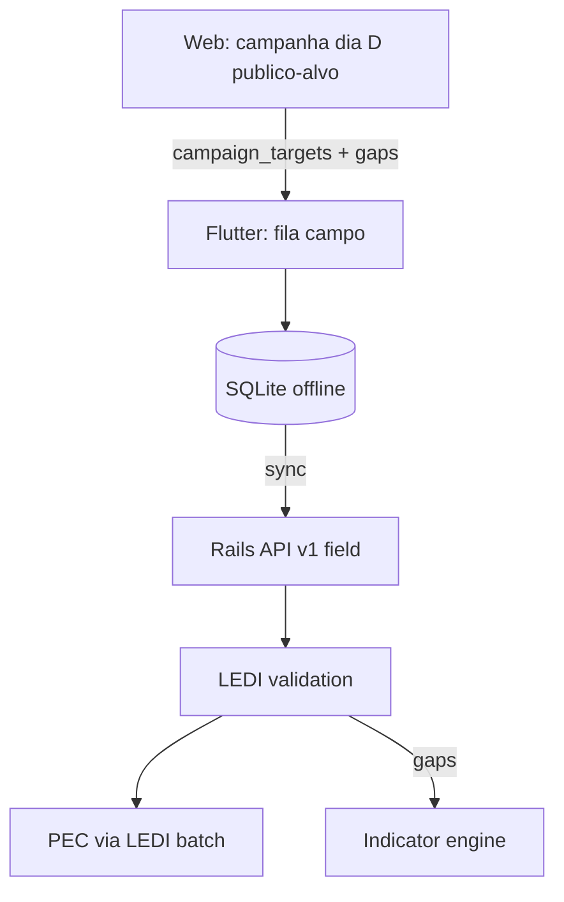

---

### CidadãoBR Saúde — app do cidadão (slogan: “Minha UBS no celular”)

**Objetivo:** o cidadão gerencia sua relação com a APS municipal sem ir à UBS para tarefas rotineiras — mesma base de dados da equipe/UBS do seu cadastro (**FCI** → `citizens` + `care_teams`).

| Tela / fluxo | Backend |
|--------------|---------|
| Início — Minha UBS (tela home) | `health_facilities`, `care_teams`, contato |
| Agendar consulta | `GET /slots` → `BookAppointment` (`channel: citizen_app`) |
| Minhas consultas | `CitizenUpcomingAppointments`; cancelar/reagendar |
| Cobertura vacinal | `CitizenImmunizationCoverage` (% PNI, atrasos) |
| Carteira de vacinação | `CitizenVaccinationWallet` (QR/PDF) |
| Agendar vacina | `BookImmunizationAppointment` + estoque |
| Medicamentos contínuos | `CitizenContinuousMedications` + `RequestMedicationRenewal` |
| Botão de pânico | `TriggerPanicAlert` → `panic_alerts` + notificação |
| Consulta online | `appointments.modality: telehealth` → `JoinTeleconsultationSession` |

**O que o cidadão não faz no app:** preencher fichas LEDI (FAI/FVD…) — isso é **Flutter Field** ou profissional na UBS. O Citizen **consome** o resultado (vacinas aplicadas, consultas realizadas, receitas).

**Vínculo com indicadores:** agendamentos `scheduled` + comparecimento alimentam **C1**; vacinação agendada e realizada reforça **C2/C3/C6/C7** e calendário PNI; não exibe “gaps MS” crus — linguagem simples (“falta vacina X”, “agende pré-natal”).

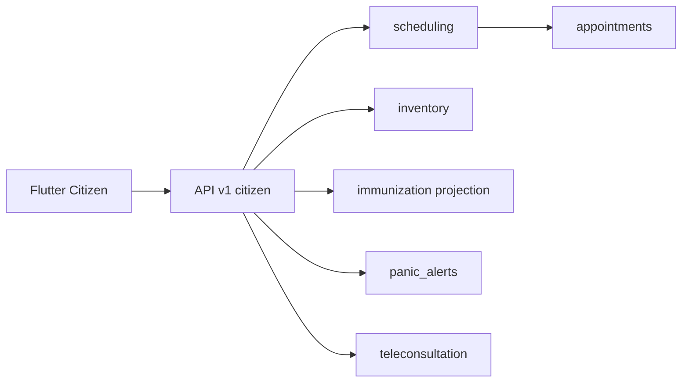

**Auth:** `citizen_accounts` — login CPF + verificação (SMS/e-mail); futuro **Gov.br**. LGPD: termo de uso, exportação de dados, exclusão sob demanda.

---

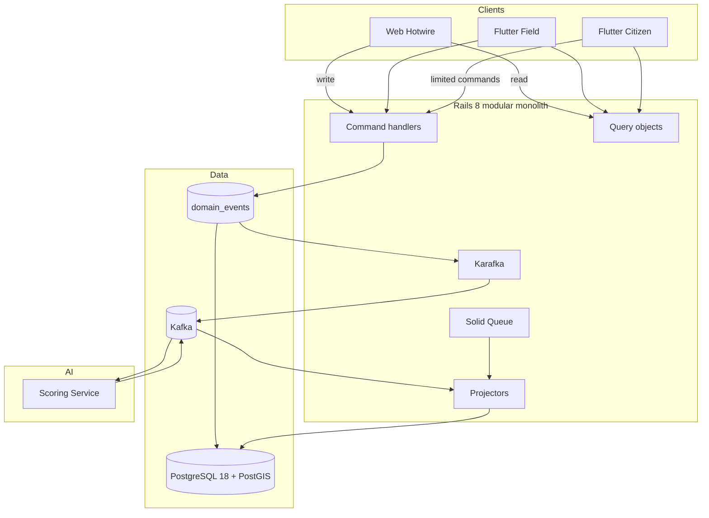

---

## Roteiro de desenvolvimento por etapas (para agentes)

Backlog estruturado para **exportação Scrum/Kanban** em **quatro níveis**: **Épico** (`EPIC-NN`) → **História** (`STORY-NN-NN`, valor de negócio) → **Tarefa** (`TASK-NN-NN`, entrega técnica) → **Subtarefa** (`SUB-NN-NN-NN`, implementação). Cada item tem `depends_on`, `legacy_ref`, `labels` e `phase` (0–8). Código **en-US**; UI **pt-BR**; narrativas de história em **pt-BR**.

**Decisão de roadmap (2026-05-29):** Fases **0–7** = monólito Rails + web gestão + APIs JSON. Fase **8** = repos Flutter (`mobile-shared`, `citizen`, `field`). Não iniciar apps mobile durante entrega web.

### Visão das fases

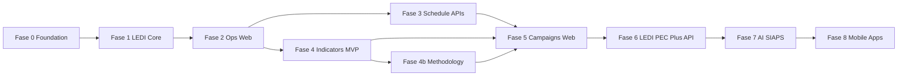

| Fase | Nome | Objetivo | Superfície |
|------|------|----------|------------|
| **0** | Foundation | Monólito Rails, ES/CQRS, Kafka, auth | — |
| **1** | LEDI Core | Ingestão e validação fichas; cadastro | — |
| **2** | Ops + Web base | UBS, equipes, cidadãos, domicílio | Web gestão |
| **3** | Scheduling + Citizen API | Agenda web + `/api/v1/citizen` | Web agenda |
| **4** | Indicators MVP | 17 indicadores, gaps, painel gestor | Web indicadores |
| **4b** | Methodology coverage | 48 packs, BPs C2–C7, audit trail, matriz cobertura | Web indicadores + docs |
| **5** | Campaigns (web) | Campanhas, estoque, rotas, romaneio | Web campanhas |
| **6** | LEDI/PEC + Plus API | PEC, 13 fichas outbound, panic/tele/meds **backend** | Web + APIs |
| **7** | AI + SIAPS | Perfis, conciliação MS, produção | Web + jobs |
| **8** | Mobile apps | `mobile-shared`, Citizen, Field | Flutter (lojas) |

---

### Formato de exportação para Scrum/Kanban

**Hierarquia:** `Epic` → `Story` (história de usuário) → `Task` (entrega técnica) → `Subtask` (implementação).

**IDs estáveis:** `EPIC-NN` | `STORY-NN-NN` | `TASK-NN-NN` | `SUB-NN-NN-NN` (exportar como Issue Key ou External ID). **Títulos** seguem [nomenclatura CidadãoBR Saúde](#nomenclatura-do-backlog-cidadaobr-saúde) — IDs não mudam.

### Nomenclatura do backlog (CidadãoBR Saúde)

| Prefixo | Produto | Uso |
|---------|---------|-----|
| `[Core]` | CidadãoBR Saúde | Backend compartilhado (LEDI, ES/CQRS, APIs, PEC, IA) |
| `[Gestão]` | CidadãoBR Saúde **Gestão** | Web Hotwire — prefeitura e UBS |
| `[Campo]` | CidadãoBR Saúde **Campo** | App Flutter profissional |
| `[Cidadão]` | CidadãoBR Saúde | App Flutter cidadão |

**Formato do título:** `{prefixo} {produto} — {entrega}` (ex.: `[Gestão] CidadãoBR Saúde Gestão — WEB-IND-01 Dashboard X/17`).

**Labels CSV:** `core`, `gestao`, `campo`, `cidadao` (além de `ledi`, `indicators`, etc.).

**Colunas CSV recomendadas** (Jira / Linear / Azure DevOps / GitHub Projects):

```csv
work_item_type,id,parent_id,epic_id,title,user_story,description,acceptance_criteria,labels,component,phase,priority,depends_on,legacy_ref,estimate_points
Epic,EPIC-00,,EPIC-00,CidadãoBR Saúde — Core Plataforma,,Monólito Rails 8 ES/CQRS Kafka,,backend;infra,platform,0,Must,,,21
Story,STORY-00-01,EPIC-00,EPIC-00,[Core] CidadãoBR Saúde — Bootstrap e convenções,"Como equipe de plataforma, quero inicializar o monólito Rails, para padronizar o desenvolvimento municipal.",,app sobe em CI,backend,platform,0,Must,,,8
Task,TASK-00-01,STORY-00-01,EPIC-00,[Core] CidadãoBR Saúde — Bootstrap Rails application,,,,backend,platform,0,Must,,F0-01,5
Subtask,SUB-00-01-01,TASK-00-01,EPIC-00,[Core] CidadãoBR Saúde — rails new + PG18 + Ruby lock,,db:create ok,backend,platform,0,Must,TASK-00-01,F0-01,2
```

| Campo | Uso na plataforma |
|-------|-------------------|
| `work_item_type` | Epic / **Story** / Task / Subtask |
| `parent_id` | Story → Epic; Task → Story; Subtask → Task |
| `epic_id` | Sempre o Epic raiz (Epic Link / filtro de board) |
| `user_story` | Narrativa **Como… / Quero… / Para que…** (somente em `Story`) |
| `labels` | `core`, `gestao`, `campo`, `cidadao`, `ledi`, `indicators`, `routing` (+ legado `web`/`field`/`citizen`) |
| `component` | `core`, `gestao`, `campo`, `cidadao`, `ledi`, `scheduling`, `inventory` |
| `phase` | 0–7 (fix version / milestone) |
| `depends_on` | IDs bloqueantes (vírgula se múltiplos) |
| `legacy_ref` | Mapeamento ids antigos F*, WEB-*, FIELD-* |

**Arquivo futuro no repo:** `docs/backlog/aps-municipal-backlog.csv` (gerado a partir desta seção).

---

### Catálogo de épicos

| epic_id | Fase | Nome | Objetivo |
|---------|------|------|----------|
| **EPIC-00** | 0 | CidadãoBR Saúde — Core Plataforma | Rails, ES/CQRS, Kafka, auth, APIs |
| **EPIC-01** | 1 | CidadãoBR Saúde — Core LEDI | Transporte, fichas, adapters, PEC draft |
| **EPIC-12** | transversal (1→6) | CidadãoBR Saúde — Dados de Referência MS/LEDI | Ingestão UFSC + SIGTAP, SSOT Postgres, API `/reference/*`, jobs mensais |
| **EPIC-02** | 2 | CidadãoBR Saúde Gestão — Admin Municipal | UBS, equipes, cidadãos, mapa, LEDI status |
| **EPIC-03** | 3 | CidadãoBR Saúde Gestão — Agendamentos UBS | Agendamentos web staff + salas |
| **EPIC-04** | 3 (API) / **8** (App) | CidadãoBR Saúde — Portal cidadão | Fase 3: auth, slots, vacinas API; Fase 8: app Flutter |
| **EPIC-05** | 4 | CidadãoBR Saúde Gestão — Indicadores 3.493 (MVP) | Painel, gaps, DSL piloto |
| **EPIC-05b** | 4b | Cobertura Notas Metodológicas 3493 | 48 packs, BPs, matriz, ADR-0005 |
| **EPIC-06** | 5 | CidadãoBR Saúde Gestão — Estoque e Campanhas | Estoque, campanha vacina, dia D |
| **EPIC-07** | 5 | CidadãoBR Saúde Gestão — Rotas e Provisionamento | Público-alvo, rotas 1..N, kit insumos |
| **EPIC-08** | **8** | CidadãoBR Saúde Campo — App Profissional | Offline, roteiro, FVD, kit equipe |
| **EPIC-09** | 6 (Core) / **8** (Field UI) | CidadãoBR Saúde — LEDI Completo e PEC | PEC, adapters, walk-in web; fichas Field UI na Fase 8 |
| **EPIC-10** | 6 (API) / **8** (App UI) | CidadãoBR Saúde — Cidadão Plus | Backend panic/tele/meds Fase 6; telas Flutter Fase 8 |
| **EPIC-11** | 7 | CidadãoBR Saúde — Core IA e Produção | Perfis IA, conciliação MS, relatórios |

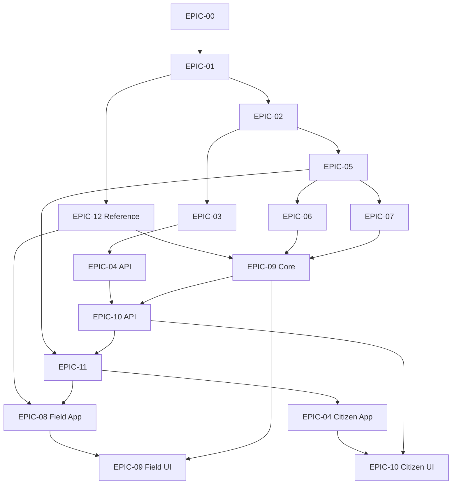

---

### Catálogo de histórias (STORY-*)

Cada história agrupa uma ou mais **Tasks**. Na exportação CSV, `parent_id` da Task = `STORY-*` (não o Epic).

| story_id | epic_id | Título | user_story (pt-BR) | Tasks |
|----------|---------|--------|-------------------|-------|
| **STORY-00-01** | EPIC-00 | [Core] CidadãoBR Saúde — Bootstrap e convenções | Como equipe de plataforma, quero inicializar o monólito Rails e convenções en-US, para padronizar o desenvolvimento. | TASK-00-01, TASK-00-02 |
| **STORY-00-02** | EPIC-00 | [Core] CidadãoBR Saúde — Event sourcing e CQRS | Como arquiteto, quero event store com `municipality_id` nos eventos, para auditar e projetar por tenant. | TASK-00-03, TASK-00-04 |
| **STORY-00-03** | EPIC-00 | [Core] CidadãoBR Saúde — Mensageria Kafka | Como integrador, quero Kafka/Karafka, para publicar eventos entre contextos. | TASK-00-05 |
| **STORY-00-04** | EPIC-00 | [Core] CidadãoBR Saúde — Autenticação, RLS e APIs | Como administrador, quero RBAC com RLS e chaves hierárquicas, para isolar Prefeitura e UBS no banco. | TASK-00-06, TASK-00-07 |
| **STORY-01-01** | EPIC-01 | [Core] CidadãoBR Saúde — Artefatos e schema LEDI | Como integrador LEDI, quero versão oficial e schema de transporte, para validar fichas antes do PEC. | TASK-01-01, TASK-01-02, TASK-01-03 |
| **STORY-01-02** | EPIC-01 | [Core] CidadãoBR Saúde — Validar e enviar fichas | Como sistema, quero adapters e batch LEDI, para submeter fichas conforme MS. | TASK-01-04, TASK-01-05, TASK-01-06 |
| **STORY-01-03** | EPIC-01 | [Core] CidadãoBR Saúde — Projetar cadastro operacional | Como UBS, quero cidadãos e domicílios projetados das fichas, para operar sem re-digitar. | TASK-01-07 |
| **STORY-12-01** | EPIC-12 | [Core] CidadãoBR Saúde — Schema e ADR dados de referência | Como plataforma, quero tabelas globais versionadas, para auditar imports UFSC/SIGTAP. | TASK-12-01 |
| **STORY-12-02** | EPIC-12 | [Core] CidadãoBR Saúde — Importar domínios e catálogo UFSC | Como integrador, quero parse automático da doc UFSC, para manter combos e campos LEDI atualizados. | TASK-12-02, TASK-12-03 |
| **STORY-12-03** | EPIC-12 | [Core] CidadãoBR Saúde — SIGTAP e publicar release | Como sistema, quero SIGTAP mensal e release com checksum, para clientes sincronizarem por versão. | TASK-12-04, TASK-12-05 |
| **STORY-12-04** | EPIC-12 | [Core] CidadãoBR Saúde — API e autocompletes de referência | Como desenvolvedor web/mobile, quero API `/reference/*`, para formulários clínicos sem HTML ao vivo. | TASK-12-06, TASK-12-07 |
| **STORY-02-01** | EPIC-02 | [Gestão] CidadãoBR Saúde Gestão — Cadastrar UBS e equipes | Como gestor municipal, quero cadastrar UBS, INE e profissionais, para organizar a rede. | TASK-02-01, TASK-02-03, TASK-02-05 |
| **STORY-02-02** | EPIC-02 | [Gestão] CidadãoBR Saúde Gestão — Cidadãos e domicílios no mapa | Como ACS/gestor, quero ver cidadãos e domicílios no mapa, para planejar cobertura territorial. | TASK-02-02, TASK-02-04, TASK-02-07 |
| **STORY-02-03** | EPIC-02 | [Gestão] CidadãoBR Saúde Gestão — Monitorar envios LEDI | Como gestor, quero ver status de lotes e rejeições PEC, para corrigir envios. | TASK-02-06 |
| **STORY-03-01** | EPIC-03 | [Gestão] CidadãoBR Saúde Gestão — Agendar na UBS (staff) | Como recepção, quero agenda por sala e profissional, para organizar atendimentos presenciais. | TASK-03-01 … TASK-03-05 |
| **STORY-04-01** | EPIC-04 | [Cidadão] CidadãoBR Saúde — Conta do cidadão | Como cidadão, quero entrar com CPF, para acessar só meus dados. | TASK-04-01 |
| **STORY-04-02** | EPIC-04 | [Cidadão] CidadãoBR Saúde — Agendar consulta pelo celular | Como cidadão, quero agendar consulta na Minha UBS, para não ir à fila presencial. | **F3:** TASK-04-02 (API). **F8:** TASK-04-06 (app Flutter) |
| **STORY-04-03** | EPIC-04 | [Cidadão] CidadãoBR Saúde — Carteira vacinal e agendar vacina | Como cidadão, quero ver carteira e agendar vacinação, para manter imunização em dia. | **F3:** TASK-04-03..05 (API). **F8:** TASK-04-07 (app Flutter) |
| **STORY-05-01** | EPIC-05 | [Gestão] CidadãoBR Saúde Gestão — Motor de indicadores | Como gestor, quero calcular gaps dos 17 indicadores, para antecipar repasse federal. | TASK-05-01 … TASK-05-04 |
| **STORY-05-02** | EPIC-05 | [Gestão] CidadãoBR Saúde Gestão — Painel de desempenho | Como secretário, quero dashboard X/17 e drill-down por equipe, para priorizar ações. | TASK-05-05, TASK-05-06, TASK-05-07 |
| **STORY-05-03** | EPIC-05b | [Core] CidadãoBR Saúde — Cobertura Notas Metodológicas 3493 | Como gestor, quero scores alinhados às BPs oficiais, para auditar conformidade SAPS. | TASK-05-08 — [matriz](docs/indicators/methodology-coverage-matrix.md) |
| **STORY-06-01** | EPIC-06 | [Gestão] CidadãoBR Saúde Gestão — Estoque de imunobiológicos | Como almoxarife, quero controlar lotes e vencimentos, para campanhas seguras. | TASK-06-01, TASK-06-03 |
| **STORY-06-02** | EPIC-06 | [Gestão] CidadãoBR Saúde Gestão — Campanha de vacinação | Como gestor, quero criar campanha e dia D com público-alvo, para multirão organizado. | TASK-06-02, TASK-06-04 |
| **STORY-07-01** | EPIC-07 | [Gestão] CidadãoBR Saúde Gestão — Público-alvo visita domiciliar | Como gestor, quero definir público-alvo (ex.: 500 cidadãos), para campanhas domiciliares. | TASK-07-01, TASK-07-02 |
| **STORY-07-02** | EPIC-07 | [Gestão] CidadãoBR Saúde Gestão — Provisionamento da campanha | Como gestor, quero ver insumos totais (ex.: 500 vacinas, 43 insulinas), para garantir estoque. | TASK-07-03, TASK-07-05, TASK-07-06 |
| **STORY-07-03** | EPIC-07 | [Gestão] CidadãoBR Saúde Gestão — Rotas ordenadas por equipe | Como gestor, quero rotas 1..N por equipe no mapa, para otimizar visitas domiciliares. | TASK-07-04, TASK-07-08, TASK-07-09, TASK-07-10 |
| **STORY-07-04** | EPIC-07 | [Gestão] CidadãoBR Saúde Gestão — Romaneio e despacho de kit | Como almoxarife, quero despachar kit da UBS para a equipe, para a visita ter insumos. | TASK-07-07 |
| **STORY-08-01** | EPIC-08 | [Campo] CidadãoBR Saúde Campo — API e sync | Como profissional de campo, quero app offline com sync, para trabalhar sem internet. | TASK-08-01, TASK-08-02, TASK-08-03 |
| **STORY-08-02** | EPIC-08 | [Campo] CidadãoBR Saúde Campo — Fichas e fila no terreno | Como ACS/enfermeiro, quero registrar FCI/FCD/FVD e fila de alvos, para cumprir indicadores. | TASK-08-04, TASK-08-05, TASK-08-06 |
| **STORY-08-03** | EPIC-08 | [Campo] CidadãoBR Saúde Campo — Executar roteiro de visitas | Como profissional, quero seguir paradas ordenadas com FVD, para concluir a rota do dia. | TASK-08-07, TASK-08-08, TASK-08-09 |
| **STORY-08-04** | EPIC-08 | [Campo] CidadãoBR Saúde Campo — Kit de insumos | Como profissional, quero conferir e consumir insumos do kit por parada, para rastrear estoque. | TASK-08-10, TASK-08-11 |
| **STORY-09-01** | EPIC-09 | [Campo] CidadãoBR Saúde Campo — LEDI completo (13 fichas) | Como município, quero todas as fichas LEDI no campo, para envio integral ao PEC. | TASK-09-01, TASK-09-04, TASK-09-05 |
| **STORY-09-02** | EPIC-09 | [Core] CidadãoBR Saúde — PEC e cuidado compartilhado | Como integrador, quero envio PEC e evoluções FCC, para conformidade federal. | TASK-09-02, TASK-09-03 |
| **STORY-09-03** | EPIC-09 | [Gestão] CidadãoBR Saúde Gestão — Vacinação animal e walk-in | Como gestor rural, quero vacinação animal e walk-in, para cobertura zoonoses e fila. | TASK-09-06, TASK-09-07, TASK-09-08 |
| **STORY-09-04** | EPIC-09 | [Gestão] Indicadores eSB/eMulti (B1–B6, M1–M2) | Como gestor, quero regras completas dos indicadores, para cobrir eSB/eMulti. | TASK-09-09 |
| **STORY-10-01** | EPIC-10 | [Cidadão] CidadãoBR Saúde — Medicamentos contínuos | Como cidadão, quero lembretes de medicamento contínuo, para adesão ao tratamento. | TASK-10-03 |
| **STORY-10-02** | EPIC-10 | [Cidadão] CidadãoBR Saúde — Botão de pânico | Como cidadão em risco, quero acionar pânico, para alertar serviços de urgência. | TASK-10-01, TASK-10-04 |
| **STORY-10-03** | EPIC-10 | [Cidadão] CidadãoBR Saúde — Teleconsulta | Como cidadão, quero entrar em teleconsulta, para ser atendido sem deslocamento. | TASK-10-02, TASK-10-05 |
| **STORY-11-01** | EPIC-11 | [Core] CidadãoBR Saúde — Perfis e priorização IA | Como coordenador, quero filas priorizadas por perfil, para focar quem mais precisa. | TASK-11-01, TASK-11-02, TASK-11-03 |
| **STORY-11-02** | EPIC-11 | [Gestão] CidadãoBR Saúde Gestão — Conciliação SIAPS | Como gestor financeiro, quero comparar score municipal vs MS, para validar projeção de repasse. | TASK-11-04 |
| **STORY-11-03** | EPIC-11 | [Gestão] CidadãoBR Saúde Gestão — Produção e relatórios | Como secretário, quero relatórios consolidados e runbooks, para operação em produção. | TASK-11-05, TASK-11-06 |

**Mapeamento plataformas:** Jira — Epic / Story / Task / Sub-task; Linear — Epic milestone / Story issue / Task sub-issue / Subtask; Azure — Epic / User Story / Task / Subtask.

---

### Backlog hierárquico (épicos → histórias → tarefas → subtarefas)

#### EPIC-00 — CidadãoBR Saúde — Core Plataforma (Fase 0)

| Story | Task | Título | Depends | Legacy |
|-------|------|--------|---------|--------|
| STORY-00-01 | **TASK-00-01** | [Core] CidadãoBR Saúde — Bootstrap Rails application | — | F0-01 |
| STORY-00-01 | **TASK-00-02** | [Core] CidadãoBR Saúde — Convenções de código e estrutura de domínio | TASK-00-01 | F0-02 |
| STORY-00-02 | **TASK-00-03** | [Core] CidadãoBR Saúde — Event store e outbox transacional | TASK-00-01 | F0-03 |
| STORY-00-02 | **TASK-00-04** | [Core] CidadãoBR Saúde — Barramento CQRS command/query | TASK-00-03 | F0-04 |
| STORY-00-03 | **TASK-00-05** | [Core] CidadãoBR Saúde — Kafka e Karafka | TASK-00-03 | F0-05 |
| STORY-00-04 | **TASK-00-06** | [Core] CidadãoBR Saúde — Auth RBAC + isolamento tenant RLS | TASK-00-02 | F0-06 |
| STORY-00-04 | **TASK-00-07** | [Core] CidadãoBR Saúde — Namespaces de API e auth web | TASK-00-01 | F0-07 |

**TASK-00-01** — [Core] CidadãoBR Saúde — Bootstrap Rails application
- **SUB-00-01-01** — [Core] CidadãoBR Saúde — rails new + PG18 + lock
- **SUB-00-01-02** — [Core] CidadãoBR Saúde — db:create + spec CI boot

**TASK-00-02** — [Core] CidadãoBR Saúde — Convenções de código e estrutura de domínio
- **SUB-00-02-01** — [Core] CidadãoBR Saúde — RuboCop e pastas bounded context
- **SUB-00-02-02** — [Core] CidadãoBR Saúde — ADR tenant isolation RLS
- **SUB-00-02-03** — [Core] `rails-i18n` + locales por model + validações idiomatic Rails (presence consolidado em uma chamada)

**TASK-00-03** — [Core] CidadãoBR Saúde — Event store e outbox transacional
- **SUB-00-03-01** — [Core] CidadãoBR Saúde — Migration domain_events
- **SUB-00-03-02** — [Core] CidadãoBR Saúde — Migration outbox_messages + job
- **SUB-00-03-03** — [Core] CidadãoBR Saúde — Spec append-only events

**TASK-00-05** — [Core] CidadãoBR Saúde — Kafka e Karafka
- **SUB-00-05-01** — [Core] CidadãoBR Saúde — docker-compose Kafka
- **SUB-00-05-02** — [Core] CidadãoBR Saúde — Karafka routing + idempotency

**TASK-00-06** — [Core] CidadãoBR Saúde — Auth RBAC + isolamento tenant RLS
- **SUB-00-06-01** — [Core] CidadãoBR Saúde — users, roles, memberships
- **SUB-00-06-02** — [Core] CidadãoBR Saúde — JWT claims municipality e facility
- **SUB-00-06-03** — [Core] CidadãoBR Saúde — RLS TenantScope e policies
- **SUB-00-06-04** — [Core] CidadãoBR Saúde — Specs vazamento cross-UBS

---

#### EPIC-01 — CidadãoBR Saúde — Core LEDI (Fase 1)

| Story | Task | Título | Depends | Legacy |
|-------|------|--------|---------|--------|
| STORY-01-01 | **TASK-01-01** | [Core] CidadãoBR Saúde — Versão LEDI e artefatos vendor | EPIC-00 | F1-01 |
| STORY-01-01 | **TASK-01-02** | [Core] CidadãoBR Saúde — Schema grupos A–C transporte e clinical records | TASK-01-01 | F1-02,F1-03 |
| STORY-01-01 | **TASK-01-03** | [Core] CidadãoBR Saúde — Catálogo de campos LEDI e regras de validação | TASK-01-01 | F1-04 |
| STORY-01-02 | **TASK-01-04** | [Core] CidadãoBR Saúde — Adapters Thrift → JSON (13 tipos) | TASK-01-02 | F1-05 |
| STORY-01-02 | **TASK-01-05** | [Core] CidadãoBR Saúde — Comando ValidateClinicalRecord | TASK-01-04 | F1-06 |
| STORY-01-02 | **TASK-01-06** | [Core] CidadãoBR Saúde — Submit LEDI batch e tópico Kafka | TASK-01-05 | F1-07 |
| STORY-01-03 | **TASK-01-07** | [Core] CidadãoBR Saúde — Projectors citizens, households, encounters | TASK-01-02 | F1-08,F1-09 |

**TASK-01-04** — [Core] CidadãoBR Saúde — Adapters Thrift → JSON (13 tipos)
- **SUB-01-04-01** — [Core] CidadãoBR Saúde — Adapters FCI, FCD
- **SUB-01-04-02** — [Core] CidadãoBR Saúde — Adapters FAI, FP, FV
- **SUB-01-04-03** — [Core] CidadãoBR Saúde — Unit tests serialized_type

---

#### EPIC-12 — CidadãoBR Saúde — Dados de Referência MS/LEDI

**Épico transversal** (Sprints S8–S9): mantém Postgres alinhado à documentação UFSC e SIGTAP via jobs recorrentes. **Não bloqueia** EPIC-06/07 (campanhas/rotas); **bloqueia** EPIC-09 Fase 6 (formulários clínicos web, validação combos, autocompletes). Detalhe técnico § [E.1](#e1--sincronização-periódica-de-referência-msledi-decisão-2026-05-29).

**Objetivo:** substituir seed manual e HTML ao vivo por **SSOT versionado** (`reference_data_releases`) consumido por web, API Field/Citizen e apps Flutter (Fase 8).

| Story | Task | Título | Depends | Legacy |
|-------|------|--------|---------|--------|
| STORY-12-01 | **TASK-12-01** | [Core] ADR-0004 + schema grupo M (`reference_*`) | EPIC-01 | F1.5-01 |
| STORY-12-02 | **TASK-12-02** | [Core] Mirror UFSC + `UfscReferenceImportJob` (dicionario + Referências) | TASK-12-01 | F1.5-02 |
| STORY-12-02 | **TASK-12-03** | [Core] `LediCatalogSyncJob` — 13 dicionários ficha HTML/XSD | TASK-12-01, TASK-01-03 | F1.5-03 |
| STORY-12-03 | **TASK-12-04** | [Core] `SigtapImportJob` — competência mensal DATASUS | TASK-12-01 | F1.5-06 |
| STORY-12-03 | **TASK-12-05** | [Core] `PublishReferenceReleaseJob` + `recurring.yml` + Kafka | TASK-12-02, TASK-12-03, TASK-12-04 | F1.5-05 |
| STORY-12-04 | **TASK-12-06** | [Core] API `GET /api/v1/reference/*` + OpenAPI + ETag | TASK-12-01 | F1.5-04 |
| STORY-12-04 | **TASK-12-07** | [Gestão] Stimulus autocompletes CIAP/CID/SIGTAP (prep Fase 6) | TASK-12-06 | F6-prep |

**Mapeamento legado:** `TASK-01-08`…`TASK-01-13` / `TASK-02-08` renumerados para `TASK-12-01`…`TASK-12-07`.

**Gate EPIC-12:** imports rodam em CI com fixtures em `vendor/reference/`; release publicada com checksum; `GET /reference/manifest` retorna versão; `catalog-fields` todo → completed.

**Consumidores downstream:**

| Épico | Uso |
|-------|-----|
| EPIC-09 | Validação server-side + walk-in web (combos, catálogo completo) |
| EPIC-08 | Pacote `reference_data` em `mobile-shared` (SQLite sync) |
| EPIC-06/07 | Opcional: domínios imunobiológico/CATMAT em campanhas (já no Postgres) |

---

#### EPIC-02 — CidadãoBR Saúde Gestão — Admin Municipal (Fase 2)

| Story | Task | Título | Depends | Legacy |
|-------|------|--------|---------|--------|
| STORY-02-01 | **TASK-02-01** | [Gestão] CidadãoBR Saúde Gestão — Schema grupo D — ops municipal | EPIC-01 | F2-01 |
| STORY-02-02 | **TASK-02-02** | [Gestão] CidadãoBR Saúde Gestão — Households PostGIS e famílias | TASK-02-01 | F2-02 |
| STORY-02-01 | **TASK-02-03** | [Gestão] CidadãoBR Saúde Gestão — WEB-ADMIN-01 UBS e equipes | TASK-02-01 | F2-03 |
| STORY-02-02 | **TASK-02-04** | [Gestão] CidadãoBR Saúde Gestão — WEB-ADMIN-02 Cidadãos e mapa | TASK-02-02 | F2-04 |
| STORY-02-01 | **TASK-02-05** | [Gestão] CidadãoBR Saúde Gestão — WEB-ADMIN-03 Usuários e RBAC | TASK-02-01 | F2-05 |
| STORY-02-03 | **TASK-02-06** | [Gestão] CidadãoBR Saúde Gestão — WEB-LEDI-01 Dashboard lotes transporte | EPIC-01 | F2-06 |
| STORY-02-02 | **TASK-02-07** | [Gestão] CidadãoBR Saúde Gestão — Schema animais no domicílio | TASK-02-02 | F2-07 |

**TASK-02-01** — [Gestão] CidadãoBR Saúde Gestão — Schema grupo D — ops municipal
- **SUB-02-01-01** — [Gestão] CidadãoBR Saúde Gestão — Migrations municipalities, facilities, teams
- **SUB-02-01-02** — [Gestão] CidadãoBR Saúde Gestão — micro_areas e facility_micro_area_coverage
- **SUB-02-01-03** — [Gestão] CidadãoBR Saúde Gestão — municipality_id NOT NULL

**TASK-02-04** — [Gestão] CidadãoBR Saúde Gestão — WEB-ADMIN-02 Cidadãos e mapa
- **SUB-02-04-01** — [Gestão] CidadãoBR Saúde Gestão — CRUD citizens e household members
- **SUB-02-04-02** — [Gestão] CidadãoBR Saúde Gestão — Mapa Stimulus PostGIS

---

#### EPIC-03 — CidadãoBR Saúde Gestão — Agendamentos UBS (Fase 3)

| Story | Task | Título | Depends | Legacy |
|-------|------|--------|---------|--------|
| STORY-03-01 | **TASK-03-01** | [Gestão] CidadãoBR Saúde Gestão — Schema grupo J — agendamentos | EPIC-02 | F3-01 |
| STORY-03-01 | **TASK-03-02** | [Gestão] CidadãoBR Saúde Gestão — Commands Book, Cancel, Reschedule | TASK-03-01 | F3-02 |
| STORY-03-01 | **TASK-03-03** | [Gestão] CidadãoBR Saúde Gestão — Projeção agenda calendário | TASK-03-01 | F3-03 |
| STORY-03-01 | **TASK-03-04** | [Gestão] CidadãoBR Saúde Gestão — WEB-SCHED-01 Agenda staff | TASK-03-02 | F3-04 |
| STORY-03-01 | **TASK-03-05** | [Gestão] CidadãoBR Saúde Gestão — WEB-SCHED-02 Check-in e fila recepção | TASK-03-02 | F3-05 |

**TASK-03-02** — [Gestão] CidadãoBR Saúde Gestão — Commands Book, Cancel, Reschedule
- **SUB-03-02-01** — [Gestão] CidadãoBR Saúde Gestão — BookAppointment multi-channel
- **SUB-03-02-02** — [Gestão] CidadãoBR Saúde Gestão — Guard double-book
- **SUB-03-02-03** — [Gestão] CidadãoBR Saúde Gestão — CompleteAppointment → encounters

---

#### EPIC-04 — CidadãoBR Saúde — Portal cidadão (Fase 3 API · Fase 8 App)

| Fase | Tasks | Entrega |
|------|-------|---------|
| **3** | TASK-04-01 .. TASK-04-05 | Schema, auth JWT, slots, consultas, carteira vacinal, agendar vacina — **Rails + OpenAPI** |
| **8** | TASK-04-06, TASK-04-07 | App Flutter `cidadaobr-citizen` (depende de `cidadaobr-mobile-shared`) |

| Story | Task | Título | Depends | Legacy |
|-------|------|--------|---------|--------|
| STORY-04-01 | **TASK-04-01** | [Cidadão] CidadãoBR Saúde — API citizen_accounts e auth | EPIC-00 | F3-07 |
| STORY-04-02 | **TASK-04-02** | [Cidadão] CidadãoBR Saúde — API-CITIZEN-01 slots e consultas | EPIC-03 | F3-06 |
| STORY-04-03 | **TASK-04-03** | [Core] CidadãoBR Saúde — Projeção citizen_immunization_records | EPIC-01 | F3-09 |
| STORY-04-03 | **TASK-04-04** | [Cidadão] CidadãoBR Saúde — API-CITIZEN-02 carteira e cobertura | TASK-04-03 | F3-10 |
| STORY-04-03 | **TASK-04-05** | [Cidadão] CidadãoBR Saúde — API-CITIZEN-03 agendar vacinação | EPIC-03 | F3-11 |
| STORY-04-02 | **TASK-04-06** | [Cidadão] CidadãoBR Saúde — App shell Minha UBS — consultas | TASK-04-02 | F3-08 |
| STORY-04-03 | **TASK-04-07** | [Cidadão] CidadãoBR Saúde — Carteira vacinal e agendar vacina | TASK-04-04 | F3-12 |

**TASK-04-06** — [Cidadão] CidadãoBR Saúde — App shell Minha UBS — consultas **(Fase 8)**
- **SUB-04-06-01** — [Cidadão] CidadãoBR Saúde — Scaffold repo `cidadaobr-citizen` + dependência `cidadaobr-mobile-shared`
- **SUB-04-06-02** — [Cidadão] CidadãoBR Saúde — Login CPF e home Minha UBS
- **SUB-04-06-03** — [Cidadão] CidadãoBR Saúde — E2E agendar consulta

**Gate Fase 8 (Citizen):** Fases 3–7 concluídas; OpenAPI taggeada; `mobile-shared` publicado.

---

#### EPIC-05 — CidadãoBR Saúde Gestão — Indicadores 3.493 (Fase 4)

| Story | Task | Título | Depends | Legacy |
|-------|------|--------|---------|--------|
| STORY-05-01 | **TASK-05-01** | [Gestão] CidadãoBR Saúde Gestão — Schema grupo H — indicadores | EPIC-01 | F4-01 |
| STORY-05-01 | **TASK-05-02** | [Core] CidadãoBR Saúde — Seed 17 indicadores CVAT C1–C7 B1–B6 M1–M2 | TASK-05-01 | F4-02 |
| STORY-05-01 | **TASK-05-03** | [Core] CidadãoBR Saúde — Motor indicadores DSL v1 | TASK-05-02 | F4-03 |
| STORY-05-01 | **TASK-05-04** | [Core] CidadãoBR Saúde — Consumer Kafka recálculo gaps | TASK-05-03 | F4-04 |
| STORY-05-02 | **TASK-05-05** | [Gestão] CidadãoBR Saúde Gestão — WEB-IND-01 Dashboard X/17 | TASK-05-03 | F4-05 |
| STORY-05-02 | **TASK-05-06** | [Gestão] CidadãoBR Saúde Gestão — WEB-IND-02 Drill-down equipe e gaps | TASK-05-05 | F4-06 |
| STORY-05-02 | **TASK-05-07** | [Gestão] CidadãoBR Saúde Gestão — WEB-IND-03 Projeção repasse | TASK-05-05 | F4-07 |
| STORY-05-01 | **TASK-05-08** | [Core] CidadãoBR Saúde — Cobertura Notas Metodológicas (EPIC-05b) | TASK-05-02 | F4-08 |

**TASK-05-08** — [Core] CidadãoBR Saúde — Cobertura Notas Metodológicas 3493 **(EPIC-05b, Done — gate ADR-0005 2026-05-30)**
- **Entregue:** `MethodologyPackDefinitions`, `MethodologyPackLoader.sync!`, 48 JSONs em `lib/indicators/methodology/3493-2024/packs/`, resolvers C2–C7 + vínculo MICI/microárea/PBF/BPC, âncora gestacional/puerpério (C3-F–J), scoring `good_practices_pct` + `linkage_aggregate` MS 0–10, `rake indicators:audit_coverage`, [ADR-0005](docs/adr/0005-methodology-coverage.md), [matriz](docs/indicators/methodology-coverage-matrix.md) **48/53 `done` (~90,6%)**
- **Onda 2 (não bloqueia Fase 5):** CVAT média mensal quadrimestre, C2-E calendário vacinal, C7-B/C rastreamento, import V_SAT (`external`)

**TASK-05-03** — [Core] CidadãoBR Saúde — Motor indicadores DSL v1
- **SUB-05-03-01** — [Core] CidadãoBR Saúde — Regras YAML C4, C5
- **SUB-05-03-02** — [Core] CidadãoBR Saúde — Cálculo V-CAD
- **SUB-05-03-03** — [Core] CidadãoBR Saúde — Spec citizen_indicator_gaps

**TASK-05-05** — [Gestão] CidadãoBR Saúde Gestão — WEB-IND-01 Dashboard X/17
- **SUB-05-05-01** — [Gestão] CidadãoBR Saúde Gestão — Score X/17 município
- **SUB-05-05-02** — [Gestão] CidadãoBR Saúde Gestão — Seletor quadrimestre

---

#### EPIC-06 — CidadãoBR Saúde Gestão — Estoque e Campanhas (Fase 5)

| Story | Task | Título | Depends | Legacy |
|-------|------|--------|---------|--------|
| STORY-06-01 | **TASK-06-01** | [Gestão] CidadãoBR Saúde Gestão — Schema grupo I — estoque e campanhas | EPIC-02 | F5-01 |
| STORY-06-02 | **TASK-06-02** | [Core] CidadãoBR Saúde — ProvisioningValidator genérico | EPIC-03 | F5-02 |
| STORY-06-01 | **TASK-06-03** | [Gestão] CidadãoBR Saúde Gestão — WEB-STOCK-01 Imunobiológicos e lotes | TASK-06-01 | F5-03 |
| STORY-06-02 | **TASK-06-04** | [Gestão] CidadãoBR Saúde Gestão — WEB-CAMP-01 Wizard campanha vacinação | TASK-06-01 | F5-04 |

**TASK-06-02** — [Core] CidadãoBR Saúde — ProvisioningValidator genérico
- **SUB-06-02-01** — [Core] CidadãoBR Saúde — Schema supply_provisionings
- **SUB-06-02-02** — [Core] CidadãoBR Saúde — Event SupplyProvisioningRejected

**TASK-06-04** — [Gestão] CidadãoBR Saúde Gestão — WEB-CAMP-01 Wizard campanha vacinação
- **SUB-06-04-01** — [Gestão] CidadãoBR Saúde Gestão — Wizard público-alvo e dia D
- **SUB-06-04-02** — [Gestão] CidadãoBR Saúde Gestão — Preview campaign_targets

---

#### EPIC-07 — CidadãoBR Saúde Gestão — Rotas e Provisionamento (Fase 5)

| Story | Task | Título | Depends | Legacy |
|-------|------|--------|---------|--------|
| STORY-07-01 | **TASK-07-01** | [Gestão] CidadãoBR Saúde Gestão — Schema grupo L — rotas e provisionamento | EPIC-05 | F5-05 |
| STORY-07-01 | **TASK-07-02** | [Gestão] CidadãoBR Saúde Gestão — Público-alvo e BuildCampaignTargetList | TASK-07-01 | F5-05a |
| STORY-07-02 | **TASK-07-03** | [Gestão] CidadãoBR Saúde Gestão — Preview provisionamento (500 doses) | TASK-07-02 | F5-05a2 |
| STORY-07-03 | **TASK-07-04** | [Gestão] CidadãoBR Saúde Gestão — GenerateVisitRoutes TSP PostGIS | TASK-07-02 | F5-05b |
| STORY-07-02 | **TASK-07-05** | [Gestão] CidadãoBR Saúde Gestão — Calculate e ReserveVisitRouteSupplies | TASK-07-04 | F5-05b2 |
| STORY-07-02 | **TASK-07-06** | [Gestão] CidadãoBR Saúde Gestão — WEB-CAMP-06 Revisão provisionamento | TASK-07-05 | F5-05b3 |
| STORY-07-04 | **TASK-07-07** | [Gestão] CidadãoBR Saúde Gestão — DispatchTeamSupplyKit e WEB-STOCK-02 | TASK-07-05 | F5-05b4 |
| STORY-07-03 | **TASK-07-08** | [Gestão] CidadãoBR Saúde Gestão — WEB-CAMP-03 Wizard rotas e mapa | TASK-07-06 | F5-05c |
| STORY-07-03 | **TASK-07-09** | [Gestão] CidadãoBR Saúde Gestão — WEB-CAMP-04 Progresso por equipe | TASK-07-08 | F5-05d |
| STORY-07-03 | **TASK-07-10** | [Gestão] CidadãoBR Saúde Gestão — WEB-CAMP-05 Visão prédio/condomínio | TASK-07-04 | F5-05e |

**TASK-07-03** — [Gestão] CidadãoBR Saúde Gestão — Preview provisionamento (500 doses)
- **SUB-07-03-01** — [Gestão] CidadãoBR Saúde Gestão — Query rollup vacina/insulina/XYZ
- **SUB-07-03-02** — [Gestão] CidadãoBR Saúde Gestão — UI tabela 500+43+534
- **SUB-07-03-03** — [Gestão] CidadãoBR Saúde Gestão — citizen_count_basis por linha

**TASK-07-05** — [Gestão] CidadãoBR Saúde Gestão — Calculate e ReserveVisitRouteSupplies
- **SUB-07-05-01** — [Gestão] CidadãoBR Saúde Gestão — CalculateVisitRouteProvisioning
- **SUB-07-05-02** — [Gestão] CidadãoBR Saúde Gestão — Rollup home_visit_campaign_provisionings
- **SUB-07-05-03** — [Gestão] CidadãoBR Saúde Gestão — ReserveVisitRouteSupplies FEFO
- **SUB-07-05-04** — [Gestão] CidadãoBR Saúde Gestão — Block PublishVisitRoutes

**TASK-07-04** — [Gestão] CidadãoBR Saúde Gestão — GenerateVisitRoutes TSP PostGIS
- **SUB-07-04-01** — [Gestão] CidadãoBR Saúde Gestão — Clustering PostGIS micro_area
- **SUB-07-04-02** — [Gestão] CidadãoBR Saúde Gestão — TSP stop_order 1..N
- **SUB-07-04-03** — [Gestão] CidadãoBR Saúde Gestão — AssignVisitRouteToCareTeam

---

#### EPIC-08 — CidadãoBR Saúde Campo — App Profissional (**Fase 8**)

APIs Field (`TASK-08-01`, `TASK-08-02`, `TASK-08-07`) podem ser entregues **antes**, nas Fases 5–6, no repo `cidadaobr` — consumidas pela web de testes e, depois, pelo app. Tasks **FIELD-*** (shell, formulários, sync, roteiro) ficam todas na **Fase 8**.

| Story | Task | Título | Depends | Legacy |
|-------|------|--------|---------|--------|
| STORY-08-01 | **TASK-08-01** | [Campo] CidadãoBR Saúde Campo — API-FIELD-01 auth e fila campanhas | EPIC-00 | F5-06 |
| STORY-08-01 | **TASK-08-02** | [Campo] CidadãoBR Saúde Campo — API-FIELD-02 clinical records offline | EPIC-01 | F5-07 |
| STORY-08-01 | **TASK-08-03** | [Campo] CidadãoBR Saúde Campo — FIELD-01 App shell e sync | TASK-08-01 | F5-08 |
| STORY-08-02 | **TASK-08-04** | [Campo] CidadãoBR Saúde Campo — FIELD-02 Formulários FCI e FCD geo | TASK-08-02 | F5-09 |
| STORY-08-02 | **TASK-08-05** | [Campo] CidadãoBR Saúde Campo — FIELD-03 FVD e checklist gaps | TASK-08-02 | F5-10 |
| STORY-08-02 | **TASK-08-06** | [Campo] CidadãoBR Saúde Campo — FIELD-04 Fila público-alvo e gaps | EPIC-05 | F5-11 |
| STORY-08-03 | **TASK-08-07** | [Campo] CidadãoBR Saúde Campo — API-FIELD-03 rotas e paradas | EPIC-07 | F5-12 |
| STORY-08-03 | **TASK-08-08** | [Campo] CidadãoBR Saúde Campo — FIELD-08 Roteiro ordenado e FVD | TASK-08-07 | F5-13 |
| STORY-08-03 | **TASK-08-09** | [Campo] CidadãoBR Saúde Campo — FIELD-09 Modo prédio/condomínio | EPIC-07 | F5-14 |
| STORY-08-04 | **TASK-08-10** | [Campo] CidadãoBR Saúde Campo — FIELD-10 Recebimento kit insumos | EPIC-07 | F5-15 |
| STORY-08-04 | **TASK-08-11** | [Campo] CidadãoBR Saúde Campo — FIELD-10b Consumo insumos por parada | TASK-08-10 | F5-16 |

**TASK-08-02** — [Campo] CidadãoBR Saúde Campo — API-FIELD-02 clinical records offline
- **SUB-08-02-01** — [Campo] CidadãoBR Saúde Campo — POST FCI FCD FVD FV FP
- **SUB-08-02-02** — [Campo] CidadãoBR Saúde Campo — Fila SQLite offline + sync

**TASK-08-08** — [Campo] CidadãoBR Saúde Campo — FIELD-08 Roteiro ordenado e FVD
- **SUB-08-08-01** — [Campo] CidadãoBR Saúde Campo — Navegação parada a parada
- **SUB-08-08-02** — [Campo] CidadãoBR Saúde Campo — CompleteRouteStop + wizard FVD

**TASK-08-10** — [Campo] CidadãoBR Saúde Campo — FIELD-10 Recebimento kit insumos
- **SUB-08-10-01** — [Campo] CidadãoBR Saúde Campo — ConfirmTeamSupplyReceipt
- **SUB-08-10-02** — [Campo] CidadãoBR Saúde Campo — RecordSupplyConsumptionAtStop

---

**Gate Fase 8 (Field):** EPIC-07 web (rotas publicadas) + APIs Field estáveis; `mobile-shared` + PEC draft testável.

---

#### EPIC-09 — CidadãoBR Saúde — LEDI Completo e PEC (Fase 6 Core · Fase 8 Field UI)

**Pré-requisito Fase 6:** **EPIC-12** concluído (catálogo completo, domínios combos, API `/reference/*`) — especialmente para TASK-09-08 walk-in e validação de fichas.

| Fase | Tasks | Entrega |
|------|-------|---------|
| **6** | TASK-09-01..03, 09-06, 09-08, 09-09 | Adapters, PEC, FCC, campanha animal web, walk-in web, regras eSB/eMulti |
| **8** | TASK-09-04, 09-05, 09-07 | Telas Field multirão, acamados, vacinação animal |

| Story | Task | Título | Depends | Legacy |
|-------|------|--------|---------|--------|
| STORY-09-01 | **TASK-09-01** | [Core] CidadãoBR Saúde — Adapters LEDI restantes FAO…FCC | EPIC-01 | F6-01 |
| STORY-09-02 | **TASK-09-02** | [Core] CidadãoBR Saúde — shared_care_cases evoluções | TASK-09-01 | F6-04 |
| STORY-09-02 | **TASK-09-03** | [Core] CidadãoBR Saúde — Integração PEC produção | EPIC-01 | F6-05 |
| STORY-09-01 | **TASK-09-04** | [Campo] CidadãoBR Saúde Campo — FIELD-05 Multirão FAI FAO FP FV FAC | TASK-09-01 | F6-02 |
| STORY-09-01 | **TASK-09-05** | [Campo] CidadãoBR Saúde Campo — FIELD-06 Acamados FAD FAE FCZM MCA FCC | TASK-09-01 | F6-03 |
| STORY-09-03 | **TASK-09-06** | [Gestão] CidadãoBR Saúde Gestão — Campanha vacinação animal | EPIC-06 | F6-06 |
| STORY-09-03 | **TASK-09-07** | [Campo] CidadãoBR Saúde Campo — FIELD-07 Vacinação animal | TASK-09-06 | F6-13 |
| STORY-09-03 | **TASK-09-08** | [Gestão] CidadãoBR Saúde Gestão — WEB-SCHED-03 Walk-in e relatórios | EPIC-03 | F6-07 |
| STORY-09-04 | **TASK-09-09** | [Core] Regras B1–B6/M1–M2 | EPIC-05 | F6-14 |

---

#### EPIC-10 — CidadãoBR Saúde — Cidadão Plus (Fase 6 API · Fase 8 App UI)

| Fase | Tasks | Entrega |
|------|-------|---------|
| **6** | TASK-10-01, 10-02 | Schema + APIs panic, teleconsulta, medicamentos |
| **8** | TASK-10-03, 10-04, 10-05 | Telas Flutter meds, pânico, tele |

| Story | Task | Título | Depends | Legacy |
|-------|------|--------|---------|--------|
| STORY-10-02 | **TASK-10-01** | [Cidadão] CidadãoBR Saúde — panic_alerts TriggerPanicAlert | EPIC-04 | F6-08 |
| STORY-10-03 | **TASK-10-02** | [Cidadão] CidadãoBR Saúde — teleconsultation_sessions WebRTC | EPIC-03 | F6-09 |
| STORY-10-01 | **TASK-10-03** | [Cidadão] CidadãoBR Saúde — CITIZEN-03 Medicamentos contínuos | TASK-10-01 | F6-10 |
| STORY-10-02 | **TASK-10-04** | [Cidadão] CidadãoBR Saúde — CITIZEN-04 Botão de pânico | TASK-10-01 | F6-11 |
| STORY-10-03 | **TASK-10-05** | [Cidadão] CidadãoBR Saúde — CITIZEN-05 Teleconsulta join | TASK-10-02 | F6-12 |

---

#### EPIC-11 — CidadãoBR Saúde — Core IA e Produção (Fase 7)

| Story | Task | Título | Depends | Legacy |
|-------|------|--------|---------|--------|
| STORY-11-01 | **TASK-11-01** | [Core] CidadãoBR Saúde — Pipeline citizen_feature_snapshots | EPIC-09 | F7-01 |
| STORY-11-01 | **TASK-11-02** | [Core] CidadãoBR Saúde — Scoring citizen_profiles v1 | TASK-11-01 | F7-02 |
| STORY-11-01 | **TASK-11-03** | [Core] CidadãoBR Saúde — Filtro privacidade API Cidadão | EPIC-10 | F7-03 |
| STORY-11-02 | **TASK-11-04** | [Gestão] CidadãoBR Saúde Gestão — Import conciliação SIAPS | EPIC-05 | F7-04 |
| STORY-11-03 | **TASK-11-05** | [Core] CidadãoBR Saúde — Runbooks produção Kafka e PG | EPIC-09 | F7-05 |
| STORY-11-03 | **TASK-11-06** | [Gestão] CidadãoBR Saúde Gestão — WEB-REP-01 Relatórios consolidados | EPIC-05 | F7-06 |

---

### Fase 8 — Apps Mobile (repos Flutter)

**Ordem de execução:**

1. **TASK-MOBILE-01** — Repo `cidadaobr-mobile-shared`: gerar `api_client` do OpenAPI; pacote `auth`; CI próprio.
2. **EPIC-08** — App `cidadaobr-field` (offline, fichas, rotas, kit) — depende de APIs Field + campanhas web.
3. **EPIC-04** (TASK-04-06/07) — App `cidadaobr-citizen` (consultas + vacinas).
4. **EPIC-09/10 UI** — FIELD-05/06/07 e CITIZEN-03/04/05 no app correspondente.

**Não bloqueia piloto municipal:** gestores usam web; profissionais podem registrar via web/PEC até Field existir; cidadão agenda via recepção web até Citizen existir.

**Script:** `doc/mobile/bootstrap_sibling_repos.sh` — executar no **início da Fase 8**, não no Sprint 5.

---

### Matriz módulo × épico × canal

> Todas as tabelas de task dos épicos **00–11** incluem coluna **Story** alinhada ao [catálogo STORY-*](#catálogo-de-histórias-story).

| Módulo | epic_id | Stories | Canal |
|--------|---------|---------|-------|
| Core Plataforma | EPIC-00 | STORY-00-01..04 | [Core] |
| Core LEDI | EPIC-01 | STORY-01-01..03 | [Core] |
| Gestão — Admin | EPIC-02 | STORY-02-01..03 | [Gestão] |
| Gestão — Agendamentos | EPIC-03 | STORY-03-01 | [Gestão] |
| Cidadão — API (F3) + App (F8) | EPIC-04 | STORY-04-01..03 | [Cidadão] |
| Gestão — Indicadores MVP (F4) | EPIC-05 | STORY-05-01..02 | [Gestão] |
| Core — Metodologia 3493 (F4b) | EPIC-05b | STORY-05-03 | [Core] |
| Gestão — Estoque/Campanhas | EPIC-06 | STORY-06-01..02 | [Gestão] |
| Gestão — Rotas | EPIC-07 | STORY-07-01..04 | [Gestão] |
| Campo — App (F8) | EPIC-08 | STORY-08-01..04 | [Campo] |
| Transversal LEDI/PEC | EPIC-09 | STORY-09-01..04 | Core + Campo + Gestão |
| Cidadão Plus | EPIC-10 | STORY-10-01..03 | [Cidadão] |
| Core IA + Gestão relatórios | EPIC-11 | STORY-11-01..03 | [Core] + [Gestão] |

### Tabela mestre de exportação (amostra — linhas principais)

> **Regra de export:** Task sem SUB listada no bloco do épico → gerar **1 Subtask implícita** (`SUB-NN-NN-01`) com mesmo título da Task. Tasks com SUB explícitas → exportar todas as linhas SUB.

| type | id | parent_id | epic_id | title | phase | labels | depends_on |
|------|-----|-----------|---------|-------|-------|--------|------------|
| Epic | EPIC-00 | | EPIC-00 | CidadãoBR Saúde — Core Plataforma | 0 | backend;infra | |
| Story | STORY-00-01 | EPIC-00 | EPIC-00 | [Core] CidadãoBR Saúde — Bootstrap e convenções | 0 | backend | |
| Task | TASK-00-01 | STORY-00-01 | EPIC-00 | [Core] CidadãoBR Saúde — Bootstrap Rails application | 0 | backend | |
| Subtask | SUB-00-01-01 | TASK-00-01 | EPIC-00 | [Core] CidadãoBR Saúde — rails new PG18 Ruby lock | 0 | backend | TASK-00-01 |
| Epic | EPIC-07 | | EPIC-07 | CidadãoBR Saúde Gestão — Rotas e Provisionamento | 5 | routing;backend;web;field | EPIC-05,EPIC-06 |
| Story | STORY-07-02 | EPIC-07 | EPIC-07 | [Gestão] CidadãoBR Saúde Gestão — Provisionamento da campanha | 5 | backend;web | STORY-07-01 |
| Task | TASK-07-03 | STORY-07-02 | EPIC-07 | [Gestão] CidadãoBR Saúde Gestão — Preview provisionamento (500 doses) | 5 | backend;web | TASK-07-02 |
| Subtask | SUB-07-03-01 | TASK-07-03 | EPIC-07 | [Gestão] CidadãoBR Saúde Gestão — Rollup vacina/insulina/XYZ | 5 | backend | TASK-07-03 |
| Task | TASK-08-08 | STORY-08-03 | EPIC-08 | [Campo] CidadãoBR Saúde Campo — FIELD-08 Roteiro ordenado e FVD | 5 | field | TASK-08-07 |
| Subtask | SUB-08-08-01 | TASK-08-08 | EPIC-08 | [Campo] CidadãoBR Saúde Campo — Navegação parada a parada | 5 | field | TASK-08-08 |
| Subtask | SUB-08-08-02 | TASK-08-08 | EPIC-08 | [Campo] CidadãoBR Saúde Campo — CompleteRouteStop + wizard FVD | 5 | field | SUB-08-08-01 |

**Export alternativo (JSON)** para automação:

```json
{"work_item_type":"Epic","id":"EPIC-07","epic_id":"EPIC-07","title":"CidadãoBR Saúde Gestão — Rotas e Provisionamento","phase":5,"depends_on":["EPIC-05","EPIC-06"]}
```

*(CSV completo: `docs/backlog/aps-municipal-backlog.csv` via `rake backlog:export` na Fase 0 — TASK-00-02.)*

---

### Mapeamento legado (F* / WEB* → backlog novo)

| Legado | Epic | Story | Task |
|--------|------|-------|------|
| F0-* | EPIC-00 | STORY-00-* | TASK-00-* |
| F1-* | EPIC-01 | STORY-01-* | TASK-01-* |
| F2-*, WEB-ADMIN-* | EPIC-02 | STORY-02-* | TASK-02-* |
| F3-*, WEB-SCHED-* | EPIC-03 | STORY-03-01 | TASK-03-* |
| F3-*, CITIZEN-01..02 | EPIC-04 | STORY-04-* | TASK-04-* |
| F4-*, WEB-IND-* | EPIC-05 | STORY-05-* | TASK-05-* |
| F5-01..04, WEB-STOCK-01, WEB-CAMP-01 | EPIC-06 | STORY-06-* | TASK-06-* |
| F5-05*, WEB-CAMP-03..06, WEB-STOCK-02 | EPIC-07 | STORY-07-* | TASK-07-* |
| F5-06..16, FIELD-* | EPIC-08 | STORY-08-* | TASK-08-* |
| F6-*, FIELD-05..07 | EPIC-09 | STORY-09-* | TASK-09-* |
| F6-08..12, CITIZEN-03..05 | EPIC-10 | STORY-10-* | TASK-10-* |
| F7-*, WEB-REP-01 | EPIC-11 | STORY-11-* | TASK-11-* |

| Ficha LEDI | Epic | Task |
|------------|------|------|
| FCI, FCD | EPIC-01 | SUB-01-04-01 |
| FAI, FP, FV | EPIC-01 | SUB-01-04-02 |
| FVD, FAD | EPIC-08 | TASK-08-05 |
| FAO, FAC | EPIC-09 | TASK-09-04 |
| FAE, FCZM, MCA, FCC | EPIC-09 | TASK-09-05 |

---

### Contagem do backlog (para estimativa em Kanban)

| Nível | Quantidade |
|-------|------------|
| Épicos | 12 (EPIC-00 … EPIC-11) |
| Histórias (Story) | **38** (`STORY-*`, narrativa Como/Quero/Para que) |
| Tarefas (Task) | ~62 (entregas técnicas; `parent_id` = Story) |
| Subtarefas (Subtask) | ~55 explícitas + implícitas onde Task não lista SUB |
| **Total work items** | **~182** |

---

### Instruções para agentes e importação Scrum/Kanban

1. **Fonte da verdade:** backlog nesta seção (catálogo STORY + blocos EPIC).
2. **Import:** CSV com `work_item_type` = Epic | Story | Task | Subtask; coluna `user_story` preenchida só em Story.
3. **Jira:** Epic Link = `epic_id`; Story tipo *Story*; Task tipo *Task*; Sub-task → Task.
4. **Linear:** Epic milestone; Story = issue principal do sprint; Task/Subtask = sub-issues.
5. **PR:** branch `TASK-07-05/SUB-07-05-01-reserve-supplies`.
6. **Done:** subtarefa Done → task 100% quando todas SUB done → epic quando todas TASK done.
7. **Dependências:** respeitar `depends_on` e ordem dos épicos no diagrama.
8. **Export futuro:** implementar `rake backlog:export[path=docs/backlog/aps-municipal-backlog.csv]`.

### Checklist por épico (executivo)

- [x] **EPIC-00** CidadãoBR Saúde — Core Plataforma  
- [x] **EPIC-01** CidadãoBR Saúde — Core LEDI (PEC produção = Fase 6; catálogo automático = **EPIC-12**)  
- [ ] **EPIC-12** Dados de Referência MS/LEDI — sync UFSC + SIGTAP → Postgres + API `/reference/*` (S8–S9)  
- [x] **EPIC-02** CidadãoBR Saúde Gestão — Admin Municipal  
- [x] **EPIC-03** CidadãoBR Saúde Gestão — Agendamentos UBS  
- [~] **EPIC-04** CidadãoBR Saúde — Portal cidadão (**Fase 3:** API TASK-04-01..05 ok; **Fase 8:** app Flutter TASK-04-06/07)
- [x] **EPIC-05** CidadãoBR Saúde Gestão — Indicadores 3.493 MVP (Fase 4; repasse ilustrativo)
- [x] **EPIC-05b** Cobertura Notas Metodológicas 3493 (48/53 BPs `done`, gate ADR-0005; [matriz](docs/indicators/methodology-coverage-matrix.md))
- [~] **EPIC-06** CidadãoBR Saúde Gestão — Estoque e Campanhas (~80% — schema + CRUD; wizard pendente)
- [~] **EPIC-07** CidadãoBR Saúde Gestão — Rotas e Provisionamento (~55% — commands parciais; mapa/TSP pendente)
- [ ] **EPIC-08** CidadãoBR Saúde Campo — App Profissional (**Fase 8**; APIs Field no monólito)  
- [ ] **EPIC-09** CidadãoBR Saúde — LEDI Completo e PEC (Fase 6 core; Field UI Fase 8)  
- [ ] **EPIC-10** CidadãoBR Saúde — Cidadão Plus (Fase 6 API; app UI Fase 8)  
- [ ] **EPIC-11** CidadãoBR Saúde — Core IA e Produção (Fase 7)  
- [ ] **Fase 8** — `mobile-shared` + `cidadaobr-citizen` + `cidadaobr-field`

---

## Referências regulatórias e técnicas

| Documento | URL |
|-----------|-----|
| Portaria GM/MS 3.493/2024 | https://bvsms.saude.gov.br/bvs/saudelegis/gm/2024/prt3493_11_04_2024.html |
| FAQ financiamento APS | https://www.gov.br/saude/pt-br/composicao/saps/esf/faq-novo-modelo-de-cofinanciamento-federal-da-aps |
| Fichas técnicas indicadores eSF/eAP | https://www.gov.br/saude/pt-br/composicao/saps/publicacoes/fichas-tecnicas/equipe-de-atencao-primaria-e-saude-da-familia |
| Notícia 15 indicadores (mai/2025) | https://www.gov.br/saude/pt-br/assuntos/noticias/2025/maio/ministerio-da-saude-apresenta-novos-indicadores-de-inducao-de-boas-praticas-para-a-atencao-primaria |

---

## Referências rápidas por ficha LEDI

Documentação central: [Estrutura dos arquivos](https://integracao.esusaps.bridge.ufsc.tech/ledi/documentacao/estrutura_arquivos/index.html) · [Dicionário de domínios](https://integracao.esusaps.bridge.ufsc.tech/ledi/documentacao/referencias/dicionario.html)

| Sigla | Dicionário |
|-------|------------|
| FCI | [dicionario-fci](https://integracao.esusaps.bridge.ufsc.tech/ledi/documentacao/estrutura_arquivos/dicionario-fci.html) |
| FCD | [dicionario-fcd](https://integracao.esusaps.bridge.ufsc.tech/ledi/documentacao/estrutura_arquivos/dicionario-fcd.html) |
| FAI | [dicionario-fai](https://integracao.esusaps.bridge.ufsc.tech/ledi/documentacao/estrutura_arquivos/dicionario-fai.html) |
| FAO | [dicionario-fao](https://integracao.esusaps.bridge.ufsc.tech/ledi/documentacao/estrutura_arquivos/dicionario-fao.html) |
| FAC | [dicionario-fac](https://integracao.esusaps.bridge.ufsc.tech/ledi/documentacao/estrutura_arquivos/dicionario-fac.html) |
| FP | [dicionario-fp](https://integracao.esusaps.bridge.ufsc.tech/ledi/documentacao/estrutura_arquivos/dicionario-fp.html) |
| FVD | [dicionario-fvd](https://integracao.esusaps.bridge.ufsc.tech/ledi/documentacao/estrutura_arquivos/dicionario-fvd.html) |
| FAD | [dicionario-fad](https://integracao.esusaps.bridge.ufsc.tech/ledi/documentacao/estrutura_arquivos/dicionario-fad.html) |
| FV | [dicionario-fv](https://integracao.esusaps.bridge.ufsc.tech/ledi/documentacao/estrutura_arquivos/dicionario-fv.html) |
| FAE | [dicionario-fae](https://integracao.esusaps.bridge.ufsc.tech/ledi/documentacao/estrutura_arquivos/dicionario-fae.html) |
| FCZM | [dicionario-fczm](https://integracao.esusaps.bridge.ufsc.tech/ledi/documentacao/estrutura_arquivos/dicionario-fczm.html) |
| FCC | [dicionario-fcc](https://integracao.esusaps.bridge.ufsc.tech/ledi/documentacao/estrutura_arquivos/dicionario-fcc.html) |
| MCA | [dicionario-mca](https://integracao.esusaps.bridge.ufsc.tech/ledi/documentacao/estrutura_arquivos/dicionario-mca.html) |
