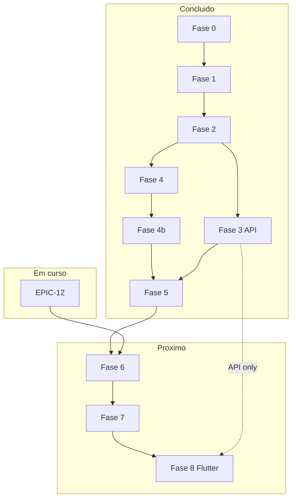

# Roteiro organizado — Fases, épicos, histórias e tasks

**Fonte da verdade operacional (jun/2026).** Detalhe de subtarefas (`SUB-*`) e specs: [padrão_ledi_e-sus_4f004208.plan.md](padrão_ledi_e-sus_4f004208.plan.md). Status executivo: [status-plano-2026-06.md](commercial/status-plano-2026-06.md).

**Regras de escopo**

| Regra | Detalhe |
|-------|---------|
| Fases **0–7** | Monólito Rails + **web gestão** + APIs JSON |
| Fase **8** | Repos Flutter (`cidadaobr-mobile-shared`, `cidadaobr-citizen`, `cidadaobr-field`) |
| **EPIC-12** | Transversal (paralelo); **bloqueia Fase 6** clínica |
| **Fase 3** | EPIC-03 + EPIC-04 **API** (TASK-04-01..05) — **sem app Flutter** |
| **EPIC-04 app** | TASK-04-06/07 = **Fase 8** apenas |
| **IDs no código** | `EPIC-*` / `STORY-*` / `TASK-*` **somente** em `.md` e `docs/backlog/*.csv`; **proibido** em Ruby, YAML de app, OpenAPI, locales, rake, CI, comentários de código — ver [AGENTS.md](../AGENTS.md) |

**Legenda de status:** `done` · `partial` · `in_progress` · `pending`

---

## 1. Roadmap por fase

| Fase | Nome | Status fase | Épicos | Gate de saída |
|------|------|-------------|--------|----------------|
| **0** | Foundation | `done` | EPIC-00 | RLS, CQRS, Kafka, auth |
| **1** | LEDI Core | `done` | EPIC-01 | Transporte, adapters MVP, projectors |
| **2** | Ops + Web base | `done` | EPIC-02 | UBS, equipes, mapa, LEDI status |
| **3** | Scheduling + Citizen **API** | `done` | EPIC-03, EPIC-04 (API) | Agenda web + `/api/v1/citizen` MVP — **não inclui Flutter** |
| **4** | Indicators MVP | `done` | EPIC-05 | Painel X/17, gaps, repasse ilustrativo |
| **4b** | Methodology | `done` | EPIC-05b | Matriz 53/53 BPs; C2.E PNI 2026 (`done`) |
| **5** | Campaigns (web) | `done` | EPIC-06, EPIC-07 | Gate técnico (suite RSpec verde); UI gestor = checklist prefeitura |
| **T** | Referência MS | `done` | **EPIC-12** | Release versionada + fixtures CI (`bin/ci_reference_gate`) |
| **6** | LEDI/PEC + Plus API | `partial` | EPIC-09, EPIC-10 (API) | Walk-in web, PEC, shared care; APIs Plus MVP |
| **7** | IA + SIAPS | `pending` | EPIC-11 | Perfis, conciliação MS |
| **8** | Mobile apps | `pending` | EPIC-04 (app), EPIC-08, EPIC-10 (UI) | `mobile-shared` + Citizen + Field |

---

## 2. Catálogo de épicos (status jun/2026)

| epic_id | Fase(s) | Status | Nome |
|---------|---------|--------|------|
| EPIC-00 | 0 | `done` | Core Plataforma |
| EPIC-01 | 1 | `done` (MVP) | Core LEDI |
| EPIC-02 | 2 | `done` | Gestão — Admin Municipal |
| EPIC-03 | 3 | `done` | Gestão — Agendamentos UBS |
| EPIC-04 | **3** API · **8** App | `partial` | Portal cidadão |
| EPIC-05 | 4 | `done` (MVP) | Gestão — Indicadores 3.493 |
| EPIC-05b | 4b | `done` | Cobertura Notas Metodológicas 3493 |
| EPIC-06 | 5 | `done` | Gestão — Estoque e Campanhas |
| EPIC-07 | 5 | `done` | Gestão — Rotas e Provisionamento |
| EPIC-12 | T (1→6) | `partial` (~40%) | Dados de Referência MS/LEDI |
| EPIC-09 | 6 core · 8 Field UI | `pending` | LEDI Completo e PEC |
| EPIC-10 | 6 API · 8 App UI | `pending` | Cidadão Plus |
| EPIC-11 | 7 | `pending` | Core IA e Produção |
| EPIC-08 | 8 | `pending` | Campo — App Profissional |

---

## 3. Hierarquia por fase

### Fase 0 — EPIC-00 Core Plataforma `done`

| Story | Task | Status |
|-------|------|--------|
| STORY-00-01 Bootstrap | TASK-00-01 Bootstrap Rails | `done` |
| | TASK-00-02 Convenções en-US | `done` |
| STORY-00-02 ES/CQRS | TASK-00-03 Event store + outbox | `done` |
| | TASK-00-04 Barramento CQRS | `done` |
| STORY-00-03 Kafka | TASK-00-05 Kafka/Karafka | `done` |
| STORY-00-04 Auth/RLS | TASK-00-06 RBAC + RLS | `done` |
| | TASK-00-07 Namespaces API web | `done` |

### Fase 1 — EPIC-01 Core LEDI `done` (MVP)

| Story | Task | Status |
|-------|------|--------|
| STORY-01-01 Artefatos | TASK-01-01 Versão LEDI | `done` |
| | TASK-01-02 Schema A–C | `done` |
| | TASK-01-03 Catálogo campos (seed; sync auto = EPIC-12) | `partial` |
| STORY-01-02 Validar/enviar | TASK-01-04 Adapters Thrift | `done` |
| | TASK-01-05 ValidateClinicalRecord | `done` |
| | TASK-01-06 Submit batch + Kafka | `done` |
| STORY-01-03 Cadastro | TASK-01-07 Projectors FCI/FCD | `done` |

### Fase 2 — EPIC-02 Admin Municipal `done`

| Story | Task | Status |
|-------|------|--------|
| STORY-02-01 UBS/equipes | TASK-02-01 Schema grupo D | `done` |
| | TASK-02-03 WEB-ADMIN-01 UBS | `done` |
| | TASK-02-05 WEB-ADMIN-03 Usuários | `done` |
| STORY-02-02 Mapa | TASK-02-02 Households PostGIS | `done` |
| | TASK-02-04 WEB-ADMIN-02 Cidadãos/mapa | `done` |
| | TASK-02-07 Animais domicílio | `done` |
| STORY-02-03 LEDI status | TASK-02-06 WEB-LEDI-01 Lotes | `done` |

### Fase 3 — Scheduling + Citizen API `done`

**Escopo:** web agenda (EPIC-03) + API cidadão (EPIC-04 TASK-04-01..05). **Fora:** TASK-04-06/07 (Fase 8).

#### EPIC-03 Agendamentos UBS `done`

| Story | Task | Status |
|-------|------|--------|
| STORY-03-01 Agenda staff | TASK-03-01 Schema grupo J | `done` |
| | TASK-03-02 Commands Book/Cancel/… | `done` |
| | TASK-03-03 Projeção calendário | `done` |
| | TASK-03-04 WEB-SCHED-01 Agenda | `done` |
| | TASK-03-05 WEB-SCHED-02 Check-in/fila | `done` |

#### EPIC-04 Portal cidadão — fatia API (Fase 3) `done`

| Story | Task | Fase | Status |
|-------|------|------|--------|
| STORY-04-01 Conta | TASK-04-01 API auth/accounts | 3 | `done` |
| STORY-04-02 Consultas | TASK-04-02 API slots/consultas | 3 | `done` |
| STORY-04-03 Vacinas | TASK-04-03 Projeção immunization | 3 | `done` |
| | TASK-04-04 API carteira/cobertura | 3 | `done` |
| | TASK-04-05 API agendar vacina | 3 | `done` (vacina via POST `/appointments`; OpenAPI alinhado) |
| STORY-04-02 Consultas app | TASK-04-06 App shell Minha UBS | **8** | `pending` |
| STORY-04-03 Vacinas app | TASK-04-07 App carteira/agendar | **8** | `pending` |

**Critério para Fase 3 `done`:** EPIC-03 `done` + TASK-04-01..05 entregues (sem TASK-04-06/07).

### Fase 4 — EPIC-05 Indicadores MVP `done`

| Story | Task | Status |
|-------|------|--------|
| STORY-05-01 Motor | TASK-05-01..04 Schema, seed, DSL, Kafka | `done` |
| STORY-05-02 Painel | TASK-05-05..06 Dashboard, drill-down | `done` |
| | TASK-05-07 Projeção repasse | `partial` (ilustrativo) |

### Fase 4b — EPIC-05b Metodologia `done`

| Story | Task | Status |
|-------|------|--------|
| STORY-05-03 Cobertura 3493 | TASK-05-08 Packs + matriz 53/53 | `done` (C2.E PNI 2026 — [ADR-0009](adr/0009-pni-calendar-reference.md)) |

### Fase 5 — EPIC-06 + EPIC-07 Campanhas web `done`

#### EPIC-06 Estoque e Campanhas

| Story | Task | Status |
|-------|------|--------|
| STORY-06-01 Estoque | TASK-06-01 Schema grupo I | `done` |
| | TASK-06-03 WEB-STOCK-01 | `partial` |
| STORY-06-02 Campanha vacina | TASK-06-02 ProvisioningValidator | `done` |
| | TASK-06-04 WEB-CAMP-01 wizard 4 passos | `partial` (spec ok; gate UI) |

#### EPIC-07 Rotas e Provisionamento

| Story | Task | Status |
|-------|------|--------|
| STORY-07-01 Público-alvo | TASK-07-01..02 Schema + targets | `done` |
| STORY-07-02 Provisionamento | TASK-07-03 Preview | `partial` |
| | TASK-07-05 Reserve supplies | `partial` (+ evento `visit_route.supplies.reserved`; E2E ok) |
| | TASK-07-06 WEB-CAMP-06 déficit/blocked | `partial` |
| STORY-07-03 Rotas | TASK-07-04 GenerateVisitRoutes | `partial` (NN+clustering; evento `home_visit.route.generated`) |
| | TASK-07-08 Mapa | `partial` |
| | TASK-07-09 Progresso rota | `partial` |
| | TASK-07-10 Prédio/condomínio | **8** (EPIC-08) | `pending` |
| STORY-07-04 Romaneio | TASK-07-07 Dispatch kit | `partial` (+ `visit_route.supplies.dispatched`) |

**Gate Fase 5:** concluído (suite RSpec verde; E2E HTTP campanhas). UI gestor: checklist prefeitura.

### Transversal — EPIC-12 Referência MS `done`

| Story | Task | Status |
|-------|------|--------|
| STORY-12-01 Schema/ADR | TASK-12-01 + [ADR-0004](adr/0004-reference-data-sources.md) | `done` |
| STORY-12-02 UFSC | TASK-12-02..03 Import + catálogo LEDI | `done` (fixture-first; stretch UFSC live) |
| STORY-12-03 SIGTAP/release | TASK-12-04..05 | `done` (fixture CI; stretch DATASUS) |
| STORY-12-04 API | TASK-12-06..07 `/reference/*` + autocompletes | `done` |

### Fase 6 — EPIC-09 + EPIC-10 (API) `partial`

#### EPIC-09 LEDI/PEC

| Story | Task | Status |
|-------|------|--------|
| STORY-09-01 LEDI 13 fichas | TASK-09-01, 09-04, 09-05 | `partial` — adapters registry; Field UI F8 |
| STORY-09-02 PEC/FCC | TASK-09-02, 09-03 | `partial` — `SubmitPecBatch` + shared care web |
| STORY-09-03 Walk-in/zoonoses | TASK-09-06..08 | `partial` — walk-in + relatório + gate release |
| STORY-09-04 Indicadores eSB | TASK-09-09 | `pending` |

#### EPIC-10 Cidadão Plus (backend)

| Story | Task | Status |
|-------|------|--------|
| STORY-10-01 Meds | TASK-10-03 | `partial` — API CRUD |
| STORY-10-02 Pânico | TASK-10-01, 10-04 | `partial` — API create |
| STORY-10-03 Tele | TASK-10-02, 10-05 | `partial` — API index/create |

### Fase 7 — EPIC-11 IA e Produção `pending`

| Story | Task |
|-------|------|
| STORY-11-01 Perfis IA | TASK-11-01..03 |
| STORY-11-02 SIAPS | TASK-11-04 |
| STORY-11-03 Relatórios | TASK-11-05..06 |

### Fase 8 — Mobile `pending`

| Ordem | Entrega | Tasks |
|-------|---------|-------|
| 1 | `cidadaobr-mobile-shared` | OpenAPI client, auth compartilhado |
| 2 | EPIC-04 app | TASK-04-06, TASK-04-07 (`cidadaobr-citizen`) |
| 3 | EPIC-08 Campo | TASK-08-01..11 (`cidadaobr-field`) |
| 4 | EPIC-09 Field UI | Fichas LEDI no app |
| 5 | EPIC-10 UI | Meds, pânico, tele no Citizen |

---

## 4. Mapeamento Story → Tasks (índice rápido)

| story_id | epic_id | Tasks |
|----------|---------|-------|
| STORY-00-01..04 | EPIC-00 | 00-01..00-07 |
| STORY-01-01..03 | EPIC-01 | 01-01..01-07 |
| STORY-02-01..03 | EPIC-02 | 02-01..02-07 |
| STORY-03-01 | EPIC-03 | 03-01..03-05 |
| STORY-04-01..03 | EPIC-04 | 04-01..04-07 (06–07 = F8) |
| STORY-05-01..02 | EPIC-05 | 05-01..05-07 |
| STORY-05-03 | EPIC-05b | 05-08 |
| STORY-06-01..02 | EPIC-06 | 06-01..06-04 |
| STORY-07-01..04 | EPIC-07 | 07-01..07-09 (+ 07-10 F8) |
| STORY-08-01..04 | EPIC-08 | 08-01..08-11 |
| STORY-09-01..04 | EPIC-09 | 09-01..09-09 |
| STORY-10-01..03 | EPIC-10 | 10-01..10-05 |
| STORY-11-01..03 | EPIC-11 | 11-01..11-06 |
| STORY-12-01..04 | EPIC-12 | 12-01..12-07 |

**Total:** 13 épicos · 38 histórias · ~62 tasks (+ subtarefas no plano mestre).

---

## 5. Próximos passos (ordem)

1. **Fase 6** — fechar EPIC-09/10 (PEC produção, eSB, polish walk-in/FCC).
2. **Piloto prefeitura** — checklist UI F5 opcional antes de go-live.
3. **PNI stretch** — calendários live MS + polish ondas 2b–2d.
4. **Fase 7** — EPIC-11.
5. **Fase 8** — mobile-shared → Citizen → Field.

**Concluído (jun/2026):** EPIC-12 gate (`Reference::Gate`, `bin/ci_reference_gate`, [ADR-0004](adr/0004-reference-data-sources.md)); Onda 2a PNI + definições 2b–2d em Ruby.

---

## 6. Exportação CSV

Backlog importável: [backlog/aps-municipal-backlog.csv](backlog/aps-municipal-backlog.csv) — **atualizado jun/2026** (~140 work items: 14 épicos incl. EPIC-05b, EPIC-12, EPIC-MOBILE; fases 4b/T/8 corretas).
